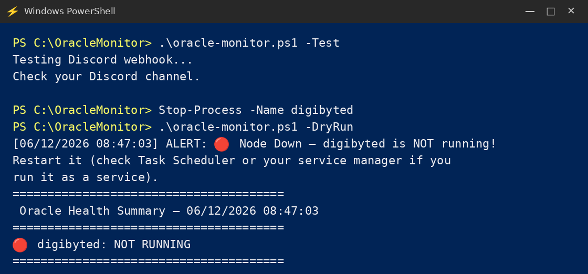
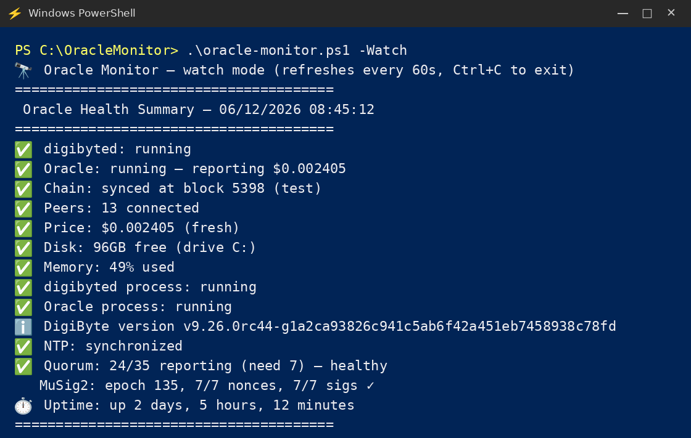
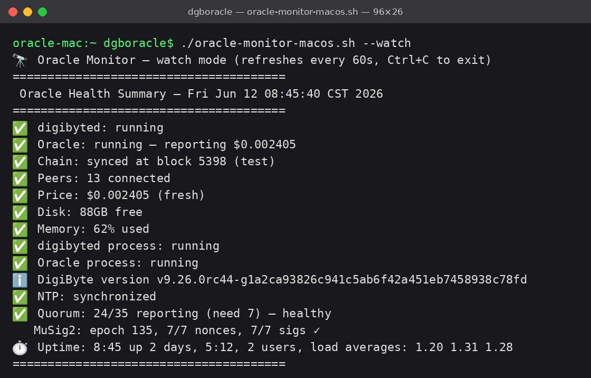

# Cross-Platform Setup — Oracle Monitor on Windows & macOS

_By digibyte-maxi (Oracle ID 17) · [@BaumerCrypto2.0](https://x.com/BaumerCrypto2_0)_

My [`oracle-monitor.sh`](https://github.com/BaumerCrypto/digidollar-oracle-tools/blob/main/oracle-monitor.sh) started life on Linux because that's where my oracle runs. But plenty of DigiDollar oracle operators run their nodes on Windows or macOS, and they deserve the same Discord alerts when something goes sideways. This guide covers the two native ports I built to close [issue #11](https://github.com/BaumerCrypto/digidollar-oracle-tools/issues/11):

| Your platform | Monitor script | Config template |
|---|---|---|
| Windows 10/11 | [`oracle-monitor.ps1`](https://github.com/BaumerCrypto/digidollar-oracle-tools/blob/main/oracle-monitor.ps1) | [`config.template.ps1`](https://github.com/BaumerCrypto/digidollar-oracle-tools/blob/main/config.template.ps1) |
| macOS | [`oracle-monitor-macos.sh`](https://github.com/BaumerCrypto/digidollar-oracle-tools/blob/main/oracle-monitor-macos.sh) | [`config-macos.template`](https://github.com/BaumerCrypto/digidollar-oracle-tools/blob/main/config-macos.template) |
| Linux (VPS) | [`oracle-monitor.sh`](https://github.com/BaumerCrypto/digidollar-oracle-tools/blob/main/oracle-monitor.sh) | [`config.template`](https://github.com/BaumerCrypto/digidollar-oracle-tools/blob/main/config.template) |

All three are logic-identical at v2.2: the same 11 health checks, the same heartbeat-based quorum counting, the same anti-flap cooldown + hysteresis, the same Discord embeds. If you've seen my alerts in #oracle-alerts, these produce the same ones. The only differences are the platform plumbing underneath.

What the monitor watches (all platforms): node process alive, oracle running and signing (`listoracle`), chain sync, peer count, consensus price freshness + degraded-network status, disk space, memory, service status, node version, NTP clock offset, and network-wide quorum margin with MuSig2 session health.

---

## Windows Setup (PowerShell)

Works on Windows PowerShell 5.1 (preinstalled on every Windows 10/11) and PowerShell 7+. No dependencies to install — PowerShell parses JSON natively, so unlike the Linux script there's no jq requirement.

**1. Download the files.** Save [`oracle-monitor.ps1`](https://github.com/BaumerCrypto/digidollar-oracle-tools/blob/main/oracle-monitor.ps1) and [`config.template.ps1`](https://github.com/BaumerCrypto/digidollar-oracle-tools/blob/main/config.template.ps1) to the same folder, e.g. `C:\OracleMonitor\`. Keep the files encoded as UTF-8 **with BOM** — they ship that way from the repo. If you re-save them in an editor that strips the BOM, Windows PowerShell 5.1 will misread the encoding and the emoji in your alerts turn to mojibake.

**2. Create your config.**

```powershell
cd C:\OracleMonitor
mkdir $env:USERPROFILE\.oracle-monitor
copy config.template.ps1 $env:USERPROFILE\.oracle-monitor\config.ps1
notepad $env:USERPROFILE\.oracle-monitor\config.ps1
```

At minimum set `$DISCORD_WEBHOOK`, `$ORACLE_ID`, `$ORACLE_NAME`, and `$CLI_PATH` (the full path to your `digibyte-cli.exe` — typically `C:\Program Files\DigiByte\daemon\digibyte-cli.exe`). If you run the Qt wallet instead of headless digibyted, set `$DAEMON_PROCESS = "digibyte-qt"`.

**3. Allow local scripts** (one time, current user only — does not weaken machine-wide policy):

```powershell
Set-ExecutionPolicy -Scope CurrentUser RemoteSigned
```

**4. Test it.**

```powershell
cd C:\OracleMonitor
.\oracle-monitor.ps1 -DryRun     # runs every check, prints to terminal, touches nothing
.\oracle-monitor.ps1 -Test      # sends a test embed to your Discord channel
```

Here's that test sequence in full — the second block uses `Stop-Process` to kill digibyted on purpose, so the `-DryRun` after it shows exactly how a real Node Down alert reads before you ever need one:



**5. Schedule it** with Task Scheduler:

```powershell
schtasks /Create /SC MINUTE /MO 5 /TN "OracleMonitor" /TR "powershell.exe -NoProfile -ExecutionPolicy Bypass -WindowStyle Hidden -File C:\OracleMonitor\oracle-monitor.ps1"
schtasks /Create /SC HOURLY /MO 12 /TN "OracleMonitorSummary" /TR "powershell.exe -NoProfile -ExecutionPolicy Bypass -WindowStyle Hidden -File C:\OracleMonitor\oracle-monitor.ps1 -Summary"
```

That's every 5 minutes for health checks (alerts only fire on problems and recoveries) plus a full summary every 12 hours.

**Optional — live stats window:** if you like having a console open that shows your oracle's status at a glance, run:

```powershell
.\oracle-monitor.ps1 -Watch                      # refreshes every 60s
.\oracle-monitor.ps1 -Watch -RefreshSeconds 30   # or your own interval
```

It redraws the full 11-check status block in place until you Ctrl+C. Watch mode never sends Discord alerts and never touches the alert state files, so it's completely safe to leave running alongside the scheduled tasks — the two don't interfere.



**Laptop warning:** open Task Scheduler (`taskschd.msc`), find both tasks, and on the Conditions tab untick "Start the task only if the computer is on AC power." And remember — a sleeping PC runs no tasks. A monitor that's asleep is a dead oracle you don't hear about.

**Windows troubleshooting:**

- *"running scripts is disabled on this system"* → you skipped step 3.
- *Alerts show `âš ï¸` instead of emoji* → the BOM got stripped. Re-download the file from the repo, or in VS Code: bottom-right encoding indicator → Save with Encoding → UTF-8 with BOM.
- *Webhook test does nothing* → the script forces TLS 1.2 itself, so on a current Windows 10/11 this should just work. Check the webhook URL for typos and confirm your firewall allows powershell.exe outbound HTTPS.
- *"could not query" on every check* → `$CLI_PATH` is wrong or the daemon isn't running. Test by hand: `& "C:\Program Files\DigiByte\daemon\digibyte-cli.exe" -testnet getblockchaininfo`.

---

## macOS Setup (bash)

Written for the stock `/bin/bash` 3.2 that ships with every Mac — no Homebrew bash needed. The only dependency is jq.

**1. Install jq** (one time): `brew install jq`

**2. Download and prep the files.**

```bash
cd ~
curl -LO https://raw.githubusercontent.com/BaumerCrypto/digidollar-oracle-tools/main/oracle-monitor-macos.sh
curl -LO https://raw.githubusercontent.com/BaumerCrypto/digidollar-oracle-tools/main/config-macos.template
chmod +x ~/oracle-monitor-macos.sh
mkdir -p ~/.oracle-monitor
cp config-macos.template ~/.oracle-monitor/config
nano ~/.oracle-monitor/config
```

At minimum set `DISCORD_WEBHOOK`, `ORACLE_ID`, `ORACLE_NAME`, and `CLI`. If `digibyte-cli` isn't on your PATH, use its full path in `CLI`. If you run the Qt app instead of headless digibyted, set `DAEMON_PROCESS="DigiByte-Qt"`.

**3. Test it.**

```bash
./oracle-monitor-macos.sh --dry-run    # runs every check, prints to terminal, touches nothing
./oracle-monitor-macos.sh --test       # sends a test embed to your Discord channel
```

**4. Schedule it** with cron (`crontab -e`):

```
*/5 * * * * /Users/YOURNAME/oracle-monitor-macos.sh 2>/dev/null
0 */12 * * * /Users/YOURNAME/oracle-monitor-macos.sh --summary 2>/dev/null
```

**Optional — live stats window:** `./oracle-monitor-macos.sh --watch` keeps a Terminal window open with the full status block, redrawn every 60 seconds (`--watch 30` for a faster interval). Like `--dry-run`, watch mode never alerts and never touches state files, so it runs safely alongside cron. Ctrl+C to exit.



**macOS-specific gotchas — read these, they will bite you otherwise:**

- **Use the full `/Users/YOURNAME/...` path** in crontab. cron does not expand `~`.
- **Full Disk Access:** depending on where your datadir sits, macOS privacy controls may block cron from reading it. If checks that work in `--dry-run` fail from cron, add `/usr/sbin/cron` under System Settings → Privacy & Security → Full Disk Access.
- **Your Mac must be awake.** cron does not fire on a sleeping Mac. On a laptop, keep it on power with "Prevent automatic sleeping on power adapter" enabled (System Settings → Battery → Options), or run `caffeinate -s` in a spare terminal. A sleeping Mac = a silent monitor = a dead oracle you don't hear about.
- **Memory readings look high — that's normal.** macOS deliberately keeps RAM full of cache. The monitor computes used% from `vm_stat` (free + inactive + speculative pages count as available), and the default 90% threshold only fires under genuine memory pressure. Don't panic at 70–80%.
- **NTP check** uses one `sntp` query against `time.apple.com` and measures your real clock offset. If it reports desync, fix it with `sudo sntp -sS time.apple.com`. Oracle bundles are rejected past 3600s of clock skew — a drifting clock kills your signing.

---

## Same config, every platform

All three config files expose the same knobs with the same defaults: alert thresholds (`MIN_PEERS=3`, `MIN_DISK_GB=5`, `MEM_THRESHOLD=90`, `MAX_CHAIN_BEHIND=10`), quorum bands (`QUORUM_GREEN=20`, `QUORUM_YELLOW=12` — red and critical come from the chain's own `oracle_consensus_required`, never hardcoded), and the anti-flap controls (`QUORUM_COOLDOWN=30` minutes, `QUORUM_HYSTERESIS=3`). Escalation alerts always fire immediately; only recovery alerts are throttled. The full explanation of the quorum bands and anti-flap design is in the main [`README`](https://github.com/BaumerCrypto/digidollar-oracle-tools/blob/main/README.md).

Switching any platform from testnet to mainnet is one config line: drop the `-testnet` argument (`$CLI_ARGS = @()` on Windows, `CLI="digibyte-cli"` on macOS/Linux).

## A note on parity and testing

I built these as faithful ports, not rewrites. The quorum state machine, the alert text, the band logic, the state-file format — all identical to Linux v2.2, so the scripts can be diffed side by side and a fix to one is a mechanical fix to the others. Version strings are `2.2-win.1` and `2.2-macos.1` to make the lineage explicit. Both ports add a `watch` mode (live refreshing console dashboard) that the Linux original doesn't have yet — it'll come back upstream in the next Linux release. A unified Python version that replaces all three remains on my roadmap as v3.0 (tracked in [issue #11](https://github.com/BaumerCrypto/digidollar-oracle-tools/issues/11)).

Testing status, honestly stated: the macOS script's logic has been exercised end-to-end in a harness with mocked macOS commands and canned RC44 RPC responses — every alert path, every recovery, the one-shot dedup, and the full quorum anti-flap state machine (escalation, hysteresis dead zone, cooldown suppression and expiry, empty roster). The PowerShell port follows the same verified logic line for line and has been hand-audited against the known PowerShell 5.1 traps, but hasn't yet executed on a real Windows box. Neither has run against a live node on real Apple/Microsoft hardware — that's where you come in. I run the Linux script in production on my own oracle (slot 17); if you run one of these ports and something misbehaves, [open an issue](https://github.com/BaumerCrypto/digidollar-oracle-tools/issues) or ping me on Gitter (digibyte-maxi). Field reports from real Windows/Mac oracle setups are exactly what these need next.
