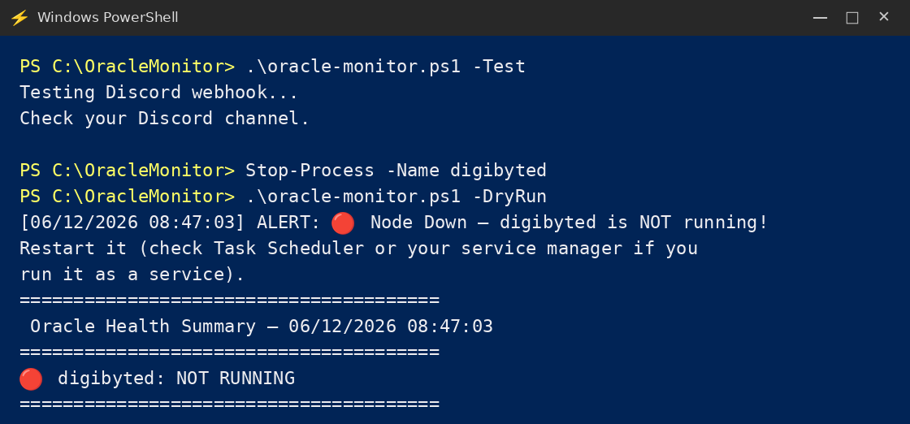
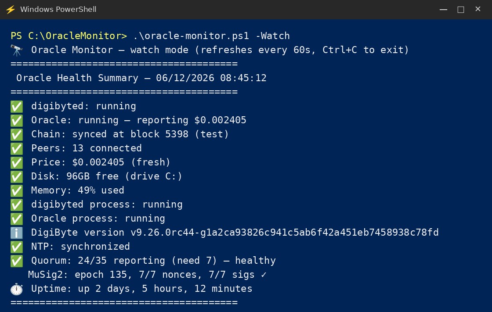
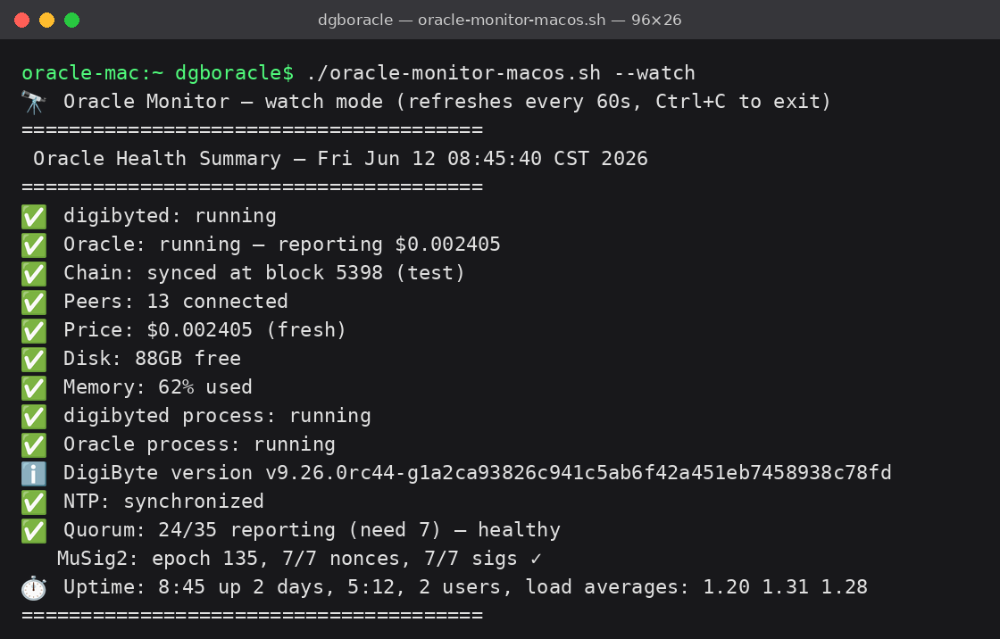

# Cross-Platform Setup — Oracle Monitor on Windows & macOS

_By digibyte-maxi (Oracle ID 17) · [@BaumerCrypto2.0](https://x.com/BaumerCrypto2_0)_

My [`oracle-monitor.sh`](https://github.com/BaumerCrypto/digidollar-oracle-tools/blob/main/oracle-monitor.sh) started life on Linux because that's where my oracle runs. But plenty of DigiDollar oracle operators run their nodes on Windows or macOS, and they deserve the same Discord alerts — and now the same email alerts — when something goes sideways. This guide covers the two native ports I built to close [issue #11](https://github.com/BaumerCrypto/digidollar-oracle-tools/issues/11) and the v2.6.0 dual-channel work that closed [issue #17](https://github.com/BaumerCrypto/digidollar-oracle-tools/issues/17):

| Your platform | Monitor script | Config template |
|---|---|---|
| Windows 10/11 | [`oracle-monitor.ps1`](https://github.com/BaumerCrypto/digidollar-oracle-tools/blob/main/oracle-monitor.ps1) | [`config.template.ps1`](https://github.com/BaumerCrypto/digidollar-oracle-tools/blob/main/config.template.ps1) |
| macOS | [`oracle-monitor-macos.sh`](https://github.com/BaumerCrypto/digidollar-oracle-tools/blob/main/oracle-monitor-macos.sh) | [`config-macos.template`](https://github.com/BaumerCrypto/digidollar-oracle-tools/blob/main/config-macos.template) |
| Linux (VPS) | [`oracle-monitor.sh`](https://github.com/BaumerCrypto/digidollar-oracle-tools/blob/main/oracle-monitor.sh) | [`config.template`](https://github.com/BaumerCrypto/digidollar-oracle-tools/blob/main/config.template) |

All three are logic-identical at v2.6.3: the same 12 health checks, the same heartbeat-based quorum counting, the same anti-flap cooldown + hysteresis, the same DigiDollar BIP9 pre-activation guard, the same headless/Qt-wallet auto-detect, the same Discord embeds, the same optional email alerts on the same triggers (added in v2.6.0), the same daily update-check footer (added in v2.6.0), the same cosmetic terminal-alignment fix that gives every ⚠️/ℹ️ status line a second space so they align with ✅/🔴 lines regardless of the terminal's emoji-width handling (added in v2.6.1), the same version-line cleanup (`DigiByte: v9.26.4` instead of the bitcoin-legacy `/DigiByte:9.26.4/`), UTC email `Time:` line, and pressure-gated swap alert that no longer red-flags a stale swap fill left over from a past reindex (added in v2.6.2), and the same update-aware DigiByte version line (green on the latest release, blue "vX.Y.Z available" when behind) plus the `SERVICE_NAME="none"` / `LAUNCHD_LABEL="none"` escape hatch for headless-without-service-manager operators (added in v2.6.3). If you've seen my alerts in #oracle-alerts, these produce the same ones. The only differences are the platform plumbing underneath.

What the monitor watches (all platforms): node process alive, oracle running and signing (`listoracle`), chain sync, peer count, consensus price freshness + degraded-network status, disk space (free, total, and used%), memory, swap/page-file pressure, service status, node version, NTP clock offset, and network-wide quorum margin with MuSig2 session health. Before DigiDollar activates on your target chain, the oracle-dependent checks automatically downgrade to blue standby INFO lines instead of firing false red alerts — a pre-activation mainnet monitor showing four ℹ️ standby lines is correct behavior, not a bug.

---

## Windows Setup (PowerShell)

Works on Windows PowerShell 5.1 (preinstalled on every Windows 10/11) and PowerShell 7+. No dependencies to install — PowerShell parses JSON natively (unlike the Linux script there's no jq requirement), and .NET's built-in `System.Net.Mail.SmtpClient` handles email (no PowerShell module install needed).

**1. Download the files.** Save [`oracle-monitor.ps1`](https://github.com/BaumerCrypto/digidollar-oracle-tools/blob/main/oracle-monitor.ps1) and [`config.template.ps1`](https://github.com/BaumerCrypto/digidollar-oracle-tools/blob/main/config.template.ps1) to the same folder, e.g. `C:\OracleMonitor\`. Keep the files encoded as UTF-8 **with BOM** — they ship that way from the repo. If you re-save them in an editor that strips the BOM, Windows PowerShell 5.1 will misread the encoding and the emoji in your alerts turn to mojibake.

**2. Create your config.**

```powershell
cd C:\OracleMonitor
mkdir $env:USERPROFILE\.oracle-monitor
copy config.template.ps1 $env:USERPROFILE\.oracle-monitor\config.ps1
notepad $env:USERPROFILE\.oracle-monitor\config.ps1
```

At minimum set `$DISCORD_WEBHOOK`, `$ORACLE_ID`, `$ORACLE_NAME`, and `$CLI_PATH` (the full path to your `digibyte-cli.exe` — typically `C:\Program Files\DigiByte\daemon\digibyte-cli.exe`). If you run the Qt wallet instead of headless digibyted, set `$DAEMON_PROCESS = "digibyte-qt"`. To also send email alerts, flip `$EMAIL_ENABLED = $true` and fill in the SMTP block — see [Email SMTP setup](#email-smtp-setup-all-platforms) below.

**3. Allow local scripts** (one time, current user only — does not weaken machine-wide policy):

```powershell
Set-ExecutionPolicy -Scope CurrentUser RemoteSigned
```

**4. Test it.**

```powershell
cd C:\OracleMonitor
.\oracle-monitor.ps1 -DryRun      # runs every check, prints to terminal, touches nothing
.\oracle-monitor.ps1 -Test        # sends a test embed to your Discord channel
.\oracle-monitor.ps1 -TestEmail   # (v2.6.0) sends a test email if $EMAIL_ENABLED = $true
```

Here's that test sequence in full — the second block uses `Stop-Process` to kill digibyted on purpose, so the `-DryRun` after it shows exactly how a real Node Down alert reads before you ever need one:



**5. Schedule it** with Task Scheduler:

```powershell
schtasks /Create /SC MINUTE /MO 5 /TN "OracleMonitor" /TR "powershell.exe -NoProfile -ExecutionPolicy Bypass -WindowStyle Hidden -File C:\OracleMonitor\oracle-monitor.ps1"
schtasks /Create /SC HOURLY /MO 12 /TN "OracleMonitorSummary" /TR "powershell.exe -NoProfile -ExecutionPolicy Bypass -WindowStyle Hidden -File C:\OracleMonitor\oracle-monitor.ps1 -Summary"
```

That's every 5 minutes for health checks (alerts only fire on problems and recoveries) plus a full summary every 12 hours.

**Optional — live stats window:** if you like having a console open that shows your oracle's status at a glance, run:

```powershell
.\oracle-monitor.ps1 -Watch                      # refreshes every 60s
.\oracle-monitor.ps1 -Watch -RefreshSeconds 30   # or your own interval
```

It redraws the full 12-check status block in place until you Ctrl+C. Watch mode never sends Discord alerts, never sends email, and never touches the alert state files, so it's completely safe to leave running alongside the scheduled tasks — the three don't interfere.



**Laptop warning:** open Task Scheduler (`taskschd.msc`), find both tasks, and on the Conditions tab untick "Start the task only if the computer is on AC power." And remember — a sleeping PC runs no tasks. A monitor that's asleep is a dead oracle you don't hear about.

**Windows troubleshooting:**

- *"running scripts is disabled on this system"* → you skipped step 3.
- *Alerts show `âš ï¸` instead of emoji* → the BOM got stripped. Re-download the file from the repo, or in VS Code: bottom-right encoding indicator → Save with Encoding → UTF-8 with BOM.
- *Webhook test does nothing* → the script forces TLS 1.2 itself, so on a current Windows 10/11 this should just work. Check the webhook URL for typos and confirm your firewall allows powershell.exe outbound HTTPS.
- *"could not query" on every check* → `$CLI_PATH` is wrong or the daemon isn't running. Test by hand: `& "C:\Program Files\DigiByte\daemon\digibyte-cli.exe" -testnet getblockchaininfo`.
- *`-TestEmail` reports send failed* → see [Email SMTP setup](#email-smtp-setup-all-platforms) below. Most likely causes: Gmail App Password not enabled, wrong port (must be 587 STARTTLS in PS 5.1 — port 465 implicit TLS is not natively supported), or Windows Firewall blocking outbound port 587 for `powershell.exe`.

---

## macOS Setup (bash)

Written for the stock `/bin/bash` 3.2 that ships with every Mac — no Homebrew bash needed. The only dependency is jq (curl SMTP support ships with modern macOS by default).

**1. Install jq** (one time): `brew install jq`

**2. Download and prep the files.**

```bash
cd ~
curl -LO https://raw.githubusercontent.com/BaumerCrypto/digidollar-oracle-tools/main/oracle-monitor-macos.sh
curl -LO https://raw.githubusercontent.com/BaumerCrypto/digidollar-oracle-tools/main/config-macos.template
chmod +x ~/oracle-monitor-macos.sh
mkdir -p ~/.oracle-monitor
cp config-macos.template ~/.oracle-monitor/config
chmod 600 ~/.oracle-monitor/config   # keep SMTP password out of world-readable files
nano ~/.oracle-monitor/config
```

At minimum set `DISCORD_WEBHOOK`, `ORACLE_ID`, `ORACLE_NAME`, and `CLI`. If `digibyte-cli` isn't on your PATH, use its full path in `CLI`. If you run the Qt app instead of headless digibyted, set `DAEMON_PROCESS="DigiByte-Qt"`. To also send email alerts, set `EMAIL_ENABLED=true` and fill in the SMTP block — see [Email SMTP setup](#email-smtp-setup-all-platforms) below.

**3. Test it.**

```bash
./oracle-monitor-macos.sh --dry-run     # runs every check, prints to terminal, touches nothing
./oracle-monitor-macos.sh --test        # sends a test embed to your Discord channel
./oracle-monitor-macos.sh --test-email  # (v2.6.0) sends a test email if EMAIL_ENABLED=true
```

**4. Schedule it** with cron (`crontab -e`):

```
*/5 * * * * /Users/YOURNAME/oracle-monitor-macos.sh 2>/dev/null
0 */12 * * * /Users/YOURNAME/oracle-monitor-macos.sh --summary 2>/dev/null
```

**Optional — live stats window:** `./oracle-monitor-macos.sh --watch` keeps a Terminal window open with the full status block, redrawn every 60 seconds (`--watch 30` for a faster interval). Like `--dry-run`, watch mode never alerts (Discord or email) and never touches state files, so it runs safely alongside cron. Ctrl+C to exit.



**macOS-specific gotchas — read these, they will bite you otherwise:**

- **Use the full `/Users/YOURNAME/...` path** in crontab. cron does not expand `~`.
- **Full Disk Access:** depending on where your datadir sits, macOS privacy controls may block cron from reading it. If checks that work in `--dry-run` fail from cron, add `/usr/sbin/cron` under System Settings → Privacy & Security → Full Disk Access.
- **Your Mac must be awake.** cron does not fire on a sleeping Mac. On a laptop, keep it on power with "Prevent automatic sleeping on power adapter" enabled (System Settings → Battery → Options), or run `caffeinate -s` in a spare terminal. A sleeping Mac = a silent monitor = a dead oracle you don't hear about.
- **Memory readings look high — that's normal.** macOS deliberately keeps RAM full of cache. The monitor computes used% from `vm_stat` (free + inactive + speculative pages count as available), and the default 90% threshold only fires under genuine memory pressure. Don't panic at 70–80%.
- **NTP check** uses one `sntp` query against `time.apple.com` and measures your real clock offset. If it reports desync, fix it with `sudo sntp -sS time.apple.com`. Oracle bundles are rejected past 3600s of clock skew — a drifting clock kills your signing.
- **curl SMTP support** ships with modern macOS by default (verify with `curl --version | grep smtp`). If you're on an unusually old macOS where it's missing, `brew install curl` and put `/opt/homebrew/opt/curl/bin` at the front of your PATH.

---

## Email SMTP setup (all platforms)

v2.6.0 adds email as a second alert channel — same triggers as Discord (red/yellow/green state changes plus the 12-hour summary), same `NETWORK_LABEL` prefix on the subject line, same footer stamp, same auto update-check line when a newer version is available. Off by default; flip it on in your config file.

The SMTP knobs are the same across Linux, macOS, and Windows — only the config-file syntax differs. Fill in six values: `EMAIL_ENABLED`, `EMAIL_TO`, `SMTP_SERVER`, `SMTP_PORT`, `SMTP_USER`, `SMTP_PASS` (plus optional `SMTP_FROM` for a display name). Then run `--test-email` / `-TestEmail` to verify.

### Provider quick-reference

| Provider | Server | Port | Notes |
|---|---|---|---|
| Gmail | `smtp.gmail.com` | 587 | Requires an **App Password** (Google Account → Security → 2-Step Verification → App passwords). Never your account password. |
| Outlook / Office 365 | `smtp.office365.com` | 587 | Account password works; App Password required if you have MFA. |
| Brevo (recommended relay) | `smtp-relay.brevo.com` | 587 | Free tier: 300 emails/day. `SMTP_USER` is a login like `xxx@smtp-brevo.com`, `SMTP_PASS` is a Standard SMTP key. |
| Mailjet | `in-v3.mailjet.com` | 587 | Free tier: 200 emails/day. API key + secret as user + pass. |
| SendGrid | `smtp.sendgrid.net` | 587 | Free tier: 100 emails/day. `SMTP_USER = apikey` (literal string), `SMTP_PASS` is the API key. |
| Your own SMTP | your host | 587 | Any auth-capable submission server works. |

Port 587 (STARTTLS) is the recommended and most portable setting. Some providers also offer port 465 (implicit TLS) — supported by Linux and macOS (curl handles both), **not** natively supported by Windows PowerShell 5.1 (.NET's built-in SmtpClient does not handle port 465). If you're on Windows, use 587.

### Gmail — the full walkthrough

1. Enable 2-Step Verification: Google Account → Security → 2-Step Verification → follow the prompts.
2. Create an App Password: Google Account → Security → **App passwords** (Google hides this until 2-Step is on; search "App passwords" in the account search bar if you can't find it in the menu).
3. Give it a name (e.g. "Oracle Monitor"), click Generate. Google shows you a 16-character password *once*. Copy it. Spaces don't matter — the SMTP server ignores them.
4. In your config file:
   ```
   SMTP_SERVER="smtp.gmail.com"
   SMTP_PORT=587
   SMTP_USER="your.full.address@gmail.com"
   SMTP_PASS="the 16 character App Password"
   ```
5. Run `--test-email` / `-TestEmail`. If it fails, the most common cause is that `SMTP_PASS` still has your real account password — Gmail rejects that from SMTP even if it works on the web.

### When your ISP blocks direct SMTP — use a relay

Some email providers throttle outbound SMTP submission from datacenter, VPS, or cloud IP ranges. Budget VPS hosts (Contabo, DigitalOcean, and similar) often trip an anti-abuse block on the big telco and ISP email providers (Rogers, Telus, AT&T, Verizon, T-Mobile, and the like). What you'll see is a `535 5.7.0 "Authentication disabled due to threshold limitation"` (or similar) from the SMTP server even with correct credentials. Rotating the password or waiting doesn't help, because the block is IP-based, not credential-based.

The fix is to route through an SMTP relay service. Their free tiers are more than enough for oracle alerts (each of the providers below handles at least 100/day, and the monitor typically sends fewer than 10). Setup on the relay side is straightforward: sign up, verify the sender address you want your alerts to come from (usually your own email address), grab an SMTP key from the dashboard, and drop it into `SMTP_USER`/`SMTP_PASS`. **Brevo is the relay I recommend**, and it's what runs in production on my Contabo VPS: free tier 300/day, IP-lockable keys, standard STARTTLS on 587, and the simplest verified-sender flow of the three. **Mailjet** and **SendGrid** are equivalent alternatives if you prefer them or hit issues.

**Detailed Brevo setup (recommended relay).** This is the exact flow that got email working on my VPS:

1. Sign up at [brevo.com](https://www.brevo.com/) with the same email you want alerts sent to.
2. The signup email address becomes a "verified sender" automatically — no separate verification email to click.
3. Dashboard → SMTP & API → **SMTP** → generate a Standard SMTP key. Name it something like "Oracle Monitor VPS". Optionally IP-lock it to your VPS address for extra safety.
4. Copy the SMTP login (looks like `xxx@smtp-brevo.com`) and the key (starts with `xsmtpsib-` and is 90 characters total — the dashboard's "length 64" refers to the body after the prefix, so don't panic that yours looks longer).
5. In your config:
   ```
   SMTP_SERVER="smtp-relay.brevo.com"
   SMTP_PORT=587
   SMTP_USER="xxx@smtp-brevo.com"
   SMTP_PASS="xsmtpsib-…the-full-key"
   SMTP_FROM="Your Name <your.address@example.com>"
   ```
6. Run `--test-email` / `-TestEmail`. Heads up: your alerts arrive from your own address (you're both the verified sender and the recipient), and mail providers often flag self-addressed mail as suspicious, so the first one may land in spam. Mark it as not-spam once and the filter usually learns. To stop it recurring, add your own sending address and your domain to your safe/trusted-senders list, alongside `brevo.com` and `smtp-relay.brevo.com`.

**Official Brevo docs.** For a deeper walkthrough on the two trickiest bits: [Create and manage your SMTP keys](https://help.brevo.com/hc/en-us/articles/7959631848850-Create-and-manage-your-SMTP-keys) covers generating the Standard SMTP key, and [Send transactional emails using Brevo SMTP](https://help.brevo.com/hc/en-us/articles/7924908994450-Send-transactional-emails-using-Brevo-SMTP) is Brevo's full end-to-end SMTP guide (remember to use an SMTP key, not an API key).

### Windows-specific notes

- Port 465 is not natively supported by PowerShell 5.1's `SmtpClient`. Every major provider offers 587 STARTTLS — use that.
- Windows Firewall may block outbound port 587 for `powershell.exe` on first send. Windows usually pops a prompt the first time; approve it or add a rule.
- Corporate proxies: `System.Net.Mail.SmtpClient` in PS 5.1 does not honor Internet Options proxy settings. If you're on a corporate network that requires a proxy for outbound SMTP, talk to your admin about a bypass, or run the monitor from a machine with direct internet.
- Password storage: `$SMTP_PASS` sits plaintext in the config file. The file lives under your Windows user profile, so it's protected by NTFS permissions to your account. If your machine is shared or you want stronger protection, look at the [SecretManagement module](https://learn.microsoft.com/en-us/powershell/utility-modules/secretmanagement/overview) — the current monitor script reads plaintext, but the module can wrap the retrieval with a per-boot unlock.

### macOS-specific notes

- macOS ships curl with SMTP support by default on modern versions (verify with `curl --version | grep smtp`). No install step required.
- Corporate networks / hotel Wi-Fi may block outbound SMTP even to trusted providers — if `--test-email` works at home but fails elsewhere, that's why.
- Password storage: `~/.oracle-monitor/config` should be `chmod 600` so only your user can read it. macOS Full Disk Access does not affect the config file itself.

### Linux-specific notes

- Stock Ubuntu curl ships with SMTP support (verify: `curl --version | grep smtp`). Nothing to install.
- Some email providers (the big telco and ISP mail hosts, as noted in the relay section above) throttle direct SMTP submission from datacenter IPs. You'll see `535 5.7.0` errors even with correct credentials, and rotating the password doesn't help. Route through a relay (Brevo recommended; Mailjet or SendGrid also work). The `--test-email` diagnostic prints the failure reason so you can identify this quickly.
- The config file should be `chmod 600` on the VPS so only your user can read it. If you keep a config backup off-VPS, encrypt it — the SMTP password is a live credential.

---

## Same config, every platform

All three config files expose the same knobs with the same defaults: alert thresholds (`MIN_PEERS=3`, `MIN_DISK_GB=5`, `MEM_THRESHOLD=90`, `MAX_CHAIN_BEHIND=10`), quorum bands (`QUORUM_GREEN=12`, `QUORUM_YELLOW=10` — red and critical come from the chain's own `oracle_consensus_required`, never hardcoded; suggested testnet override: 10/8), and the anti-flap controls (`QUORUM_COOLDOWN=30` minutes, `QUORUM_HYSTERESIS=3`). Escalation alerts always fire immediately; only recovery alerts are throttled. The full explanation of the quorum bands and anti-flap design is in the main [`README`](https://github.com/BaumerCrypto/digidollar-oracle-tools/blob/main/README.md).

New in v2.6.0, on all three platforms: email as a second alert channel (identical trigger set to Discord — configured via `EMAIL_ENABLED`, `EMAIL_TO`, and the SMTP block; the `NETWORK_LABEL` prefix is added at the send chokepoint, mirroring the Discord title behavior from v2.5.3 so dual-instance operators can tell testnet from mainnet in the inbox at a glance) and an auto update-check that quietly notifies you via a footer line on every Discord card and email when a newer version of the monitor is published to GitHub main.

New in v2.5.5, still applies to all three platforms (both enhancements suggested by Aussie Epic): the disk line shows free/total/used% (`✅ Disk: 156GB free of 200GB (22% used)`), and the Low Disk Space alert names your DigiByte datadir on its own line so you know exactly where to clean up. The path comes from the `DATADIR` config variable — no RPC returns the datadir, so you declare it. Each template ships the platform-correct default: `$HOME/.digibyte` (Linux), `$HOME/Library/Application Support/DigiByte` (macOS), `$env:APPDATA\DigiByte` (Windows). Single-instance operators leave the default. Dual-instance operators (testnet + mainnet on one box) should set it per config file — testnet points at the `testnet26` subdirectory, mainnet at the top level — so the same full disk produces two distinct, actionable cards instead of two ambiguous ones:

```
Testnet26 — 🔴 Low Disk Space
Only 3GB free of 200GB (98% used).
Clean up old logs or unused chain data in:
/home/YOU/.digibyte/testnet26/
```

```
Mainnet — 🔴 Low Disk Space
Only 3GB free of 200GB (98% used).
Clean up old logs or unused chain data in:
/home/YOU/.digibyte/
```

`NETWORK_LABEL` tells you which daemon fired; `DATADIR` tells you which directory to prune. The testnet subdirectory tracks the current testnet reset (`testnet26`, `testnet27`, ...) — bump it when the testnet resets.

Switching any platform from testnet to mainnet is one config line: drop the `-testnet` argument (`$CLI_ARGS = @()` on Windows, `CLI="digibyte-cli"` on macOS/Linux).

## A note on parity and testing

I built these as faithful ports, not rewrites. The quorum state machine, the alert text, the band logic, the state-file format, the email chokepoint and update-check plumbing added in v2.6.0, the v2.6.1 cosmetic spacing fix, the v2.6.2 version-line cleanup + UTC email timestamp + pressure-gated swap alert, and the v2.6.3 update-aware DigiByte version line + service-check escape hatch — all identical to Linux v2.6.3, so the scripts can be diffed side by side and a fix to one is a mechanical fix to the others. (The deliberate platform differences: the swap gate uses Linux PSI as its primary pressure signal where available, while macOS and Windows — which have no PSI — use the RAM-headroom signal alone; and the service-check escape hatch is `SERVICE_NAME="none"` on Linux/Windows but `LAUNCHD_LABEL="none"` on macOS.) Version strings are `2.6.3-win.1` and `2.6.3-macos.1` to make the lineage explicit. Both ports add a `watch` mode (live refreshing console dashboard) that the Linux original doesn't have yet — it'll come back upstream in a future Linux release. A unified Python version that replaces all three remains on my roadmap as v3.0 (tracked in [issue #11](https://github.com/BaumerCrypto/digidollar-oracle-tools/issues/11)).

Testing status, honestly stated: the Linux v2.6.x script is live in production on my VPS (both testnet and mainnet instances, dual-channel Discord + email via Brevo relay, validated end-to-end 2026-07-17 through 2026-07-18; v2.6.1 layered the cosmetic spacing fix, v2.6.2 layered the version-line cleanup + UTC email timestamp + pressure-gated swap alert, and v2.6.3 layered the update-aware DigiByte version line + service-check escape hatch on top the same session). The macOS script's core logic has been exercised end-to-end in a harness with mocked macOS commands and canned RC44 RPC responses — every alert path, every recovery, the one-shot dedup, and the full quorum anti-flap state machine (escalation, hysteresis dead zone, cooldown suppression and expiry, empty roster). The PowerShell port follows the same verified logic line for line, has been hand-audited against the known PowerShell 5.1 traps, and its check_daemon/check_services behavior has been verified on a real Windows box via the bundled test harness (9/9 scenarios on Windows PowerShell 5.1). The v2.6.0 email + update-check additions on the two ports follow the same code paths as the live Linux version. If you run one of these ports and something misbehaves, [open an issue](https://github.com/BaumerCrypto/digidollar-oracle-tools/issues) or ping me on Gitter (digibyte-maxi). Field reports from real Windows/Mac oracle setups are exactly what these need next.
