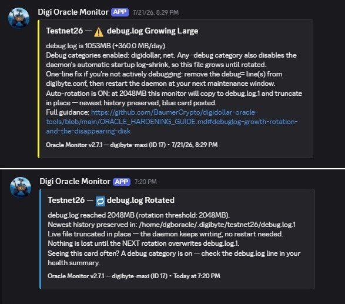

# Oracle Node Hardening Guide

**A step-by-step security hardening guide for DigiDollar oracle operators running Linux VPS.**
> **Running from home instead of a VPS?** See the [Home Oracle Hardening Guide](HOME_ORACLE_HARDENING_GUIDE.md) — covers Linux, Windows, macOS with router hardening, port forwarding, VLANs, and more.

### 🔥 Ports Your Oracle Needs — Don't Block These — Read This First!

Before configuring your firewall, know what your oracle needs to function:

| Port | Direction | Required | Purpose |
|------|-----------|----------|---------|
| 12024/tcp | Inbound | Yes (mainnet) | P2P node discovery + oracle bundle relay |
| 12033/tcp | Inbound | Yes (testnet26) | P2P testnet connections |
| Your SSH port | Inbound | Yes | SSH admin access (default 22, or custom port like 2222 — see SSH Hardening section in this Guide) |
| ALL | Outbound | **Allow ALL — do not restrict** | Price feeds (exchange APIs), peer connections, NTP time sync, DNS, system updates |

> ⚠️ **Do NOT set `ufw default deny outgoing`.** Your oracle needs outbound access for exchange price feeds, NTP sync, peer discovery, and system updates. Blocking outbound traffic is the #1 over-hardening mistake — your node looks fine but silently stops reporting prices. See [Over-Hardening Warnings](#over-hardening-warnings) for more.

I wrote this guide based on the security setup running on my own DigiDollar oracle node. Every step here is tested, verified, and confirmed to survive reboots. If you're running an oracle on a Linux VPS, this guide will get your server locked down properly (server hardening).

---

## Table of Contents

- [Before You Start](#before-you-start)

1. [Create a Dedicated User](#step-1--create-a-dedicated-user)
2. [SSH Hardening](#step-2--ssh-hardening)
3. [Generate SSH Keys](#step-3--generate-ssh-keys)
4. [Firewall (UFW)](#step-4--firewall-ufw)
5. [Fail2Ban](#step-5--fail2ban)
6. [Kernel Hardening (sysctl)](#step-6--kernel-hardening-sysctl)
7. [Shared Memory Hardening](#step-7--shared-memory-hardening)
8. [Disable Unnecessary Services](#step-8--disable-unnecessary-services)
9. [Automatic Security Updates](#step-9--automatic-security-updates)
10. [DigiByte-Specific Hardening](#step-10--digibyte-specific-hardening)
11. [Verify Everything](#step-11--verify-everything)

- [Over-Hardening Warnings](#over-hardening-warnings)
- [Optional Extras](#optional-extras)
  - [NTP Time Sync](#ntp-time-sync--verify-your-clock)
  - [Resource Isolation and OOM Protection](#resource-isolation-and-oom-protection)
- [debug.log: Growth, Rotation, and the Disappearing Disk](#debuglog-growth-rotation-and-the-disappearing-disk)
- [Hardware Requirements: RAM and Disk](#hardware-requirements-ram-and-disk)
- [Maintenance](#maintenance)

---

## Before You Start

**This guide is for Linux VPS servers.** If you're running a DigiDollar oracle on a home Windows PC, I'd strongly recommend migrating to a Linux VPS before worrying about hardening. Oracle nodes need 24/7 uptime for a frozen roster — power outages, ISP instability, Windows Update reboots, no DDoS protection, and residential IP changes make home PCs a poor fit. Most major VPS providers (Vultr, Contabo, Hetzner, OVH, DigitalOcean) offer Ubuntu VPS plans for $5–15/month with built-in DDoS protection and near-perfect uptime.

**Tested on:** Ubuntu 24.04 LTS. Compatible with Ubuntu 26.04 LTS and other Debian-based distros. Minor differences between versions are noted throughout the guide where they apply.


**Prerequisites:**

- A VPS running Ubuntu 24.04 LTS (or similar)
- Root or sudo access
- DigiByte Core installed and synced (see [DIGIDOLLAR_ORACLE_SETUP.md](https://github.com/DigiByte-Core/digibyte/blob/feature/digidollar-v1/DIGIDOLLAR_ORACLE_SETUP.md))
- An SSH client on your local machine (PuTTY on Windows, Terminal on Mac/Linux)

> [!CAUTION]
> Before making ANY SSH changes, keep your current SSH session open and test the new config in a second session. If you lock yourself out and can't SSH back in, your only way in is through your VPS provider's emergency console (Contabo: VNC in Customer Control Panel, Hetzner: Console in Cloud Panel, Vultr: View Console, DigitalOcean: Droplet Console). Every major VPS provider has one — find yours BEFORE you start changing SSH settings. I learned this the hard way. :grimacing:

---

## Step 1 — Create a Dedicated User

Don't run your oracle as root. I created a dedicated user with sudo access specifically for oracle operations.

```bash
# Create user (replace 'dgboperator' with your preferred username)
sudo adduser dgboperator

# Add to sudo group
sudo usermod -aG sudo dgboperator
```

Switch to the new user and verify:

```bash
su - dgboperator
sudo whoami
# Should output: root
```

From here on, everything runs as this user — never root directly.

---

## Step 2 — SSH Hardening

SSH is the front door to your VPS. I changed every default that matters.

### Move SSH Off Port 22

Every automated scanner on the internet hammers port 22. Moving to a custom port eliminates the vast majority of brute-force noise. Pick any unused port between 1024–65535.

Edit the SSH config:

```bash
sudo nano /etc/ssh/sshd_config
```

Find and set these values. Some may already exist and need changing, others you may need to add:

```
Port 2222                          # Pick your own port — not 22
LoginGraceTime 30                  # 30 seconds to authenticate, then disconnect
PermitRootLogin no                 # Never allow root login via SSH
MaxAuthTries 3                     # Lock out after 3 failed attempts per session
PubkeyAuthentication yes           # Allow key-based authentication
PasswordAuthentication no          # Disable password login entirely
KbdInteractiveAuthentication no    # Disable keyboard-interactive auth
X11Forwarding no                   # No GUI forwarding needed on a server
PrintMotd no                       # Suppress message of the day
ClientAliveInterval 300            # Send keepalive every 5 minutes
ClientAliveCountMax 2              # Disconnect after 2 missed keepalives (10 min idle timeout)
AllowUsers dgboperator             # ONLY this user can SSH in — whitelist
```

**`AllowUsers` is the most important line.** Even if someone guesses your port and has a valid key, they can't log in unless they're hitting the exact username on this whitelist.

### Test Before You Commit

**Do NOT close your current SSH session.** First, restart the SSH service:

```bash
sudo systemctl restart ssh

# If you can't connect after restarting, your system may use socket-activated SSH.
# In that case, run these instead:
sudo systemctl daemon-reload
sudo systemctl restart ssh.socket
```

Open a **second** terminal/PuTTY window and connect using your new port:

```bash
ssh -p 2222 dgboperator@your-vps-ip
```

If the new session works, you're good. If it doesn't, your original session is still open to fix things.

---

## Step 3 — Generate SSH Keys

Password authentication is disabled in Step 2, so you need SSH keys. Here's how I set mine up.

### Option A — RSA 4096 (Proven, Universal Compatibility)

**On your local machine** (not the VPS):

**PuTTY (Windows):**
1. Open **PuTTYgen**
2. Select **RSA** at the bottom
3. Set **Number of bits** to **4096**
4. Click **Generate** and move your mouse to create randomness
5. Add a passphrase (strongly recommended)
6. Click **Save private key** — save the `.ppk` file somewhere secure on your PC
7. Copy the entire contents of the **"Public key for pasting into OpenSSH authorized_keys file"** box

**Linux/macOS Terminal:**

```bash
ssh-keygen -t rsa -b 4096 -C "your-identifier"
```

### Option B — Ed25519 (Modern Best Practice)

Ed25519 is the current standard for new SSH keys. It's faster, smaller, and equally secure to RSA 4096 with just 256 bits. If you're setting up fresh and your SSH client supports it (all modern clients do), this is the recommended choice.

**PuTTY (Windows):**
1. Open **PuTTYgen**
2. Select **EdDSA** at the bottom
3. Ensure **255 bits** (Ed25519) is selected
4. Click **Generate**
5. Add a passphrase
6. Save the `.ppk` private key
7. Copy the public key from the box

**Linux/macOS Terminal:**

```bash
ssh-keygen -t ed25519 -C "your-identifier"
```

> **Note:** RSA 4096 is what I use on my oracle VPS and it's fully secure. Ed25519 is the newer algorithm and what I'd pick if starting fresh today. Either works — don't lose sleep over which one you chose. What matters is that you're using keys instead of passwords.

### Install the Public Key on Your VPS

On the VPS, as your oracle user:

```bash
mkdir -p ~/.ssh
chmod 700 ~/.ssh
nano ~/.ssh/authorized_keys
```

Paste your public key (the long string starting with `ssh-rsa` or `ssh-ed25519`), save, and set permissions:

```bash
chmod 600 ~/.ssh/authorized_keys
```

Test the key login in a new session before closing your current one.

### Verify Your Key Size

To check what key type and size you're using:

```bash
ssh-keygen -l -f ~/.ssh/authorized_keys
```

Output looks like: `4096 SHA256:abc123... rsa-key-20260503 (RSA)` — the first number is your key size.

---

## Step 4 — Firewall (UFW)

I use UFW (Uncomplicated Firewall) to block everything except the ports my oracle actually needs.

### Install and Configure

```bash
sudo apt install ufw -y

# Default: deny all incoming, allow all outgoing
sudo ufw default deny incoming
sudo ufw default allow outgoing

# Allow SSH on your custom port (CRITICAL — do this before enabling UFW)
sudo ufw allow 2222/tcp comment 'SSH custom port'

# Allow DigiByte MainNet P2P
sudo ufw allow 12024/tcp comment 'DGB MainNet P2P'

# Allow DigiByte TestNet P2P (keep testnet running alongside mainnet for future testing)
sudo ufw allow 12033/tcp comment 'DGB TestNet P2P'

# Enable the firewall
sudo ufw enable
```

**Warning:** If you enable UFW without allowing your SSH port first, you will lock yourself out. Always allow SSH before enabling.

> **Why include the testnet port?** Oracle operators can keep testnet running alongside mainnet. Testnet is where all future releases get tested before mainnet deployment — if operators shut down their testnet nodes, there's nobody to test with. Keep both ports open. If you decide not to participate in testnet, you can remove the 12033 rule: `sudo ufw delete allow 12033/tcp`

### Verify

```bash
sudo ufw status verbose
```

Expected output:

```
Status: active
Logging: on (low)
Default: deny (incoming), allow (outgoing), disabled (routed)

To                         Action      From
--                         ------      ----
2222/tcp                   ALLOW IN    Anywhere        # SSH custom port
12024/tcp                  ALLOW IN    Anywhere        # DGB MainNet P2P
12033/tcp                  ALLOW IN    Anywhere        # DGB TestNet P2P
```

### What About RPC?

**Don't open RPC ports in UFW.** DigiByte Core binds RPC to `127.0.0.1` (localhost) by default. This means only programs running on the VPS itself can talk to the RPC interface. There is no reason to expose RPC to the internet — and doing so is a serious security risk.

If your `digibyte.conf` doesn't have `rpcbind` or `rpcallowip` lines, you're already safe — the default is localhost-only. You can verify:

```bash
ss -tlnp | grep 14024
```

If the local address shows `127.0.0.1:14024` or `[::1]:14024`, RPC is not exposed. (Port number varies by network — 14024 for mainnet RPC, 14026 for testnet.)

---

## Step 5 — Fail2Ban

Fail2Ban monitors your SSH logs and automatically bans IPs that fail authentication too many times. On my VPS, it catches real brute-force attempts daily.

### Install

```bash
sudo apt install fail2ban -y
```

### Configure

Create a local config file (don't edit the defaults — they get overwritten on updates):

```bash
sudo nano /etc/fail2ban/jail.local
```

Add this:

```ini
[sshd]
enabled = true
port = 2222
filter = sshd
backend = systemd
maxretry = 3
bantime = 86400
findtime = 600
```

**What this means:**
- **maxretry = 3** — 3 failed attempts and you're banned
- **bantime = 86400** — banned for 24 hours (not the default 10 minutes)
- **findtime = 600** — the 3 attempts must happen within 10 minutes

I initially had `bantime = 3600` (1 hour) but found that attackers just waited an hour and tried again. 24 hours is much better for an oracle VPS where you're the only person who ever SSH's in.

### Start and Enable

```bash
sudo systemctl enable fail2ban
sudo systemctl start fail2ban
```

### Verify

```bash
sudo fail2ban-client status sshd
```

You should see the jail active with `Currently banned` and `Total banned` counts. Give it a day and check back — you'll likely see bans already accumulating.

---

## Step 6 — Kernel Hardening (sysctl)

The Linux kernel has runtime parameters that control network behavior and security policies. Many defaults prioritize compatibility over security. I created a hardening config file that tightens the important ones.

```bash
sudo nano /etc/sysctl.d/99-oracle-hardening.conf
```

Add this:

```ini
# DigiDollar Oracle VPS Hardening

# Don't send ICMP redirects (this VPS is not a router)
net.ipv4.conf.all.send_redirects = 0
net.ipv4.conf.default.send_redirects = 0

# Disable Magic SysRq key (raw kernel access — not needed on a production server)
kernel.sysrq = 0

# Prevent core dumps from setuid programs (can leak sensitive data like wallet passphrases)
fs.suid_dumpable = 0
```

Apply immediately:

```bash
sudo sysctl --system
```

### What's Already Secure by Default (Ubuntu 24.04)

On a fresh Ubuntu 24.04 VPS, these are typically already set correctly — verify rather than assume:

```bash
sysctl net.ipv4.ip_forward              # Should be 0 (not a router)
sysctl net.ipv4.conf.all.accept_redirects    # Should be 0
sysctl net.ipv4.conf.all.accept_source_route # Should be 0
sysctl net.ipv4.tcp_syncookies          # Should be 1 (SYN flood protection)
```

If any of those are wrong, add them to `99-oracle-hardening.conf`.

### A Note on `log_martians`

Many hardening guides recommend enabling `net.ipv4.conf.all.log_martians = 1` to log packets with spoofed source addresses. It's worth having in your config, but on some cloud providers the cloud networking stack resets this value on every boot. If it doesn't persist on your VPS, don't worry — the actual protection comes from `rp_filter` (reverse path filtering), which Ubuntu 24.04 enables by default in `/etc/sysctl.d/10-network-security.conf`. That's what drops the spoofed packets. `log_martians` just writes a note about packets that are already being blocked.

---

## Step 7 — Shared Memory Hardening

Shared memory (`/dev/shm`) can be used by attackers to stage and execute malicious code. I restrict it so nothing can be executed from there.

Check current state:

```bash
mount | grep shm
```

If the output doesn't include `noexec`, add it:

```bash
echo 'tmpfs /dev/shm tmpfs defaults,noexec,nosuid,nodev 0 0' | sudo tee -a /etc/fstab
sudo mount -o remount,noexec,nosuid,nodev /dev/shm
```

Verify:

```bash
mount | grep shm
```

Should now show: `tmpfs on /dev/shm type tmpfs (rw,nosuid,nodev,noexec,...)`

---

## Step 8 — Disable Unnecessary Services

### Apport (Ubuntu Crash Reporter)

Ubuntu's crash reporter (`apport`) overrides the `suid_dumpable` kernel setting on boot, which re-enables core dumps from privileged processes. An oracle VPS doesn't need to send crash reports to Canonical.

```bash
sudo systemctl disable apport
sudo systemctl stop apport
```

Verify it's gone:

```bash
systemctl is-enabled apport
# Should output: disabled
```

---

## Step 9 — Automatic Security Updates

I use Ubuntu's `unattended-upgrades` to automatically install security patches. This way, critical vulnerabilities get patched even if I don't log in for a few days.

### Install

```bash
sudo apt install unattended-upgrades -y
```

### Configure

```bash
sudo nano /etc/apt/apt.conf.d/20auto-upgrades
```

Should contain:

```
APT::Periodic::Update-Package-Lists "1";
APT::Periodic::Unattended-Upgrade "1";
```

This checks for updates daily and installs security patches automatically.

### Manual Updates

Automatic updates only cover security patches. Periodically run full updates manually:

```bash
sudo apt update && sudo apt upgrade
```

If a kernel update is installed, reboot to load it:

```bash
sudo reboot
```

After rebooting, verify your oracle comes back up automatically (see [Verify Everything](#step-11--verify-everything)).

---

## Step 10 — DigiByte-Specific Hardening

These are security steps specific to running a DigiByte oracle node.

### Wallet Passphrase File Permissions

**A note on oracle wallet encryption:** The community has largely converged on running the oracle signing wallet **unencrypted** on hardened VPS environments — Bastian's argument (Gitter, 2026): the oracle wallet is signing-only, holds no coins, and the hardened environment itself is the real protection. Since RC25, an unencrypted wallet auto-starts the oracle on load with no manual intervention required (survives reboots cleanly). This is what I run on both my testnet and mainnet oracles.

If instead you choose to run an encrypted wallet with a passphrase file for automated startup, lock the permissions:

```bash
chmod 600 /home/dgboperator/.oracle_passphrase
chown dgboperator:dgboperator /home/dgboperator/.oracle_passphrase
```

This means only your oracle user can read it — no other user or process on the system. Note that even with strict permissions, a passphrase file on disk is functionally similar to an unencrypted wallet — the passphrase is still readable by the oracle user process, so a compromised oracle user is a compromised key either way. The main threat model the passphrase file protects against is offline disk theft (e.g., someone getting a VPS snapshot); it does not add meaningful protection against a live-system compromise.

### Systemd Service Hardening

My `digibyted.service` includes these hardening flags in the `[Service]` section:

```ini
[Service]
Restart=on-failure
RestartSec=30
PrivateTmp=true
ProtectSystem=full
NoNewPrivileges=true
```

**What these do:**
- **Restart=on-failure / RestartSec=30** — if digibyted crashes, systemd waits 30 seconds and restarts it automatically
- **PrivateTmp=true** — gives digibyted its own `/tmp` directory, isolated from other processes
- **ProtectSystem=full** — makes `/usr`, `/boot`, and `/etc` read-only for the service
- **NoNewPrivileges=true** — prevents the process from gaining additional privileges after startup

### Wallet Backups

I keep encrypted wallet backups in multiple locations:

- On the VPS itself (the live copy)
- On my local machine (downloaded via SFTP/SCP)
- On an encrypted USB drive stored offline

Your oracle wallet contains the signing key that makes you an oracle operator. If you lose it, you lose your oracle slot. Back it up.

```bash
# Copy wallet from VPS to local machine (run from your local machine)
scp -P 2222 dgboperator@your-vps-ip:~/.digibyte/wallets/oracle/wallet.dat ./wallet-backup.dat
```

Or use WinSCP/FileZilla for a graphical transfer.

---

## Step 11 — Verify Everything

After completing all steps — and especially after every reboot — run this verification block:

```bash
echo "=== HARDENING VERIFY — $(date) ===" && \
echo "" && \
echo "=== SSH ===" && \
sudo systemctl status ssh --no-pager | head -3 && \
echo "" && \
echo "=== FAIL2BAN ===" && \
sudo systemctl status fail2ban --no-pager | head -3 && \
grep bantime /etc/fail2ban/jail.local && \
echo "" && \
echo "=== SYSCTL ===" && \
sysctl net.ipv4.conf.all.send_redirects && \
sysctl kernel.sysrq && \
sysctl fs.suid_dumpable && \
echo "" && \
echo "=== SHARED MEMORY ===" && \
mount | grep shm && \
echo "" && \
echo "=== UFW ===" && \
sudo ufw status | head -8 && \
echo "" && \
echo "=== ORACLE ===" && \
digibyte-cli listoracle 2>/dev/null | grep -E '"running"|"oracle_id"' || \
echo "RPC not ready — daemon may still be loading" && \
echo "" && \
echo "=== UPTIME ===" && \
uptime
```

**Expected results:**

| Check | Expected Value |
|-------|---------------|
| SSH | active (running) |
| Fail2Ban | active (running), bantime = 86400 |
| send_redirects | 0 |
| kernel.sysrq | 0 |
| suid_dumpable | 0 |
| /dev/shm | noexec,nosuid,nodev |
| UFW | active, deny incoming |
| Oracle | "running": true |

### Take a Snapshot

After completing all hardening steps and verifying with a reboot, take a snapshot through your VPS provider's control panel. This gives you a known-good restore point. If a future upgrade or config change breaks something, you can roll back to a fully hardened, working state. Most providers limit the number of snapshots (some allow as few as 2), so delete the oldest before creating a new one. I take a fresh snapshot after every major change — binary upgrades, hardening updates, or config migrations.
---

## Over-Hardening Warnings

Not every security recommendation from a generic hardening guide applies to an oracle node. Here are things I specifically **do not** do on my oracle VPS, and why.

### Don't Restrict Outbound Traffic

Your oracle **must** reach cryptocurrency exchange APIs (Binance, Coinbase, Kraken, etc.) over HTTPS port 443 to fetch price data. If you add outbound firewall rules, you will break your oracle's price feed and it will stop contributing to consensus.

### Don't Put AppArmor Profiles on digibyted

Unless you deeply understand AppArmor, a restrictive profile can silently block RPC calls, P2P connections, or file access. Your oracle goes down with no obvious error in the logs. The systemd hardening flags in Step 10 provide isolation without this risk.

### Don't Rate-Limit or Restrict the P2P Port

Your oracle needs to accept inbound peer connections on the DigiByte P2P ports (12024 for mainnet, 12033 for testnet). Don't add connection limits, geo-blocking, or rate limiting to these ports. Other oracle nodes and network peers need to reach you.

### Don't Set Fail2Ban to Permanent Bans

Setting `bantime = -1` (permanent) means any banned IP stays banned forever — including potentially your own IP if your connection hiccups during authentication. Unless you have a guaranteed backup access method (like your VPS provider's web console), stick with 24-hour bans. It's enough to stop attackers without risking locking yourself out.

### Don't Disable ICMP Entirely

Some hardening guides recommend blocking all ICMP. This breaks path MTU discovery, which can cause silent packet drops and weird P2P networking issues. Leave ICMP at default settings.

### Don't Over-Restrict SSH MaxSessions

Some guides recommend `MaxSessions 2`. If you ever use SCP/SFTP to transfer files while you're also SSH'd in (which you will — wallet backups, script uploads), you need concurrent sessions. Leave it at the default or no lower than 4.

---

## Optional Extras

These aren't critical for oracle security but are worth knowing about.
### NTP Time Sync — Verify Your Clock

> 🙏 *Suggested by Aussie Epic — thanks for catching this.*

Oracle price bundles have a 3,600-second freshness limit. If your VPS clock drifts, bundles can be rejected as too old (`bad-oracle-timestamp`) even when everything else is working perfectly. Clock drift is hard to diagnose because the errors look like software or network bugs.

Most VPS providers run `systemd-timesyncd` by default. Verify it's actually working:

```bash
timedatectl status
```

Look for both of these:
If NTP is not active:

```bash
sudo timedatectl set-ntp on
timedatectl status
```

For tighter accuracy, consider switching to `chrony` — it polls more frequently and corrects drift faster than `systemd-timesyncd`:

```bash
sudo apt install chrony -y
sudo systemctl enable chrony
sudo systemctl start chrony

# Check sync status
chronyc tracking
```

If you're running [oracle-monitor.sh](https://github.com/BaumerCrypto/digidollar-oracle-tools/blob/main/oracle-monitor.sh), NTP is monitored automatically as Check #10 — it fires Discord alerts if sync drops.

### Serving Compact Block Filters (BIP157/158)

> 🙏 *Requested by JohnnyLawDGB in Gitter for mobile wallet compatibility — trivial change, real network benefit.*

Modern light clients (Neutrino-style mobile wallets) use BIP157/158 compact block filters to sync without trusting a specific server. To let them use your node directly, add two lines to your `digibyte.conf` (or `mainnet.conf`):

```ini
blockfilterindex=basic
peerblockfilters=1
```

**What each line does:**
- `blockfilterindex=basic` — builds a local BIP158 compact filter index (~4-6 GB extra on disk for a full mainnet chain).
- `peerblockfilters=1` — serves those filters to light clients over P2P (BIP157). Requires the index above.

Restart the daemon after adding both lines. The filter index builds in a background thread and takes several hours to catch up on a synced full chain (~4-8 hours depending on disk speed). It does not block oracle signing or any other node function.

Verify build progress with:

```bash
digibyte-cli getindexinfo
```

You'll see the `basic block filter index` entry with `synced: false` and a climbing `best_block_height` until it matches your chain tip, then `synced: true`.

**Cost/benefit for oracle operators:**
- Disk: +4-6 GB (VPS 20 has 100+ GB — negligible).
- CPU: background thread, non-blocking.
- Bandwidth: modest outbound increase (mobile wallets syncing filters ~1-2 GB per full sync).
- Oracle signing: not affected.
- Public-good contribution: light clients get better privacy and reliability without you doing anything after the initial setup.

Recommended if your oracle is serving as a public seed peer, optional otherwise.

### Resource Isolation and OOM Protection

> 🙏 *Suggested by shenger in Gitter — thanks for flagging this.*

> ⚠️ **These limits target interactive/admin slices — NOT digibyted.** The oracle daemon runs in `system.slice` under systemd and is completely unaffected by the user-slice limits below. Do NOT create drop-in files for `digibyted.service` or apply `MemoryMax` to the oracle — that would starve it during IBD or reindex and kill your oracle. The whole point is to cap *everything else* so the oracle stays safe.

If you run more than just the oracle on your VPS — SSH admin sessions, VS Code Server, shells, build jobs, language servers, or other tooling — memory spikes from those side workloads can push the whole host into memory pressure. The oracle and digibyted can be perfectly healthy, but interactive/admin processes trigger OOM kills, temporary unreachability, or the wrong process getting terminated. That is a hard failure to diagnose after the fact — same diagnostic problem as clock drift was before I added the NTP check.

This is optional for oracle-only boxes. Recommended for anyone who actively works on the same machine.

#### Check Current State First

VPS providers ship images differently — some already have swap, some have `systemd-oomd` installed but disabled, some have neither. Check what you've got before changing anything:

```bash
swapon --show                                     # Existing swap? (blank = none)
free -h                                            # Total RAM and what's available
systemctl status systemd-oomd 2>/dev/null || echo "systemd-oomd: not installed"
cat /proc/sys/vm/swappiness                        # Current swappiness (60 = default)
```

#### Add Swap (Safety Net)

Swap gives the host breathing room during short memory spikes. It is **not** a replacement for RAM — with low swappiness (next step) it's only touched as a last resort. A 4 GB swap file is a good default for most VPS sizes:

```bash
sudo fallocate -l 4G /swapfile
sudo chmod 600 /swapfile
sudo mkswap /swapfile
sudo swapon /swapfile
echo '/swapfile none swap sw 0 0' | sudo tee -a /etc/fstab
```

Verify:

```bash
swapon --show
free -h
```

You should now see `/swapfile` listed as active with 0B used.

#### Reduce Aggressive Swapping

With swap present, keep swappiness low so the kernel only swaps when it actually needs to:

```bash
sudo tee /etc/sysctl.d/99-memory-tuning.conf > /dev/null <<'EOF'
# DigiDollar Oracle — only swap as a last resort
vm.swappiness = 10
EOF

sudo sysctl --system
sysctl vm.swappiness
```

Expected: `vm.swappiness = 10`

#### Install `systemd-oomd`

The kernel OOM killer only reacts once things are already bad — and it picks the "biggest" process, which is often digibyted (the thing you most want to protect). `systemd-oomd` gives earlier userspace protection and can kill the right cgroup before the whole host becomes unstable:

```bash
sudo apt install systemd-oomd -y
sudo systemctl enable --now systemd-oomd.service
systemctl status systemd-oomd.service
```

> If `apt` reports no `systemd-oomd` package, your image may already bundle it in the `systemd` suite — run the `systemctl status` line first to check. Available as a separate package on Ubuntu 22.04+.

#### Limit Interactive User Slices

The goal is **not** to limit DigiByte Core or the oracle. It's to cap interactive/admin workloads so they can't take the whole VPS down. The oracle daemon runs in `system.slice` under systemd — these limits only apply to `user-.slice` (SSH sessions, VS Code, shells, build jobs).

Size the limits to your host's RAM:

| Host RAM | MemoryHigh | MemoryMax | Notes |
|----------|------------|-----------|-------|
| 8 GB | 2G | 3G | Tight — leaves ~5 GB for daemons |
| 12 GB | 3G | 4G | Comfortable for 2-3 daemons + admin work |
| 16 GB | 4G | 6G | Generous — room for heavy builds |
| 24 GB+ | 6G | 8G | Large VPS — adjust to taste |

Create the drop-in file (using your values from the table above — this example uses 12 GB / 3G/4G):

```bash
sudo mkdir -p /etc/systemd/system/user-.slice.d
sudo tee /etc/systemd/system/user-.slice.d/50-interactive-guardrails.conf > /dev/null <<'EOF'
[Slice]
MemoryHigh=3G
MemoryMax=4G
ManagedOOMSwap=kill
ManagedOOMMemoryPressure=kill
ManagedOOMMemoryPressureLimit=40%
EOF

sudo systemctl daemon-reload
```

#### Verify

Confirm digibyted is in `system.slice` (protected), not `user.slice` (limited):

```bash
cat /proc/$(pgrep -x digibyted)/cgroup
```

Expected: `0::/system.slice/digibyted.service`

If it shows `user.slice` instead, your daemon was started manually from a login shell rather than via `systemctl start`. Always start daemons through systemd so they land in the correct slice.

Check the drop-in is active:

```bash
systemctl show user-.slice | grep -E 'MemoryHigh|MemoryMax|ManagedOOM'
```

#### Rollback

If anything behaves unexpectedly, all of this undoes cleanly with no data risk:

```bash
# Remove user-slice limits
sudo rm -rf /etc/systemd/system/user-.slice.d
sudo systemctl daemon-reload

# Disable systemd-oomd
sudo systemctl disable --now systemd-oomd.service

# Restore swappiness to default
sudo rm -f /etc/sysctl.d/99-memory-tuning.conf
sudo sysctl --system

# Remove swap file (optional)
sudo swapoff /swapfile
sudo sed -i '\#/swapfile none swap sw 0 0#d' /etc/fstab
sudo rm -f /swapfile
```

None of this touches chain data, wallet files, or oracle state. It removes config files and clears live cgroup limits. `digibyted` is never affected.

### Lynis — Security Audit Tool

Lynis scans your system and gives a hardening score with specific recommendations. It's a good way to find things you might have missed.

```bash
sudo apt install lynis -y
sudo lynis audit system
```

Run it periodically (monthly or after major changes). Don't blindly implement every suggestion — some conflict with oracle node requirements.

### Rootkit Scanner

Lightweight tools to check for rootkits:

```bash
sudo apt install rkhunter -y
sudo rkhunter --check
```

Can be automated via cron for periodic scans. Not critical, but good hygiene.

### Login Banner

Some administrators add a legal warning banner to SSH login. It's cosmetic but some compliance frameworks require it:

```bash
sudo nano /etc/issue.net
```

Add something like:

```
Authorized access only. All activity is monitored and logged.
```

Then in `/etc/ssh/sshd_config`:

```
Banner /etc/issue.net
```

Restart SSH to apply (`sudo systemctl restart ssh`, or `sudo systemctl daemon-reload && sudo systemctl restart ssh.socket` on Ubuntu 26.04+).

---

## debug.log: Growth, Rotation, and the Disappearing Disk

This section exists because my own testnet26 `debug.log` quietly reached **15 GB** before anything complained — on a hardened, monitored box. Nothing was broken; three defaults were just stacked against me, and if you followed the early oracle setup docs they are stacked against you too.

### Why oracle boxes are the worst case

**1. Enabling any debug category silently disables auto-shrink.** DigiByte Core inherits Bitcoin Core's `-shrinkdebugfile` behavior: the log is trimmed to ~10 MB at startup *by default* — **unless `-debug` is set**. The old oracle setup docs told operators to put `debug=digidollar` in `digibyte.conf`, which flips auto-shrink off without saying so. If you want the category *and* the shrink, you must set both explicitly:

```ini
debug=digidollar
shrinkdebugfile=1
```

**2. The shrink only runs at startup — and oracle boxes never restart.** Uptime discipline is a virtue everywhere else on an oracle node. Here it means the one built-in bound never fires.

**3. Routine monitoring multiplies the growth.** With `debug=digidollar` enabled, a single `getoracleprice` call logs **one line per block of the 24-hour price window** — about 5,760 blocks, so **4,780-5,800 lines** depending on the cache-miss rate (I measured ~4,780 on testnet v9.26.4 at an ~83% miss rate, and ~5,800 on mainnet v9.26.5 running at essentially 100%). The RPC itself is fast (~30 ms — this is a *logging* problem, not a performance problem), but a monitor calling it every 5 minutes turns one enabled category into a firehose.

**Measured on my slot-17 VPS, July 2026, same box, same monitor:**

| Configuration | Growth |
|---|---|
| `debug=digidollar` + `debug=net` (testnet26) | **~374 MB/day** |
| Default logging, no categories (mainnet) | **~8 MB/day** |

That is ~11 GB/month on a "normal-looking" testnet oracle. On a 100 GB VPS shared with a mainnet chain, that is the disk gone in months.

A second mainnet oracle independently reported **11.4 MB/day** in July 2026, which puts default logging in the 8 to 12 MB/day range and the categories-on case roughly 30x above it. That ratio is the single biggest factor in whether any of the rotation machinery below ever runs: at 11 MB/day a 2 GB threshold is reached about twice a year, at 374 MB/day it is reached every five or six days.

### The fix, in order of preference

**Before the list: pick ONE owner of rotation.** Option B is **on by default** in oracle-monitor v2.7.0 and later, so adding C or D without turning B off leaves two tools rotating the same file. That is not belt-and-braces. Two rotators sharing a size threshold means the faster one wins every time and starves the slower one; two rotators sharing a filename means one silently overwrites the other's history. Both failures are silent, and both are covered under D below. Set `DEBUG_LOG_ROTATE="no"` in `~/.oracle-monitor/config` whenever something else owns the file.

**A. Turn the category off unless you are actively debugging.** `debug=digidollar` is a troubleshooting tool, not a requirement. The oracle signs fine without it. Remove the `debug=` line(s) from `digibyte.conf` and restart at your next maintenance window. Check what's currently enabled without restarting:

```bash
digibyte-cli logging          # mainnet
digibyte-cli -testnet logging # testnet
```

You can also flip categories live, no restart: `digibyte-cli logging '[]' '["digidollar"]'` disables it.

**B. Let oracle-monitor v2.7.0 handle it (default ON).** The monitor now watches `debug.log` size and growth-per-day (Check 13), names any enabled categories right in the alert, and safely auto-rotates at 2 GB: copy to `debug.log.1`, truncate the live file **in place** (the daemon keeps writing — no restart), blue Discord card on every rotation, red card instead of rotation if free space can't hold the safety copy. Nothing is deleted until a *second* rotation overwrites `.1`, so ~4 GB of the newest history is always on disk for a developer. Knobs: `DEBUG_LOG_WARN_MB`, `DEBUG_LOG_ROTATE`, `DEBUG_LOG_MAX_MB`, `DEBUG_LOG_KEEP`, and `PRICE_CHECK_EVERY` to thin the loudest RPC.

Both halves on a live testnet oracle — the yellow warning as the log crosses the warn threshold (categories named, guide linked), then the blue rotation card hours later at the 2 GB mark:



**C. Weekly cron truncate (if you are not using the monitor's own rotation).** Copy-then-truncate is the only safe pattern — the daemon holds the file open, so `rm`/`mv` leaks the space until restart. Note the `.weekly` suffix: option B writes `debug.log.1`, so a cron job that also wrote `.1` would overwrite the monitor's safety copy and be overwritten by it in turn. A distinct name means the two cannot destroy each other, though you should still run only one of them:

```bash
# crontab -e — Sundays 04:00, keep one previous copy
0 4 * * 0 cp ~/.digibyte/debug.log ~/.digibyte/debug.log.weekly && truncate -s 0 ~/.digibyte/debug.log
0 4 * * 0 cp ~/.digibyte/testnet26/debug.log ~/.digibyte/testnet26/debug.log.weekly && truncate -s 0 ~/.digibyte/testnet26/debug.log
```

**D. logrotate, if you prefer the system tool.** The critical directive is `copytruncate` — same reason as above. Set `DEBUG_LOG_ROTATE="no"` in your monitor config first, so logrotate is the only owner:

```
# /etc/logrotate.d/digibyte
/home/YOUR_USER/.digibyte/debug.log /home/YOUR_USER/.digibyte/testnet26/debug.log {
    weekly
    rotate 2
    copytruncate
    compress
    missingok
    notifempty
}
```


### Running logrotate and the monitor together: the cadence trap

If you leave `DEBUG_LOG_ROTATE="yes"` and also point logrotate at the same file, the
two do not layer. They compete, and the loser fails silently.

Seen live on an operator's mainnet box, July 2026:

```
# /etc/logrotate.d/digibyte
/home/YOUR_USER/.digibyte/debug.log {
    size 2048M
    rotate 5
    missingok
    copytruncate
}
```

That config looks like five generations of history. It delivers one. `size 2048M` is
the same number as the monitor's `DEBUG_LOG_MAX_MB` default of 2048, but the monitor
evaluates it every five minutes while logrotate runs once a day from `cron.daily`. The
monitor reaches 2048 first on essentially every crossing and truncates the live file to
zero, so logrotate's daily pass never sees a file large enough to rotate. `rotate 5`
never builds up. One generation on disk, five believed, nothing logged and nothing
warned.

**The rule: a five-minute checker and a daily one sharing a size threshold is not
belt-and-braces, because the faster one resets the condition the slower one is waiting
for.** Whichever tool checks more often owns rotation, whether you intended that or
not.

So choose deliberately:

| You want | Monitor config | logrotate config |
|---|---|---|
| logrotate owns rotation | `DEBUG_LOG_ROTATE="no"` | `size` or `weekly` plus `rotate N` to taste |
| monitor owns it, logrotate as a backstop | `DEBUG_LOG_ROTATE="yes"` | `size` at **2x `DEBUG_LOG_MAX_MB` or more** |

The backstop row is the one people get wrong, because matching the two numbers feels
like the careful choice. It is not insurance, it is a tool that can only ever fire in
the few minutes before the monitor acts. Set it well above and it fires only when the
monitor has genuinely failed: cron stopped, rotation blocked on low disk, or the safety
copy itself failing.

**Three smaller traps in the same area:**

- **Filename clash.** The monitor writes `debug.log.1`. A logrotate stanza without
  `compress` writes that same name, and whichever runs last overwrites the other's
  history. `compress` resolves it, because logrotate then produces `debug.log.1.gz`.
  Do **not** add `delaycompress`: it deliberately leaves the newest generation
  uncompressed as `debug.log.1`, which puts the clash straight back.
- **Lowering `rotate N` strands the older generations.** logrotate only manages
  generations up to its rotate count, so going from `rotate 5` to `rotate 1` does not
  clean up `.2` through `.5`, it abandons them. The operator above had a 5.9 GB
  `debug.log.4` left over from a pre-rotation era; under `rotate 5` it would have aged
  out in two more passes, and under `rotate 1` it is permanent. Run
  `ls -lh ~/.digibyte/debug.log*` after any change and remove the strays by hand.
- **Compression is not optional at these sizes.** Five uncompressed 2048M generations
  is up to 10 GB before you count the live file. This kind of repetitive text log packs
  down roughly ten to one, so `compress` turns that into about 1 GB.

**Check 13 measures the live `debug.log` only**, never the rotated generations beside
it. A card can read `debug.log: 17MB (+11.4 MB/day)` and look completely healthy while
several GB of old generations sit in the same directory. The disk line is what catches
that, so read the two together.

> ⚠️ **Never `rm` or `mv` a live debug.log.** The daemon keeps the deleted inode open: `df` shows no space reclaimed, `du` can't find the file, and the confusion usually ends in an unnecessary restart. Truncate in place, always.

### Quick health check

```bash
ls -lh ~/.digibyte/debug.log ~/.digibyte/testnet26/debug.log 2>/dev/null
digibyte-cli logging | jq -r 'to_entries[] | select(.value==true) | .key'
```

If the second command prints anything and you are not mid-investigation, that category is costing you disk for nothing.

---

## Hardware Requirements: RAM and Disk

Numbers below are from my own dual-daemon VPS (mainnet + testnet26) and the community's v9.26.4 pruning validation, July 2026. Treat them as floors, not targets.

### RAM

- Budget **~2 GB of RAM per mainnet daemon as a floor** — and note that **pruning does not reduce this**. The v9 block index keeps per-block algo history in memory and loads fully at startup regardless of prune mode, so a pruned mainnet node needs the same RAM as a full one.
- A comfortable dual-daemon oracle box (mainnet + testnet, monitor, OS): **8 GB works, 12 GB is comfortable.** My 12 GB box idles around 60% RAM with both daemons — that baseline is the block index doing its job, not a leak.
- Keep the swap safety net from [Resource Isolation and OOM Protection](#resource-isolation-and-oom-protection). Swap is the difference between "yellow card" and "OOM-killed signer".

### Disk

| Node type | Today | Growth |
|---|---|---|
| Pruned mainnet (prune=550 floor) | ~2–3 GB | ~3–5 GB/year |
| Full mainnet | ~42 GB and up | tens of GB/year |
| + testnet26 (full) | add a few GB | varies with testnet activity |

- **Pruned nodes can run oracles.** Validated on v9.26.4 (DigiSwarm, slot 15). The oracle signs from its key + recent chain state; it does not need historical blocks.
- **Prune floor:** the chain enforces keeping blocks from height **23,627,520** (the DigiDollar deployment's `min_activation_height`) — the practical floor, already below any block a healthy oracle needs.
- **In-place full→pruned migration is validated** — set `prune=550` (or your target), restart, and the daemon trims itself; no resync. One caveat: the **first** prune on v9.26.3+ triggers a one-time DigiDollar health-seeding scan (~8 minutes on my hardware). Plan the restart window, don't panic at the pause.
- **Wallet-birthday caveat:** if your oracle wallet was created *before* the prune floor and you ever need a full rescan, a pruned node can't serve it — you'd need a full node or a `-reindex` on one. Keep your wallet backup discipline tight and this stays theoretical.
- **Who should stay full:** if your node is a **seed peer** (hardcoded in chainparams), keep it full with `txindex=1` — the network leans on it. Mine stays full for exactly that reason; I grow the SSD instead of pruning.
- And after all of the above: the fastest-growing file on many oracle boxes is not the chain — it's `debug.log`. See [the section above](#debuglog-growth-rotation-and-the-disappearing-disk).

---

## Maintenance

Security isn't a one-time setup. Here's what I do regularly:

### Weekly

- Check Fail2Ban status: `sudo fail2ban-client status sshd`
- Review failed SSH attempts: `sudo grep 'Failed' /var/log/auth.log | tail -20`
  - If `/var/log/auth.log` doesn't exist (Ubuntu 26.04+ journal-only), use: `journalctl -u ssh --no-pager --since "7 days ago" | grep 'Failed' | tail -20`
- Verify oracle is running: `digibyte-cli listoracle`

### Monthly

- Run full system updates: `sudo apt update && sudo apt upgrade`
- Reboot if kernel was updated, then verify oracle auto-starts
- Review UFW rules: `sudo ufw status verbose`

### After Every Reboot

- Run the verification block from Step 11
- Check Discord/monitoring alerts fired correctly
- Verify oracle is running and reporting price

### After Every DigiByte Binary Upgrade

- Verify systemd services restart correctly
- Check oracle is running: `digibyte-cli listoracle`
- If oracle shows `"running": false`, manually restart the oracle service:

```bash
sudo systemctl restart dgb-oracle.service
```

---

## Summary

Here's everything this guide covers, in one table:

| Layer | What | Why |
|-------|------|-----|
| User | Dedicated non-root user with sudo | Least privilege |
| SSH | Custom port, key-only auth, AllowUsers whitelist | Eliminates brute-force surface |
| SSH Keys | RSA 4096 or Ed25519 | Replaces password authentication |
| Firewall | UFW default deny, only required ports open | Blocks all unexpected traffic |
| Fail2Ban | 3 attempts → 24-hour ban | Stops brute-force attackers |
| Kernel | sysctl hardening (redirects, SysRq, core dumps) | Closes kernel-level attack vectors |
| Shared Memory | noexec on /dev/shm | Prevents code execution in shared memory |
| Services | Apport disabled | Stops crash reporter from weakening core dump protection |
| Updates | Unattended security upgrades | Patches vulnerabilities automatically |
| DigiByte | RPC localhost-only, wallet file permissions, systemd hardening | Protects oracle-specific assets |
| Resource Isolation | Swap safety net, low swappiness, systemd-oomd, user-slice limits | Prevents admin workloads from killing the oracle (Optional Extra) |

My oracle VPS gets hammered daily by automated scanners and brute-force bots. With this setup, they hit a wall at every layer — wrong port, wrong username, no password to guess, banned after 3 tries, and firewall blocking everything else. The oracle keeps running through all of it.

If you follow this guide and verify with Step 11, your oracle node will be properly locked down/hardened for mainnet and testnet. 😊

---

*Built by digibyte-maxi — Oracle Slot 17*
*[digidollar-oracle-tools](https://github.com/BaumerCrypto/digidollar-oracle-tools)*

Version: v1.5.0

