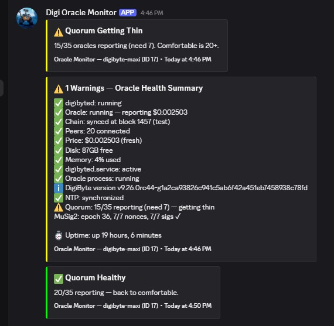
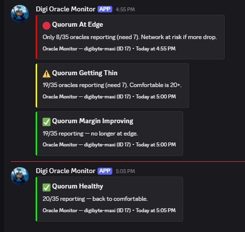

# digidollar-oracle-tools

Operator tools and monitoring scripts for [DigiByte](https://www.digibyte.org/) DigiDollar Oracle nodes.

Maintained by **digibyte-maxi** (Oracle Slot 17) — see contact at the bottom.

---

## What's in this repo

| File | Purpose |
|------|---------|
| [oracle-monitor.sh](oracle-monitor.sh) | Bash health monitor v2.2 — 12 checks (daemon, oracle, chain sync, peers, consensus price, disk, memory, services, version, NTP, quorum margin). Quorum tracking via `getdigidollardeploymentinfo` + `getoracles` with MuSig2 session health. Counts online oracles by heartbeat (stable across round transitions). Anti-flap: cooldown timer + hysteresis buffer prevent alert spam during volatile periods. Discord webhook alerts with red/yellow/green embeds. External config file, `--dry-run` mode, jq-based JSON parsing. State files prevent repeat alerts. |
| [oracle-network-status.sh](oracle-network-status.sh) | Gitter network status bot v1.2 — posts automated oracle network health summaries to the DigiDollar Gitter channel every 12 hours via Matrix API. Reports: fresh heartbeats, quorum health, consensus price, MuSig2 session, BIP9 activation, last bundle signers, software version adoption, stale/offline oracle list. Bot account: `@digidollar-oracle-bot:matrix.org`. |
| [config.template](config.template) | Configuration template for oracle-monitor.sh and oracle-network-status.sh. Copy to `~/.oracle-monitor/config` and set your oracle ID, webhook URL, alert thresholds, quorum margin thresholds, anti-flap settings, and Matrix API credentials for the Gitter bot. Both scripts work without it using built-in defaults. |
| [ORACLE_SETUP_QUICKSTART.md](./ORACLE_SETUP_QUICKSTART.md) | Quick-start checklist for new oracle operators. Covers download, config, key generation, and posting to Gitter. |
| [ORACLE_SETUP_TUTORIAL.md](./ORACLE_SETUP_TUTORIAL.md) | Full step-by-step tutorial for all platforms (Linux, Windows, macOS). Posted by shenger in the DigiDollar Gitter community. |
| [ORACLE_HARDENING_GUIDE.md](ORACLE_HARDENING_GUIDE.md) | VPS security hardening guide — SSH, UFW, Fail2Ban, kernel hardening, systemd. Step-by-step, based on my live oracle setup. |
| [HOME_ORACLE_HARDENING_GUIDE.md](HOME_ORACLE_HARDENING_GUIDE.md) | Home network security hardening guide — Linux, Windows, macOS. Three tiers (Essential, Recommended, Advanced). Covers firewall, port forwarding, NTP, router hardening, UPS, VLANs, WireGuard. Network diagrams: [Tier 1](https://htmlpreview.github.io/?https://github.com/BaumerCrypto/digidollar-oracle-tools/blob/main/network-tier1-essential.html) · [Tier 2](https://htmlpreview.github.io/?https://github.com/BaumerCrypto/digidollar-oracle-tools/blob/main/network-tier2-recommended.html) · [Tier 3](https://htmlpreview.github.io/?https://github.com/BaumerCrypto/digidollar-oracle-tools/blob/main/network-tier3-advanced.html). Community-requested by Aussie Epic. |

More tools will be added as the DigiDollar testnet matures toward mainnet activation.
**Roadmap:** See [open issues](https://github.com/BaumerCrypto/digidollar-oracle-tools/issues) for planned features — mainnet migration, bundle signer detection, cross-platform support, and more.

---

## `oracle-monitor.sh`

### What it checks (every 5 minutes by default)

- `digibyted` daemon process alive
- Oracle is `running` in `listoracle`
- Chain sync (`verificationprogress`)
- Peer count (default min: 3)
- Price freshness (`is_stale` flag on `getoracleprice`)
- Degraded consensus detection (`status` != `ok` on `getoracleprice`)
- Disk space (default min: 5GB free)
- Memory usage
- `digibyted.service` and oracle process status via `listoracle` RPC
- Binary version drift detection
- NTP time synchronization
- **Quorum margin tracking** — counts online oracles via `getoracles true` using `heartbeat_status` (stable across MuSig2 round transitions, matches dashboard's "Online Heartbeats" metric), compares against on-chain quorum threshold from `getdigidollardeploymentinfo`, reports MuSig2 session health. Anti-flap: cooldown timer throttles recovery alerts during volatile periods, hysteresis buffer prevents oscillation at band boundaries (v2.2)

### What it sends

Discord embeds — color-coded:

- 🔴 **Red** — critical (daemon down, oracle stopped, chain stuck, quorum at edge or lost)
- 🟡 **Yellow** — warnings (low peers, low disk, stale price, degraded consensus, NTP desync, quorum getting thin)
- 🟢 **Green** — recovery confirmations (quorum healthy, margin improving)
- 🔵 **Blue** — 12-hour status summary

State files in `~/.oracle-monitor/` prevent the same alert firing every 5 minutes — you get notified once when something breaks and once again when it recovers. Quorum tracking uses a single `quorum_state` file that stores the current band and timestamp, with cooldown and hysteresis to prevent alert flapping during network volatility.

All timestamps inside alerts are in UTC for unambiguous reading across timezones. Discord's footer time auto-converts to each viewer's local time.

### Discord alert examples

**Health summary with quorum tracking and MuSig2 session status:**



**Quorum state transition alerts — red/yellow/green as oracle count changes:**



### Requirements

- Linux (tested on Ubuntu 24.04 LTS)
- DigiByte Core **v9.26.0-rc44** or later (RC45 recommended — uses `listoracle`, `getoracleprice`, `getdigidollardeploymentinfo`, `getoracles` RPCs)
- `jq` (for JSON parsing — install with `sudo apt install jq`)
- `curl`
- A Discord webhook URL — create one at: *Server Settings → Integrations → Webhooks → New Webhook*

### Setup

1. Download the script and config template to your oracle VPS:
```bash
   wget https://raw.githubusercontent.com/BaumerCrypto/digidollar-oracle-tools/main/oracle-monitor.sh
   wget https://raw.githubusercontent.com/BaumerCrypto/digidollar-oracle-tools/main/config.template
   chmod +x oracle-monitor.sh
```

2. Create your config file from the template:
```bash
   mkdir -p ~/.oracle-monitor
   cp config.template ~/.oracle-monitor/config
```

3. Edit the config file with your settings:
```bash
   nano ~/.oracle-monitor/config
```
   Set your Discord webhook URL, oracle ID, and oracle name. For mainnet, change `CLI="digibyte-cli"`.

4. Test with `--dry-run` (runs all checks, prints to terminal, skips Discord):
```bash
   ./oracle-monitor.sh --dry-run
```

5. Test the webhook:
```bash
   ./oracle-monitor.sh --test
```
   You should see a test alert appear in your Discord channel.

6. Test a full health summary:
```bash
   ./oracle-monitor.sh --summary
```

7. Add to cron (`crontab -e`):
```cron
   */5 * * * * $HOME/oracle-monitor.sh 2>/dev/null
   0 */12 * * * $HOME/oracle-monitor.sh --summary 2>/dev/null
```

### Flags

| Flag | What it does |
|------|-------------|
| *(none)* | Normal health check — alerts only on problems or recovery |
| `--summary` | Full status summary — always sends to Discord |
| `--dry-run` | Runs all checks, prints to terminal, skips Discord, no state changes |
| `--test` | Sends a test embed to Discord to verify webhook |

### Configuration options

All thresholds are configurable in `~/.oracle-monitor/config`. The script uses built-in defaults if a value isn't set.

| Setting | Default | Description |
|---------|---------|-------------|
| `DISCORD_WEBHOOK` | *(empty)* | Discord webhook URL for alerts |
| `ORACLE_ID` | `0` | Your oracle slot ID |
| `ORACLE_NAME` | `my-oracle` | Your oracle name (shown in Discord embeds) |
| `CLI` | `digibyte-cli -testnet` | RPC command. Use `digibyte-cli` for mainnet |
| `WALLET_FLAG` | `-rpcwallet=oracle` | Wallet flag for RPC calls |
| `MIN_PEERS` | `3` | Minimum peer count before alerting |
| `MIN_DISK_GB` | `5` | Minimum free disk space (GB) |
| `MEM_THRESHOLD` | `90` | Memory usage % above which to alert |
| `MAX_CHAIN_BEHIND` | `10` | Blocks behind before alerting |
| `QUORUM_GREEN` | `20` | Oracles reporting at/above this = healthy (no alert) |
| `QUORUM_YELLOW` | `12` | Below green but at/above this = "getting thin" warning |
| `QUORUM_COOLDOWN` | `30` | Minutes between quorum recovery alerts. Escalation (worse) always fires immediately. Set to `0` to disable (v2.1+) |
| `QUORUM_HYSTERESIS` | `3` | Recovery buffer — must exceed threshold by this many oracles to recover. Prevents flapping at boundaries. Set to `0` to disable (v2.1+) |

The quorum minimum (`oracle_consensus_required`, currently 7) comes from the chain itself via `getdigidollardeploymentinfo` — it's not configurable. Below that threshold, DigiDollar signing halts regardless of your config settings.

### Quorum alert bands

| Active oracles | Status | Escalation alert | Recovery alert |
|----------------|--------|------------------|----------------|
| 🟢 20+ | Comfortable | — | `✅ Quorum Healthy` |
| 🟡 12–19 | Getting thin | `⚠️ Quorum Getting Thin` | `✅ Quorum Margin Improving` |
| 🔴 7–11 | At quorum edge | `🔴 Quorum At Edge` | `✅ Quorum Recovering` |
| 💀 Below 7 | DD signing halted | `💀 QUORUM LOST` | — |

**Escalation** (dropping into a worse band) fires immediately — no delay. **Recovery** (climbing to a better band) is throttled by cooldown and requires clearing the hysteresis buffer:

| Recovery transition | Without hysteresis | With hysteresis=3 |
|---------------------|--------------------|--------------------|
| 💀→🔴 Critical → Red | 7+ oracles | 10+ oracles |
| 🔴→🟡 Red → Yellow | 12+ oracles | 15+ oracles |
| 🟡→🟢 Yellow → Green | 20+ oracles | 23+ oracles |

`QUORUM_GREEN` (20) and `QUORUM_YELLOW` (12) are configurable in your config file.

### Anti-flap behavior (v2.1+)

During network volatility (e.g. RC44 launch with operators upgrading), the active oracle count can oscillate rapidly around threshold boundaries. Without protection, this causes a flood of Discord alerts every 5 minutes as the count crosses back and forth.

Two configurable anti-flap features:

**Cooldown timer** (`QUORUM_COOLDOWN`, default 30 min) — after any quorum alert fires, recovery alerts are suppressed for this many minutes. Escalation alerts (things getting worse) always fire immediately regardless of cooldown. Default tuned to testnet's ~20-minute oscillation cycle.

**Hysteresis buffer** (`QUORUM_HYSTERESIS`, default 3) — recovery requires exceeding the threshold by this buffer. For example, with `QUORUM_GREEN=20` and `QUORUM_HYSTERESIS=3`, the count must reach 23 before recovering from yellow to green. This creates a dead zone that absorbs oscillation at boundaries. Hysteresis evaluates the count directly against thresholds — a multi-band recovery (e.g. 25/35 from critical) correctly lands on green, while a partial recovery (e.g. 22/35 from critical) correctly lands on yellow.

Both can be set to `0` to disable (reverts to v2.0 behavior).

### Heartbeat-based counting (v2.2)

Prior to v2.2, the monitor counted oracles with `last_price_usd > 0` from `getoracles true`. This metric is volatile — it resets during MuSig2 round transitions (~every 10 minutes), causing the count to temporarily drop to 3–9 even when 24 oracles are online. This triggered false escalation alerts.

v2.2 counts oracles with `heartbeat_status == "fresh"` instead — a signed operator heartbeat that stays valid for 30 minutes. This matches the dashboard's "Online Heartbeats" metric and remains stable across round transitions.

### RPC field-name notes (RC44/RC45)

If you adapt this for a different release, double-check these field names — they have changed between RCs:

| RPC | Field used |
|-----|-----------|
| `listoracle` | `running` *(not `is_running`)* |
| `listoracle` | `price_usd` *(not `last_price_usd`)* |
| `getoracleprice` | `price_usd`, `is_stale`, `status`, `oracle_count` |
| `getdigidollardeploymentinfo` | `oracle_consensus_required`, `oracle_total_slots`, `musig2_session.state`, `musig2_session.epoch`, `musig2_session.nonce_count`, `musig2_session.partial_sig_count` |
| `getoracles true` | `last_price_usd`, `status`, `heartbeat_status` *(v2.2: "fresh" = online within 30 min)*, `heartbeat_age_seconds`, `heartbeat_timestamp`, `software_version` *(used by oracle-network-status.sh)* |
| `getoraclesigners` | `bundle_count`, `bundles[].height`, `bundles[].signer_count`, `bundles[].signer_ids` *(used by oracle-network-status.sh)* |

**RC45 new RPCs** (not used by these scripts yet but available):
| RPC | Purpose |
|-----|---------|
| `exportoracleprivkey` | Export oracle signing key from wallet (wallet-context, usable before activation) |
| `importoracleprivkey` | Import oracle signing key into wallet (wallet-context, usable before activation) |

---

## `oracle-network-status.sh`

Community-facing Gitter bot that posts oracle network health summaries to the [DigiDollar Gitter channel](https://app.gitter.im/#/room/#digidollar:gitter.im) every 12 hours. Unlike `oracle-monitor.sh` (which watches your own node and alerts you privately via Discord), this script monitors the entire oracle network and reports publicly.

### What it reports

- **Fresh Heartbeats** — active oracle count vs roster size, quorum health status (healthy / thin / critical / lost)
- **Consensus price** — current DGB/USD price and oracle price feed status
- **MuSig2 session** — current epoch, signing state, nonce and signature counts
- **BIP9 activation** — deployment status and signaling bit
- **Last bundle** — most recent on-chain price bundle block height and signer count
- **Software versions** — dominant version among active operators (✅ current vs 🔄 outdated during upgrades)
- **Stale oracles** (⚠️) — were running, went down (liveness concern)
- **Not connected oracles** (❌) — never set up or lost oracle key on this testnet

### Example output

```
🟢 Oracle Network Status — 2026-06-16 03:55 UTC

Fresh Heartbeats: 29/35 (quorum healthy — threshold: 7)
Consensus price: $0.00268 (status: active)
MuSig2: epoch 475, complete, 7/7 nonces, 7/7 sigs
BIP9: active (bit 23)
Last bundle: block 19014, signed by 7 oracles
Software: v9.26.0rc45-gabf5633876d1b78f008ca6b35cc9e891664b0609 — 27 operators

⚠️ Stale (2):
  — ID 15 DigiSwarm
  — ID 23 ChozenOne43

❌ Not connected (4):
  — ID 28 DigiHash Mining Pool
  — ID 29 medgboracle3452
  — ID 31 Peer2Peer
  — ID 34 Manu_DGB_oracle
```

### Data sources

| RPC | What it provides |
|-----|-----------------|
| `getoracles true` | Per-oracle heartbeat status — active, stale, and offline lists |
| `getoracleprice` | Consensus price, feed status, oracle count |
| `getdigidollardeploymentinfo` | BIP9 activation, quorum config, MuSig2 session state |
| `getoraclesigners 50` | Recent bundle signer participation (50-block window covers at least one full 40-block round) |

### Requirements

- Linux (tested on Ubuntu 24.04 LTS)
- DigiByte Core **v9.26.0-rc44** or later
- `jq`, `curl`
- A [Matrix](https://matrix.org) bot account joined to `#digidollar:gitter.im`

### Setup

1. Create a Matrix bot account at [Element](https://app.element.io/#/register) (e.g. `@digidollar-oracle-bot:matrix.org`)
2. Join `#digidollar:gitter.im` from the bot account
3. Generate an access token on the VPS:
```bash
curl -s -X POST "https://matrix.org/_matrix/client/v3/login" \
  -H "Content-Type: application/json" \
  -d '{"type":"m.login.password","identifier":{"type":"m.id.user","user":"YOUR_BOT_USERNAME"},"password":"YOUR_PASSWORD"}' \
  | jq -r '.access_token'
```
4. Get the room ID (Element → Room Settings → Advanced → Internal room ID)
5. Add to `~/.oracle-monitor/config`:
```bash
MATRIX_ACCESS_TOKEN="your_token_here"
MATRIX_ROOM_ID="!your_room_id:gitter.im"
```
6. Test: `./oracle-network-status.sh --dry-run`
7. Test: `./oracle-network-status.sh --test`
8. Add to cron: `5 */12 * * * /home/dgboracle/oracle-network-status.sh 2>/dev/null`

### Flags

| Flag | What it does |
|------|-------------|
| *(none)* | Collect data and post to Gitter |
| `--dry-run` | Collect data, print to terminal, skip Gitter post |
| `--test` | Send a test message to Gitter to verify Matrix API |

### Important: single-operator bot

This script is designed for a **single designated community operator** to post to the shared DigiDollar Gitter channel. Running a second instance against the same channel will create duplicate posts. If you want to monitor your own oracle, use `oracle-monitor.sh` with a Discord webhook to your private channel.

---

## Compatibility

| Component | Version |
|-----------|---------|
| OS | Ubuntu 24.04 LTS |
| DigiByte Core | v9.26.0-rc45 (also compatible with rc44) |
| Chain | testnet26 |
| Oracle protocol | v0x03 MuSig2 bundle |
| oracle-monitor.sh | v2.2 |
| oracle-network-status.sh | v1.2 |

If you're running a different release and something breaks, please open an issue.

---

## Contributing

Pull requests welcome. If you spot a bug, run into a field-name change on a newer RC, or want to add a check, open an issue or PR.

---

## Author

**digibyte-maxi** — DigiDollar oracle operator (Slot 17)

- GitHub: [BaumerCrypto](https://github.com/BaumerCrypto) (display name: BaumerCrypto2.0)
- X/Twitter: [@BaumerCrypto2_0](https://x.com/BaumerCrypto2_0)
- Gitter: `digibyte-maxi` in [#digidollar](https://app.gitter.im/#/room/#digidollar:gitter.im)

---

## License

[MIT](LICENSE) — use, fork, modify, share. Credit appreciated but not required.

## Disclaimer

These scripts are provided as-is for the DigiByte community. The DigiDollar protocol is currently in testnet; mainnet activation is pending miner signaling (BIP9 bit 23, window opens June 1, 2026). Always test on testnet first and back up your oracle wallet.
