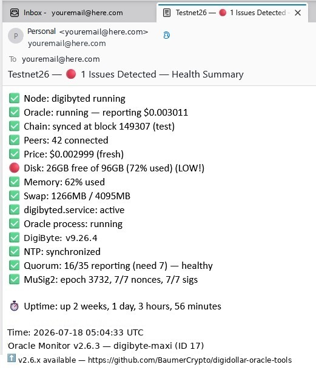
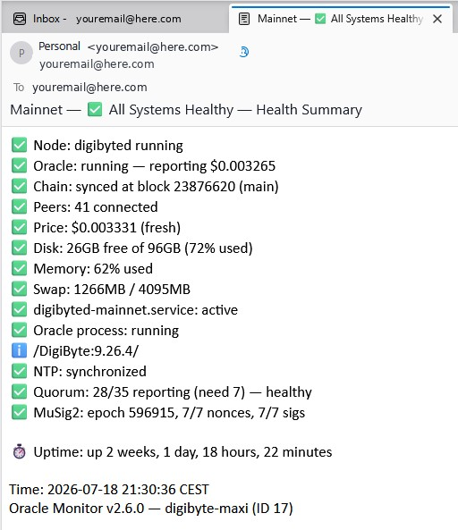
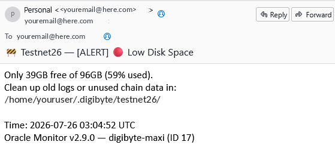
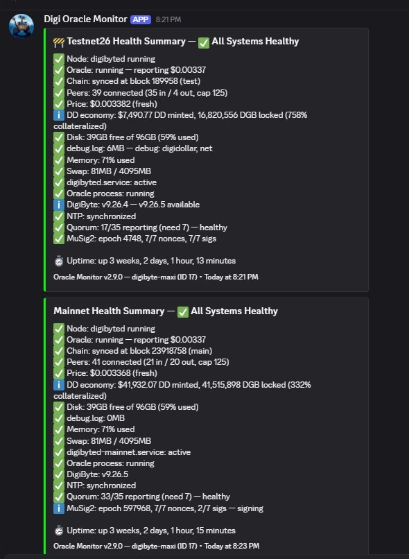
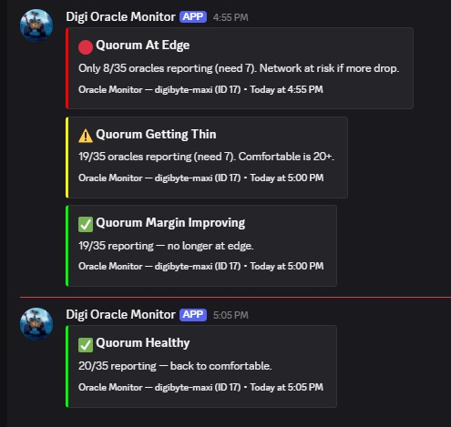
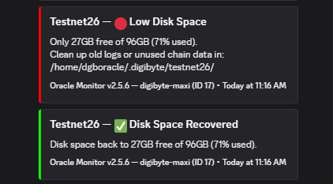

# digidollar-oracle-tools

[](https://github.com/BaumerCrypto/digidollar-oracle-tools/releases/latest)
[](LICENSE)
[](CROSS_PLATFORM_SETUP.md)

Operator tools and monitoring scripts for [DigiByte](https://www.digibyte.org/) DigiDollar Oracle nodes.

Maintained by **digibyte-maxi** (Oracle Slot 17), see contact at the bottom.

> 🚀 **DigiDollar is live on mainnet.** The deployment activated at block **23,869,440** on **2026-07-17**. These tools monitor both mainnet and testnet26 oracles; everything below applies to both chains unless noted.

---

## In production

These aren't demo scripts. This is the monitoring I run on my own oracle (Slot 17), which has been signing on DigiByte mainnet since the 2026-07-17 activation (block 23,869,440) and on testnet26 alongside it:

- [`oracle-network-status.sh`](oracle-network-status.sh) is the shared network-status bot for the DigiDollar community, posting health summaries to [`#digidollar:gitter.im`](https://app.gitter.im/#/room/#digidollar:gitter.im), one instance covering mainnet + testnet for the whole room.
- [`oracle-monitor.sh`](oracle-monitor.sh) and its Windows and macOS ports run on operator boxes across all three platforms, giving each operator private Discord + email alerts for their own node.
- The hardening guides come straight from my live VPS setup, reboot-verified and soak-tested with multiple concurrent daemons.

Beyond the tooling, I've taken part in the DigiDollar launch discussions with the core developers, including the frozen-roster launch strategy and oracle-roster mechanics.

---

## What's in this repo

| File | Purpose |
|------|---------|
| [oracle-monitor.sh](oracle-monitor.sh) | Bash health monitor v2.9.0, 13 checks (daemon, oracle, chain sync, peers, consensus price, disk, **debug.log growth**, memory, swap pressure, service status, version, NTP, quorum margin). Dual-channel alerts: **Discord webhook + email** (v2.6.0, closes #17) fire on the same red/yellow/green triggers plus the 12-hour summary. Email via `curl` SMTP (built into stock Ubuntu, no mailx/postfix/sendmail), config-driven with `EMAIL_ENABLED`, `EMAIL_TO`, `SMTP_SERVER/PORT/USER/PASS/FROM`, subjects prefixed with `[ALERT]`/`[WARNING]`/`[RESOLVED]`/`[INFO]` plus `NETWORK_LABEL`, `--test-email` flag with inline diagnostics. **Auto update-check** (v2.6.0) fetches the published script header from GitHub main once per day, silently adds a `⬆️ vX.Y.Z available` footer line to every Discord card and email when a newer version exists. Quorum tracking via `getdigidollardeploymentinfo` + `getoracles` with MuSig2 session health. Counts online oracles by heartbeat (stable across round transitions). Anti-flap: cooldown timer + hysteresis buffer prevent alert spam during volatile periods. `--config /path` for dual-instance monitoring (testnet + mainnet). DigiDollar BIP9 pre-activation guard downgrades oracle checks to standby INFO before activation. Auto-detects either `digibyted` (headless) or `digibyte-qt` (Qt wallet) so operators running either binary get correct alerts. Card titles carry `NETWORK_LABEL`, footer stamps monitor version + oracle identity. Disk line shows free/total/used%; the Low Disk alert names your configurable `DATADIR` so you know exactly where to clean up (v2.5.5). MuSig2 line carries its own ✅/ℹ️/⚠️ status icon for visual consistency (v2.5.6); v2.6.1 double-spaces every ⚠️/ℹ️ prefix so terminal alignment stays clean across emoji-width handling. v2.6.2 cleans up the version line (`ℹ️  DigiByte: v9.26.4` instead of `ℹ️  /DigiByte:9.26.4/`), switches the email `Time:` line to UTC for operators on VPS in different timezones than their home, and pressure-gates the swap alert so a stale swap fill left over from a past reindex no longer fires a false red (only alerts on real current pressure via Linux PSI or a RAM-headroom threshold). v2.6.3 makes the version line update-aware, ✅ green when running the latest DigiByte Core release, ℹ️ blue `— vX.Y.Z available` when a newer release is out (GitHub `releases/latest`, cached daily), and adds a `SERVICE_NAME="none"` escape hatch for operators running headless without systemd. **v2.7.0 disk-safety net:** a debug.log watchdog (Check 13) that names enabled debug categories in the alert via the `logging` RPC, safe copy-then-truncate auto-rotation (default ON, announced on every rotation, skipped when free space can't hold the safety copy), a yellow disk-usage band ahead of the red floor (closes #33), and `PRICE_CHECK_EVERY` to thin the loudest RPC, plus dual-shape parsing so the monitor is **v9.26.5-ready**. **v2.9.0:** a DigiDollar economy line on the health summary (`DD economy: $40,932.07 DD minted, 40,461,618 DGB locked (332% collateralized)`, #40) sourced from `getdigidollarstats`, information only and summary-card only; plus the summary title now leads with `NETWORK_LABEL` like every other card does (#41), with an optional `NETWORK_EMOJI` for operators who want one instance visually flagged. **v2.10.0:** a chain-vs-label mismatch warning (#43) that catches a `CLI` pointed at the wrong daemon, an `SPDX-License-Identifier` header, and log-rotation coexistence guidance. External config file, `--dry-run` mode, jq-based JSON parsing. State files prevent repeat alerts. |
| [oracle-network-status.sh](oracle-network-status.sh) | Gitter network status bot v1.7.2, posts automated oracle network health summaries to the DigiDollar Gitter channel every 12 hours via Matrix API. **v9.26.5-ready:** the BIP90 burial reshapes both deployment RPCs, and v1.7.x reads the buried forms for activation height and status. Software rows sort ascending by version within each compliance tier. See file for full description. |
| [oracle-roster.template](oracle-roster.template) | Template for the oracle-to-Gitter-handle mapping file used by the @ mention feature. Copy to `~/.oracle-monitor/oracle-roster.conf` and populate with real Matrix IDs. The populated file stays on VPS only, never push to GitHub. |
| [config.template](config.template) | Configuration template for oracle-monitor.sh and oracle-network-status.sh. Copy to `~/.oracle-monitor/config` and set your oracle ID, webhook URL, alert thresholds, quorum margin thresholds, anti-flap settings, network label, and Matrix API credentials for the Gitter bot. v2.6.0 additions: email SMTP settings (Gmail App Password, Outlook, Brevo relay examples), update-check toggle + TTL. v2.7.0 additions: the disk/debug.log safety knobs (`DISK_USED_PCT_WARN`, `DEBUG_LOG_WARN_MB`, `DEBUG_LOG_ROTATE`, `DEBUG_LOG_MAX_MB`, `DEBUG_LOG_KEEP`, `PRICE_CHECK_EVERY`). v2.9.0 additions: `DD_ECONOMY_ENABLED`, `NETWORK_EMOJI`, and rewritten dual-instance `CLI` guidance (#42). v2.10.0: the `DEBUG_LOG_ROTATE` block now documents both legitimate reasons to turn rotation off, and the cadence rule for coexisting with an external log rotator. |
| [ORACLE_SETUP_QUICKSTART.md](./ORACLE_SETUP_QUICKSTART.md) | Quick-start checklist for new oracle operators. Covers download, config, key generation, and posting to Gitter. |
| [ORACLE_SETUP_TUTORIAL.md](./ORACLE_SETUP_TUTORIAL.md) | Full step-by-step tutorial for all platforms (Linux, Windows, macOS). Posted by shenger in the DigiDollar Gitter community. |
| [ORACLE_HARDENING_GUIDE.md](ORACLE_HARDENING_GUIDE.md) | VPS security hardening guide v1.5.0, SSH, UFW, Fail2Ban, kernel hardening, systemd, resource isolation and OOM protection, plus **new in v1.5.0:** a full `debug.log` growth/rotation section (why `debug=digidollar` silently disables the daemon's auto-shrink, measured growth rates, safe rotation and `logrotate copytruncate` recipes) and hardware sizing (RAM floors, pruning does not reduce daemon RAM; pruned-vs-full disk footprints). Step-by-step, based on my live oracle setup. |
| [HOME_ORACLE_HARDENING_GUIDE.md](HOME_ORACLE_HARDENING_GUIDE.md) | Home network security hardening guide, Linux, Windows, macOS. Three tiers (Essential, Recommended, Advanced). Covers firewall, port forwarding, NTP, router hardening, UPS, VLANs, WireGuard. Network diagrams: [Tier 1](https://htmlpreview.github.io/?https://github.com/BaumerCrypto/digidollar-oracle-tools/blob/main/network-tier1-essential.html) · [Tier 2](https://htmlpreview.github.io/?https://github.com/BaumerCrypto/digidollar-oracle-tools/blob/main/network-tier2-recommended.html) · [Tier 3](https://htmlpreview.github.io/?https://github.com/BaumerCrypto/digidollar-oracle-tools/blob/main/network-tier3-advanced.html). Community-requested by Aussie Epic. |
| [oracle-monitor.ps1](oracle-monitor.ps1) | Windows PowerShell port v2.10.0-win.1, full logic parity with Linux v2.10.0, including the v2.7.0 disk-safety net (debug.log watchdog, safe auto-rotation with a documented Windows file-lock divergence, disk warning band, `PRICE_CHECK_EVERY`), the v2.6.0 email + auto update-check features, the v2.6.1 cosmetic spacing fix, the v2.6.2 version-line cleanup + UTC email timestamp + pressure-gated swap alert, and the v2.6.3 update-aware DigiByte version line + `SERVICE_NAME="none"` escape hatch. PS 5.1 and PS 7 compatible, zero external dependencies (native JSON parsing, .NET's built-in `System.Net.Mail.SmtpClient` for email). Includes watch mode (`-Watch`), `-Config` for dual-instance monitoring, and `-TestEmail` for SMTP diagnostics. Ships UTF-8 with BOM. |
| [config.template.ps1](config.template.ps1) | Windows configuration template for oracle-monitor.ps1. v2.6.0-win.1: email + update-check sections mirror the Linux template. |
| [oracle-monitor-macos.sh](oracle-monitor-macos.sh) | macOS port v2.10.0-macos.1, stock bash 3.2 compatible, jq is the only dependency (curl SMTP support ships with modern macOS). Full logic parity with Linux v2.10.0 (v2.7.0 disk-safety net with BSD-native idioms, `stat -f%z`, `df -m`, `: >` in place of `truncate(1)`; v2.6.0 email + update-check + v2.6.1 spacing fix + v2.6.2 version-line cleanup + UTC email timestamp + pressure-gated swap alert + v2.6.3 update-aware version line + `LAUNCHD_LABEL="none"` escape hatch). Includes watch mode (`--watch`), `--config` for dual-instance monitoring, and `--test-email` for SMTP diagnostics. |
| [config-macos.template](config-macos.template) | macOS configuration template for oracle-monitor-macos.sh. v2.6.0-macos.1: email + update-check sections mirror the Linux template. |
| [CROSS_PLATFORM_SETUP.md](CROSS_PLATFORM_SETUP.md) | Setup guide for Windows and macOS ports, installation, config, Task Scheduler/cron, watch mode, email SMTP setup per platform, troubleshooting. |

### Testing

The Windows and macOS ports ship with parallel isolated test harnesses for verifying `check_daemon` + `check_services` behavior on your box before scheduling the monitor. Nine scenarios each, auto-detect for headless vs Qt, override honored, service check appropriately skipped when Qt is the running daemon, and so on.

| Harness | Purpose |
|------|---------|
| [test-macos-daemon-services.sh](test-macos-daemon-services.sh) | Mocks pgrep, launchctl, and `$CLI`, runs 9 scenarios in isolation. Verifies parity with the Linux logic before you point the monitor at a live oracle. |
| [test-win-daemon-services.ps1](test-win-daemon-services.ps1) | Mocks Get-Process, Get-Service, and Invoke-DGBCli, runs 9 scenarios under Windows PowerShell 5.1 or 7. Verifies PS-specific behavior including auto-detect candidate loop and Windows Service Qt-skip. Ships UTF-8 with BOM. |

Neither harness sends Discord alerts, touches state files, or runs against a real node, they're safe to run on any box, even without DigiByte installed.

More tools will be added as the DigiDollar testnet matures toward mainnet activation.
**Roadmap:** See [open issues](https://github.com/BaumerCrypto/digidollar-oracle-tools/issues) for planned features, bundle signer detection, oracle deselection alerts, price deviation alerts, and more.

---

## Platform support

The monitor runs natively on all three major platforms. Same 13 checks, same DigiDollar BIP9 pre-activation guard, same quorum state machine, same anti-flap logic, same Qt/headless auto-detect, same Discord card format, and, as of v2.6.0, the same dual-channel email + Discord alerts and the same daily update-check. Only the platform plumbing underneath differs.

| Platform | Script | Config template | Version |
|---|---|---|---|
| Linux | [`oracle-monitor.sh`](oracle-monitor.sh) | [`config.template`](config.template) | 2.10.0 |
| Windows 10/11 | [`oracle-monitor.ps1`](oracle-monitor.ps1) | [`config.template.ps1`](config.template.ps1) | 2.10.0-win.1 |
| macOS | [`oracle-monitor-macos.sh`](oracle-monitor-macos.sh) | [`config-macos.template`](config-macos.template) | 2.10.0-macos.1 |

Windows needs no dependencies at all (PowerShell parses JSON natively; .NET's built-in `SmtpClient` handles email). macOS needs only jq and runs on the stock bash 3.2 every Mac ships with (curl SMTP support ships with modern macOS). Setup for both is in [`CROSS_PLATFORM_SETUP.md`](CROSS_PLATFORM_SETUP.md). The rest of this README documents the Linux version; the ports behave identically.

---

## `oracle-monitor.sh`

### What it checks (every 5 minutes by default)

- `digibyted` daemon process alive (auto-detects headless `digibyted` or Qt wallet `digibyte-qt`, configurable via `DAEMON_PROCESS` override)
- Oracle is `running` in `listoracle`
- Chain sync (`blocks` vs `headers` from `getblockchaininfo`, alerts when the node falls more than `MAX_CHAIN_BEHIND` blocks behind)
- Peer count (default min: 3), the line shows the inbound/outbound split and your connection cap: `Peers: 41 connected (34 in / 7 out, cap 125)`. `connections_in` is what serves wallets; as it approaches the cap the node starts accepting-then-evicting new wallets, so this makes saturation visible at a glance (v2.8.0). Display-only, the alert threshold is still on total peers. Raising `maxconnections` is the lever if you're saturated, but budget ~1-2 MB RAM per peer before doing so; over-raising it on an underpowered box can OOM the daemon, which is far worse than a full connection table.
- Price freshness (`is_stale` flag on `getoracleprice`), gate with `PRICE_CHECK_EVERY` to run this on every Nth pass (v2.7.0)
- Degraded consensus detection (`status` != `ok` on `getoracleprice`)
- Disk space, free, total, and used% (default min: 5GB free); the Low Disk alert names your `DATADIR` on its own line so you know exactly where to clean up (v2.5.5). **v2.7.0** adds a yellow warning band at `DISK_USED_PCT_WARN` (default 80% used) so you get a calm heads-up long before the red floor
- **debug.log size + growth (v2.7.0, Check 13)**, tracks the daemon's `debug.log` size and MB/day, and names any enabled debug categories (via the `logging` RPC) right in the alert. Paired with safe auto-rotation (default ON) that bounds the file without losing history. Full detail in the [v2.7.0 section](#v270-the-disk-safety-release) below
- Memory usage
- **Swap pressure**, alerts when swap usage exceeds threshold (default 100 MB). On a properly tuned box with `swappiness=10`, any meaningful swap usage signals real memory pressure before things get critical (v2.4)
- `digibyted.service` and oracle process status via `listoracle` RPC, systemd unit check auto-skips with an INFO line when the Qt wallet is the running daemon (Qt operators typically run outside systemd)
- Binary version drift detection via RPC (`getnetworkinfo` → `.subversion`), works identically for Qt and headless (v2.5)
- NTP time synchronization
- **Quorum margin tracking**, counts online oracles via `getoracles true` using `heartbeat_status` (stable across MuSig2 round transitions, matches dashboard's "Online Heartbeats" metric), compares against on-chain quorum threshold from `getdigidollardeploymentinfo`, reports MuSig2 session health. Anti-flap: cooldown timer throttles recovery alerts during volatile periods, hysteresis buffer prevents oscillation at band boundaries

### v2.6.0: email notifications + auto update-check

**Email notifications (closes #17).** Every red/yellow/green state change and the 12-hour summary now fires on Discord AND email, off the same triggers. Off by default, flip `EMAIL_ENABLED=true` in your config and set `EMAIL_TO`/`SMTP_SERVER`/`SMTP_PORT`/`SMTP_USER`/`SMTP_PASS`/`SMTP_FROM`. Sends via `curl`'s built-in SMTP (no `mailx`, no `postfix`, no `sendmail`, stock Ubuntu ships SMTP-capable curl). Subjects carry the severity (`[ALERT]`/`[WARNING]`/`[RESOLVED]`/`[INFO]`) so inbox scanning works without opening cards, and the `NETWORK_LABEL` prefix (dual-instance parity with the v2.5.3 Discord titles) means testnet + mainnet emails from one VPS never look ambiguous. Port 587 STARTTLS by default (Gmail/Outlook/Brevo), port 465 implicit TLS supported for legacy setups.

Two setup notes. Gmail requires an App Password (2FA → App passwords, never your account password). And if your email provider blocks SMTP submission from datacenter or VPS IPs, route through an SMTP relay. Big telco and ISP email providers (Rogers, Telus, AT&T, Verizon, T-Mobile, and the like) commonly reject a VPS IP with `535 5.7.0 "Authentication disabled due to threshold limitation"` even when your credentials are correct, because the block is IP-based, not password-based. **Brevo is the relay I recommend** (free tier 300/day, IP-lockable keys, STARTTLS on 587, and it's what runs in production on my own VPS); Mailjet and SendGrid are equivalent alternatives. Full per-platform setup, including the exact Brevo walkthrough, is in [`CROSS_PLATFORM_SETUP.md`](CROSS_PLATFORM_SETUP.md).

New flag: `./oracle-monitor.sh --test-email` verifies your SMTP settings with inline diagnostics for the common failure modes (wrong App Password, wrong port, ISP block, missing curl SMTP support).

**Auto update-check.** The monitor now fetches its own published header from `raw.githubusercontent.com/BaumerCrypto/digidollar-oracle-tools/main/oracle-monitor.sh` once per day (per instance, cached in `STATE_DIR`), compares the published `SCRIPT_VERSION` against what's running, and, when a newer version exists, adds a second footer line to every Discord card and email: `⬆️ vX.Y.Z available — https://github.com/BaumerCrypto/digidollar-oracle-tools`. Silent on every failure mode (no curl, timeout, offline, parse fail): the footer stays one line and the monitor itself is completely unaffected. Set `UPDATE_CHECK="no"` to disable. Never fetches and never writes the cache in `--dry-run` (v2.5.4 dry-run-touches-nothing discipline).

**v2.6.1 cosmetic fix (caught by Aussie Epic).** ⚠️ (U+26A0 + VS16) and ℹ️ (U+2139 + VS16) render as single-width text glyphs in most terminals, the VS16 selector requests emoji presentation but is honored inconsistently, while ✅ 🔴 💀 render as double-width emoji. Net effect in the health summary: every ⚠️/ℹ️ line's label sat one column left of the ✅/🔴 line labels, giving the summary a subtle "some lines look squished" appearance. Every ⚠️ and ℹ️ prefix now carries a second space so all status lines line up at the same column regardless of the terminal's emoji-width handling. No logic change; purely how the terminal `--dry-run` and `--watch` output renders. Discord and email are visually unaffected (both render these as full-width emoji so the extra space just reads as padding). Shipped cross-platform as `2.6.1` / `2.6.1-win.1` / `2.6.1-macos.1`.

**v2.6.2 three operator-suggested fixes (two cosmetic, one alert-logic).** First: the node version line in every health summary now reads `ℹ️  DigiByte: v9.26.4` instead of `ℹ️  /DigiByte:9.26.4/`. `getnetworkinfo → .subversion` returns the bitcoin-legacy `/Name:Version/` user-agent format, the slashes matter to network peers as a message-boundary marker but are noise to operators reading a health card. `check_version` now strips the wrapper via a single sed pass (regex-transform in PowerShell), matching the format `oracle-network-status.sh` has always used in its Gitter Software section. RC builds and hash suffixes come through cleanly (`/DigiByte:9.26.0rc46/` → `DigiByte: v9.26.0rc46`). Second: the `Time:` line in the email body now uses UTC (`date -u` on Linux/macOS, `(Get-Date).ToUniversalTime()` in PowerShell) instead of the VPS-local timezone. Matches Discord card timestamps (which have always used the ISO-8601 embed timestamp field that Discord renders to viewer-local automatically). Operators running a VPS in a different timezone from their home, very common, no longer need to mentally convert CEST/PST/AEST to their local clock when scanning the email. No config change; automatic.

Third (caught by Aussie Epic): **the swap alert is now pressure-gated, fixing a false positive.** A filled swap is not the same as memory pressure. After a `-reindex`, or any heavy transient, the kernel can page several GB out to swap and never page it back in; the fill just sits there, stale, long after the pressure ended. On a node upgraded from 16GB to 32GB RAM this produced a permanent red swap alert while RAM sat at 40% used and nothing was actually stalling. When swap is filled, `check_swap` now gates the alert on *current* pressure using two independent signals, either one firing raises the alert: **Linux PSI** (`/proc/pressure/memory` "some avg10" > `PSI_SWAP_THRESHOLD`, the kernel's real stall-time meter) or **RAM headroom** (RAM usage ≥ `SWAP_MEM_HEADROOM_PCT`). macOS and Windows have no PSI, so they use the RAM-headroom signal alone. If both signals are quiet the fill is shown as an informational `ℹ️  Swap: … (stale — RAM 40%, PSI 0.00)` line, not a warning, and it no longer inflates the warning count. If neither signal can be measured the monitor fails safe and alerts exactly as it did before. Two new config keys (`SWAP_MEM_HEADROOM_PCT`, default 70; `PSI_SWAP_THRESHOLD`, default 5.0) let operators tune it; real memory pressure still alerts exactly as in v2.4. Shipped cross-platform as `2.6.2` / `2.6.2-win.1` / `2.6.2-macos.1`.

**v2.6.3 two operator-suggested additions.** First: **the DigiByte version line is now update-aware.** Until now the node-version line always rendered as a blue `ℹ️` regardless of whether the running version was current, because the monitor never asked GitHub what the latest DigiByte Core release was. Now `check_version` compares the running version against the latest release (GitHub `releases/latest`, cached once per day per instance) and colours the icon: `✅ DigiByte: v9.26.4` when you're on the latest release (or newer, an RC ahead of the last release stays green), and `ℹ️  DigiByte: v9.26.3 — v9.26.4 available` when a newer release is out. It falls back to the plain blue line when GitHub is unreachable or the check is disabled, and, because this runs inside a health check that also executes under `--dry-run`, it never fetches or writes its cache during a dry run. `releases/latest` only ever points at a real (non-prerelease) release, so operators are never nudged toward an RC. New config keys `DIGIBYTE_UPDATE_CHECK` (default `"yes"`) and `DIGIBYTE_UPDATE_TTL` (default 86400) on all three platforms. Second: **`SERVICE_NAME="none"` escape hatch.** Operators who deliberately run headless *without* a service manager (tmux/screen, Docker, runit, a hand-started `digibyted -daemon`) can set `SERVICE_NAME="none"` (also `"skip"`/`"disabled"`) so the service/systemd check reports an informational `ℹ️  Systemd: check disabled` line instead of a red on a unit that isn't there, the node and oracle-process checks still run. On macOS the parity twin is `LAUNCHD_LABEL="none"`. Shipped cross-platform as `2.6.3` / `2.6.3-win.1` / `2.6.3-macos.1`.

### v2.7.0: the disk-safety release

My own testnet26 `debug.log` quietly reached **15 GB** before anything complained, on a hardened, monitored box. Nothing was broken; three defaults were stacked against me, and anyone who followed the early oracle setup docs has the same stack. First, enabling any debug category, and the docs said `debug=digidollar`, silently disables the daemon's automatic startup log-shrink (`-shrinkdebugfile` defaults to on *unless* `-debug` is set). Second, oracle boxes are exactly the machines that never restart, so the one built-in bound never fires. Third, `getoracleprice` logs **one category-gated line per block of the 24-hour price window**, about 5,760 blocks, so 4,780-5,800 lines per call depending on the cache-miss rate, so a monitor calling it every 5 minutes multiplies the growth. Measured on my box, same monitor: **~374 MB/day** with `digidollar`+`net` enabled versus **~8 MB/day** on default logging.

This is driven by your *config*, not the network: a mainnet daemon with `debug=digidollar` set grows just as fast, and a testnet daemon on default logging stays small. The alert's category list is how you tell which case you're in, if it names a category and you're not actively debugging, that daemon is filling its disk for nothing, on either network.

**1. debug.log watchdog (Check 13).** Tracks size and growth-per-day, and names any enabled debug categories via the `logging` RPC right in the yellow alert, "disk is filling" becomes "here's why, and the one-line fix". New knob: `DEBUG_LOG_WARN_MB` (1024).

**2. Safe auto-rotation, DEFAULT ON. This is a behavior change.** At `DEBUG_LOG_MAX_MB` (2048) the monitor copies `debug.log` to `debug.log.1` and truncates the live file **in place**, the daemon keeps writing, no restart, and no `rm`/`mv` (which leak the space until restart because the daemon holds the file open). Evidence rules throughout: copy first and never truncate if the copy failed; nothing is lost until a *second* rotation overwrites `.1`, so ~4 GB of the newest history is always on disk at defaults; every rotation posts a blue card, never silent; rotation is skipped with a red card when free space can't hold the safety copy; and `--dry-run` touches nothing. Set `DEBUG_LOG_ROTATE="no"` if you're actively capturing logs for a developer. `DEBUG_LOG_KEEP` (1) controls retained copies, `0` is treated as `1`, because truncate-without-copy is exactly the evidence destruction this design forbids. Platform note: macOS ships no `truncate(1)` so the macOS port uses `: >` (identical primitive); on Windows, if the daemon holds an exclusive lock the monitor keeps the safety copy, posts one yellow card naming the durable fix (`shrinkdebugfile=1` + restart), and stops re-attempting.

The two cards below are the whole arc on one testnet oracle: the yellow watchdog warning as the log crosses `DEBUG_LOG_WARN_MB`, naming the enabled categories and linking straight to the guide, then the blue rotation card hours later when it hits `DEBUG_LOG_MAX_MB`, copied to `debug.log.1`, truncated in place, daemon never restarted.


**3. Disk usage warning band (closes #33).** Yellow at `DISK_USED_PCT_WARN` (80% used) while `MIN_DISK_GB` stays the red floor. My June→July crawl from 67%→72% used produced zero honest warnings, the only alert that fired was a misconfigured threshold doing accidental duty. Now the calm heads-up exists, with a green recovery when usage drops back under the band.

**4. `PRICE_CHECK_EVERY` (1).** Runs the `getoracleprice` freshness check on every Nth pass instead of all of them, the knob for small-VPS operators to cut the loudest log source to 1/N without losing daemon, disk, or quorum detection. Default 1 = every pass, exactly the pre-2.7.0 behavior; `--summary` always checks.

**5. v9.26.5-ready.** That release buries the DigiDollar deployment (BIP90) and reshapes `getdigidollardeploymentinfo`, the BIP9 signaling fields give way to a `{type:"buried", status, activation_height}` form. v2.7.0 parses **both** shapes, so daemon and monitor can be upgraded in either order.

Full background, the measured growth table, why `rm` on a live log makes things worse, weekly cron and `logrotate copytruncate` recipes, and hardware sizing, is in [`ORACLE_HARDENING_GUIDE.md`](ORACLE_HARDENING_GUIDE.md#debuglog-growth-rotation-and-the-disappearing-disk) (v1.5.0). Shipped cross-platform as `2.7.0` / `2.7.0-win.1` / `2.7.0-macos.1`. **v2.7.1** follows up with one fix: the debug.log alert used to end with a bare filename that Discord and email clients won't linkify, so it now carries the full anchor URL and lands you on the right section of the guide. Shipped as `2.7.1` / `2.7.1-win.1` / `2.7.1-macos.1`.

**v2.7.1-win.2 (Windows only)** landed shortly after: a critical parse fix for PowerShell 5.1. `Check-Quorum` normalized the roster with `@($raw | ConvertFrom-Json)`, but PS 5.1 writes a JSON array to the pipeline as a single non-enumerated object, so `@()` wrapped all 35 oracles as *one* element. The `heartbeat_status` check then failed, the roster-count fallback engaged, and a fully healthy 35/35 network reported `1/35 reporting (need 7) — CRITICAL`. Assigning the parse result to a variable before normalizing fixes it on both PS 5.1 and PS 7. Latent since v2.2-win.1 and masked pre-activation by the empty roster; it affected every PS 5.1 operator once the roster populated. Linux and macOS were never affected, they parse with jq. Caught by DigiByte on mainnet post-activation ([#38](https://github.com/BaumerCrypto/digidollar-oracle-tools/issues/38)).

### v2.9.0: DigiDollar economy line + clearer instance labels

**DD economy line (#40).** Requested in the DigiDollar Gitter room. The health summary gains one line under Price:

```
ℹ️  DD economy: $40,932.07 DD minted, 40,461,618 DGB locked (332% collateralized)
```

Same wording the Gitter status bot has used since v1.6.4, so the two tools share a vocabulary. Read from `getdigidollarstats`: `total_dd_supply` (which carries **cents**, not dollars), `total_collateral_dgb`, and `health_percentage`. The field map is identical on v9.26.4 and v9.26.5, so the BIP90 burial did not move these the way it moved `.since` in the deployment RPCs.

It is deliberately **not** a numbered check. It never alerts, never counts toward the warning or issue totals, and never changes the card colour, so an all-green card stays all-green. It also runs on the **health summary only**, never the 5-minute passes: those post single-purpose alert cards with no status block, and a network-wide total under a "Node Down" card is noise at the exact moment you want signal. That also keeps the RPC at two calls a day per instance rather than 288. Measured at 11ms and one to two `debug.log` lines per call on a chain with 23.9 million blocks, so it needs no `PRICE_CHECK_EVERY`-style gate. Every failure path omits the line rather than guessing: a missing RPC, a parse failure, a renamed field, or a non-numeric value all render nothing, and a chain where DigiDollar has not activated shows a standby line. Set `DD_ECONOMY_ENABLED="no"` to skip the call entirely. Idea credit to Bastian for the original bot-side line.

**Instance labels you can actually tell apart (#41).** Operators running two instances reported they could not distinguish a testnet card from a mainnet card in the same channel. The cause was a gap left over from v2.5.3: that release added `NETWORK_LABEL` to alert titles and email subjects through the two send chokepoints, but `send_summary` builds its own title and buried the label mid-string. Two healthy cards therefore opened with an identical run of characters and differed by one word in the middle.

The summary title now leads with the label, matching every other card and every email:

```
Testnet26 Health Summary — ⚠️  1 Warning
Mainnet Health Summary — ✅ All Systems Healthy
```

Status moves to the tail, where the embed border colour already carries it. Optional `NETWORK_EMOJI` (empty by default, so nothing changes unless you set it) prefixes the label everywhere. Marking only the exception is usually enough: leave your production instance unset so its cards look exactly as they always have, and flag the test one with `NETWORK_EMOJI="🚧"`. Internally the label and emoji are combined once into a single derived value at config load, which is what keeps the emoji from doubling up on the email path.

### v2.10.0: chain/label mismatch warning + log-rotation coexistence

`NETWORK_LABEL` was free text the monitor took entirely on trust. If your `CLI` line
resolves to the wrong daemon you get a card titled "Mainnet Health Summary" reporting
testnet block heights, quorum and prices, and nothing errors. The only tell was the
chain name already printed on the Chain line, sitting beside a green checkmark where
nobody looks for a contradiction. Issue #42 fixed the documentation side in v2.9.0;
this is the runtime check that catches it either way.

`check_chain` now compares the two and adds a second line when they clearly disagree:

```
✅ Chain: synced at block 178878 (test)
⚠️  Label/chain mismatch: label "Mainnet", node reports (test). Check CLI in your config.
```

It is a second line rather than a recoloured Chain line because the node really is
synced, and "your label is wrong" is a separate claim that also has to hold when the
node is behind. One yellow alert fires, latched, so a persistent misconfiguration
alerts once instead of every five minutes and clears green when you fix the config.

The comparison is deliberately lenient, because a false warning here would be worse
than the silence it replaces: it would fire on correctly configured boxes and teach
operators to ignore the line. The chain value is matched exactly, so `regtest` never
collides with the substring `test`. Only the label is matched loosely, and it has to
clearly name a chain to be judged at all. `Testnet26`, `Main Net Oracle` and
`my-mainnet-box` all match; `Primary domain oracle`, `Latest net`, `Main Oracle Box`,
a label naming both chains, and an empty label are all left alone. There is no config
toggle, because the check costs nothing at runtime and a label that names no chain
already opts out.

**Log-rotation coexistence, raised by Aussie Epic.** The `DEBUG_LOG_ROTATE="no"`
guidance named developer log capture as the only reason to turn rotation off, when
coexisting with logrotate is an equally valid one. His own config then showed the real
hazard is cadence rather than tidiness: logrotate at `size 2048M rotate 5` against the
monitor's `DEBUG_LOG_MAX_MB` default of 2048 is the same threshold, but the monitor
checks every five minutes while logrotate runs once a day. The monitor gets there
first and truncates to zero, so logrotate never sees a file big enough to rotate and
`rotate 5` never builds up. One generation on disk while the operator believes there
are five, with nothing erroring and nothing warning. All three config templates and
the [hardening guide](ORACLE_HARDENING_GUIDE.md#running-logrotate-and-the-monitor-together-the-cadence-trap) now carry the rule: a faster checker resets the
condition a slower one is waiting for, so only one tool should own rotation.

All three scripts also gained an `SPDX-License-Identifier: MIT` header line, so the
licence travels with any single-file copy. Shipped cross-platform as `2.10.0` /
`2.10.0-win.1` / `2.10.0-macos.1`.

### Email alert examples

**Testnet26 Health Summary, red status with an issue detected, and the instance flagged with `NETWORK_EMOJI`:**



The subject reads `🚧 Testnet26 — 🔴 1 Issue Detected — Health Summary`. The label and its optional glyph are applied once, at the `send_email` chokepoint, so a dual-instance operator can sort testnet from mainnet in an inbox list without opening anything (v2.9.0, #41).

**Mainnet Health Summary, green all-clear with live post-activation oracle data:**



Mainnet is deliberately left without a `NETWORK_EMOJI`, so production subjects stay exactly as they have always looked. Both summaries carry the DD economy line under Price (v2.9.0, #40), and the two show entirely separate DigiDollar economies because they are two different chains.

**Individual Low Disk alert, showing the severity tag and the datadir call-out:**



This is the shape of an individual alert rather than a summary, and it is where the severity tag shows up: `[ALERT]` sits in the subject line so inbox scanning works without opening anything. The body names your configured `DATADIR` on its own line (v2.5.5), so the message tells you where to go clean up instead of leaving you to guess. Health summaries do not carry a severity tag, only the individual alerts do.

All three carry the `NETWORK_LABEL` subject prefix and the same footer stamp as the Discord cards. When a newer version exists on GitHub main, the footer gains its second line automatically (the `⬆️ vX.Y.Z available — https://github.com/BaumerCrypto/digidollar-oracle-tools` line), no config change needed. The `https://` scheme is included so email clients auto-linkify the URL universally, including Outlook desktop and corporate gateways that only linkify explicit-scheme URLs (v2.6.1).

### DigiDollar activation status handling

**DigiDollar activated on mainnet at block 23,869,440 on 2026-07-17**, so a healthy mainnet monitor now shows full oracle data rather than standby lines. The guard below still matters: it's what keeps a monitor quiet on any chain where the deployment isn't live, a fresh testnet reset, or a node you're bringing up ahead of a future deployment.

Before DigiDollar BIP9 activates on a given chain, the oracle RPCs (`listoracle`, `getoracleprice`, `getoracles`) return no data, the deployment simply isn't live yet. Without special handling, a monitor pointed at such a node would fire red alerts every 5 minutes for oracle down, price unknown, and quorum unavailable, even though nothing is actually broken.

The v2.5+ monitors solve this with a pre-flight check. A `check_digidollar_active` function runs first on every pass, reads `getdigidollardeploymentinfo` for the current deployment status, and sets a `DD_ACTIVE` global that the four oracle-dependent checks (`check_oracle`, `check_price`, `check_services`, `check_quorum`) consult before deciding whether to alert.

When `DD_ACTIVE=false`, those four checks downgrade "no data" to a blue ℹ️ standby INFO line instead of a red alert, showing something like `ℹ️ Oracle: standby (DigiDollar deployment: started)` in the health summary. The other checks (daemon, chain, peers, disk, debug.log, memory, swap, service, NTP, version) continue to alert normally on real problems. Result: your Discord channel stays quiet until DigiDollar activates, then automatically switches to full oracle alerting once `DD_ACTIVE=true`.

So an all-green health summary with four ℹ️ standby lines is correct pre-activation behavior, not a bug, it flips to full oracle data automatically the moment the deployment goes active.

**v9.26.5 note (v2.7.0).** That release buries the DigiDollar deployment (BIP90) and reshapes `getdigidollardeploymentinfo`: the BIP9 signaling fields give way to `{enabled, type:"buried", status, activation_height}`. v2.7.0 reads both shapes, the status field persists through the burial, and there's an explicit `{type:"buried", active:true}` fallback behind it, so the daemon and the monitor can be upgraded in either order.

### What it sends

Discord embeds and (v2.6.0+) plain-text emails, color-coded / severity-tagged:

- 🔴 **Red** / `[ALERT]`, critical (daemon down, oracle stopped, chain stuck, quorum at edge or lost)
- 🟡 **Yellow** / `[WARNING]`, warnings (low peers, low disk, disk over the warn band, debug.log growing large, stale price, degraded consensus, NTP desync, quorum getting thin, swap pressure)
- 🟢 **Green** / `[RESOLVED]`, recovery confirmations (quorum healthy, margin improving, disk back under band, debug.log back under threshold)
- 🔵 **Blue** / `[INFO]`, 12-hour status summary, ℹ️ INFO lines for standby state, and **one card per debug.log rotation** (v2.7.0, rotations are never silent)
- **Card titles and email Subject lines** carry the `NETWORK_LABEL` from your config on *every* alert, health summaries (`Testnet26 Health Summary`), individual checks (`Mainnet — 🔴 Node Down`), and the `--test` alert, so dual-instance operators can tell which daemon fired an alert at a glance without opening the card (v2.5.3, mirrored into emails at the `send_email` chokepoint in v2.6.0)
- **Footer** stamps the monitor version and your oracle identity on every card (e.g. `Oracle Monitor v2.7.1 — digibyte-maxi (ID 17)`). When an update is available, the footer gains a second line: `⬆️ v2.6.x available — https://github.com/BaumerCrypto/digidollar-oracle-tools` (v2.6.0)

State files in `~/.oracle-monitor/` prevent the same alert firing every 5 minutes, you get notified once when something breaks and once again when it recovers. Quorum tracking uses a single `quorum_state` file that stores the current band and timestamp, with cooldown and hysteresis to prevent alert flapping during network volatility.

All timestamps inside alerts are in UTC for unambiguous reading across timezones. Discord's footer time auto-converts to each viewer's local time; email footers include an explicit local-time `Time:` line.

### Discord alert examples

**Dual-instance health summaries, testnet26 and mainnet, same Discord channel, one daemon each:**



This is the day-to-day view, and it is the argument for `NETWORK_LABEL` in one picture: two daemons on one box, two cards in one channel, and no ambiguity about which fired. The testnet instance carries a `NETWORK_EMOJI` so it announces itself at a glance, while mainnet is deliberately left unmarked so production cards look exactly as they always have (v2.9.0, #41).

Beyond the title the cards diverge exactly where they should: `digibyted.service` versus `digibyted-mainnet.service`, testnet block height versus mainnet, quorum counts from two different rosters, and two entirely separate DigiDollar economies. That last one is the clearest tell, `$7,490.77 DD minted (758% collateralized)` on testnet against `$41,932.07 DD minted (332% collateralized)` on mainnet. Same box, same monitor, same five-minute cron, and every number that should differ does. Both footers stamp `v2.9.0`.

**Quorum state transition alerts, red/yellow/green as oracle count changes:**



_The transition image is older than the rest, a fresh capture needs an organic quorum event, which can't be staged. Quorum bands and hysteresis behave as documented below regardless._

### Requirements

- Linux (tested on Ubuntu 24.04 LTS), for Windows and macOS, see [Platform support](#platform-support) above
- DigiByte Core **v9.26.5** (also compatible with v9.26.2/v9.26.3/v9.26.4 and RC44–RC46, uses `listoracle`, `getoracleprice`, `getdigidollardeploymentinfo`, `getoracles`, and `logging` RPCs)
- `jq` (for JSON parsing, install with `sudo apt install jq`)
- `curl` with SMTP support (stock Ubuntu ships this, verify with `curl --version | grep smtp`)
- A Discord webhook URL, create one at: *Server Settings → Integrations → Webhooks → New Webhook*
- (Optional, for email) SMTP credentials, Gmail App Password, Outlook, Brevo relay, or your own provider

### Setup

1. Download the script and config template to your oracle VPS:
```bash
   wget https://raw.githubusercontent.com/BaumerCrypto/digidollar-oracle-tools/main/oracle-monitor.sh
   wget https://raw.githubusercontent.com/BaumerCrypto/digidollar-oracle-tools/main/config.template
   chmod +x oracle-monitor.sh
```

2. Create your config file from the template:
```bash
   mkdir -p ~/.oracle-monitor
   cp config.template ~/.oracle-monitor/config
   chmod 600 ~/.oracle-monitor/config    # keep SMTP password out of world-readable files
```

3. Edit the config file with your settings:
```bash
   nano ~/.oracle-monitor/config
```
   Set your Discord webhook URL, oracle ID, and oracle name. For mainnet, change `CLI="digibyte-cli"`. To enable email, set `EMAIL_ENABLED=true` and fill in the SMTP block, see the template's inline docs for Gmail App Password / Outlook / Brevo setup.

4. Test with `--dry-run` (runs all checks, prints to terminal, skips Discord + email):
```bash
   ./oracle-monitor.sh --dry-run
```

5. Test the webhook:
```bash
   ./oracle-monitor.sh --test
```
   You should see a test alert appear in your Discord channel. If email is also enabled, a test email lands in your inbox at the same time.

6. Test email alone (v2.6.0):
```bash
   ./oracle-monitor.sh --test-email
```
   Sends a test email through your configured SMTP. Reports success or one of the common failure modes with a diagnostic hint.

7. Test a full health summary:
```bash
   ./oracle-monitor.sh --summary
```

8. Add to cron (`crontab -e`):
```cron
   */5 * * * * $HOME/oracle-monitor.sh 2>/dev/null
   0 */12 * * * $HOME/oracle-monitor.sh --summary 2>/dev/null
```

### Upgrading

Aussie Epic's method, and the one I would recommend:

1. Download the fresh script **and the fresh `config.template`** from this repo.
2. Migrate your settings from your existing `~/.oracle-monitor/config` into the new
   template, rather than patching the old config.
3. Move the edited template over your config.

Working from the new template matters more than it looks. The template is where new
settings arrive with their reasoning attached, so this way you read the guidance
instead of copying a key name out of a changelog. Your state files, cron entries and
alert latches are untouched by any of it.

```bash
wget https://raw.githubusercontent.com/BaumerCrypto/digidollar-oracle-tools/main/oracle-monitor.sh
wget https://raw.githubusercontent.com/BaumerCrypto/digidollar-oracle-tools/main/config.template
chmod +x oracle-monitor.sh
# migrate your settings into config.template, then:
cp config.template ~/.oracle-monitor/config
chmod 600 ~/.oracle-monitor/config
./oracle-monitor.sh --dry-run
```

Windows and macOS operators: the same three steps with the platform files, see
[CROSS_PLATFORM_SETUP.md](CROSS_PLATFORM_SETUP.md).

### Flags

| Flag | What it does |
|------|-------------|
| *(none)* | Normal health check, alerts only on problems or recovery |
| `--summary` | Full status summary, always sends to Discord + email |
| `--dry-run` | Runs all checks, prints to terminal, skips Discord + email, no state changes |
| `--test` | Sends a test embed to Discord to verify webhook (also fires the email test if `EMAIL_ENABLED=true`) |
| `--test-email` | Sends a test email to verify SMTP settings, inline diagnostics for the common failure modes (v2.6.0) |
| `--config /path` | Use alternate config file, enables dual-instance monitoring (v2.3+) |

### Configuration options

All thresholds are configurable in `~/.oracle-monitor/config`. The script uses built-in defaults if a value isn't set.

| Setting | Default | Description |
|---------|---------|-------------|
| `DISCORD_WEBHOOK` | *(empty)* | Discord webhook URL for alerts |
| `EMAIL_ENABLED` | `false` | Set to `true` to fire the same alerts as Discord to `EMAIL_TO` via SMTP (v2.6.0) |
| `EMAIL_TO` | *(empty)* | Recipient email address (v2.6.0) |
| `SMTP_SERVER` | `smtp.gmail.com` | SMTP server hostname (v2.6.0) |
| `SMTP_PORT` | `587` | 587 for STARTTLS (Gmail/Outlook/Brevo default), 465 for implicit TLS (v2.6.0) |
| `SMTP_USER` | *(empty)* | SMTP login, usually your full email address (v2.6.0) |
| `SMTP_PASS` | *(empty)* | SMTP password. Gmail: **App Password**, not account password (v2.6.0) |
| `SMTP_FROM` | *(empty)* | `"Display Name <you@example.com>"`, empty = use `SMTP_USER` (v2.6.0) |
| `UPDATE_CHECK` | `yes` | Set to `no` to disable the daily GitHub version check (v2.6.0) |
| `DD_ECONOMY_ENABLED` | `yes` | Set to `no` to skip the `getdigidollarstats` call and drop the DD economy line from the summary (v2.9.0, #40) |
| `NETWORK_EMOJI` | *(empty)* | Optional glyph placed in front of `NETWORK_LABEL` on every card title, email subject, and summary header. Requires `NETWORK_LABEL` to be set (v2.9.0, #41) |
| `UPDATE_CHECK_TTL` | `86400` | Seconds between GitHub fetches, default 1 day (v2.6.0) |
| `ORACLE_ID` | `0` | Your oracle slot ID |
| `ORACLE_NAME` | `my-oracle` | Your oracle name (shown in Discord embeds and email footer) |
| `CLI` | `digibyte-cli -testnet` | RPC command. Mainnet-only box: `digibyte-cli`. **Running both chains on one box: use `digibyte-cli -conf=$HOME/.digibyte/mainnet.conf`.** Never bare `digibyte-cli` there, it reads `~/.digibyte/digibyte.conf`, which carries `testnet=1`, so the mainnet instance silently reports testnet data under a Mainnet label (v2.9.0, #42) |
| `WALLET_FLAG` | `-rpcwallet=oracle` | Wallet flag for RPC calls |
| `MIN_PEERS` | `3` | Minimum peer count before alerting |
| `MIN_DISK_GB` | `5` | Minimum free disk space (GB) |
| `DISK_PATH` | `/home` | Path whose filesystem is watched for free space. Point it at the mount holding your datadir if that isn't under `/home` (v2.5.4) |
| `DATADIR` | `$HOME/.digibyte` | DigiByte datadir named in the Low Disk alert, and (v2.7.0) the directory whose `debug.log` the watchdog checks. Dual-instance operators set it per config so each alert names its own datadir (v2.5.5) |
| `DISK_USED_PCT_WARN` | `80` | Yellow warning at this used-%, ahead of the `MIN_DISK_GB` red floor. `0` disables the band (v2.7.0) |
| `DEBUG_LOG_WARN_MB` | `1024` | Yellow alert when `debug.log` reaches this many MB; the alert names any enabled debug categories (v2.7.0) |
| `DEBUG_LOG_ROTATE` | `"yes"` | Safe auto-rotation, **on by default**. Copy-then-truncate, announced on every rotation, skipped with a red card when free space can't hold the copy. `"no"` opts out (v2.7.0) |
| `DEBUG_LOG_MAX_MB` | `2048` | Rotation threshold (v2.7.0) |
| `DEBUG_LOG_KEEP` | `1` | Rotated copies to retain (`debug.log.1`, …). `0` is treated as `1`, never truncate without a copy (v2.7.0) |
| `PRICE_CHECK_EVERY` | `1` | Run the `getoracleprice` freshness check every Nth pass. That RPC logs ~one line per block of the 24h price window (~5,760 blocks) when `debug=digidollar` is on. `1` = every pass (v2.7.0) |
| `MEM_THRESHOLD` | `90` | Memory usage % above which to alert |
| `SWAP_THRESHOLD_MB` | `100` | Swap usage in MB above which to alert. On a swappiness=10 box, any meaningful swap means real pressure (v2.4) |
| `MAX_CHAIN_BEHIND` | `10` | Blocks behind before alerting |
| `QUORUM_GREEN` | `12` | Oracles reporting at/above this = healthy (no alert). Tuned in v2.5.1, the old 20/12 defaults fired "getting thin" at 2x the 7-of-35 quorum floor. Testnet suggestion: 10 |
| `QUORUM_YELLOW` | `10` | Below green but at/above this = "getting thin" warning. Testnet suggestion: 8 |
| `QUORUM_COOLDOWN` | `30` | Minutes between quorum recovery alerts. Escalation (worse) always fires immediately. Set to `0` to disable (v2.1+) |
| `QUORUM_HYSTERESIS` | `3` | Recovery buffer, must exceed threshold by this many oracles to recover. Prevents flapping at boundaries. Set to `0` to disable (v2.1+) |

The quorum minimum (`oracle_consensus_required`, currently 7) comes from the chain itself via `getdigidollardeploymentinfo`, it's not configurable. Below that threshold, DigiDollar signing halts regardless of your config settings.

### Low Disk alerts name your datadir (v2.5.5)

The disk line shows the full picture, `✅ Disk: 156GB free of 200GB (22% used)`, and when disk runs low, the red alert names the datadir to clean up, on its own line so it's a clean copy target on mobile:

```
🔴 Low Disk Space
Only 3GB free of 200GB (98% used).
Clean up old logs or unused chain data in:
/home/YOU/.digibyte/
```

That path comes from the `DATADIR` config variable. No RPC returns the datadir, so the monitor can't discover it, you declare it. Single-instance operators leave the default and never think about it again. As of v2.7.0 `DATADIR` earns a second job: it's also where the debug.log watchdog looks, so setting it per instance keeps both the disk alert and the debug.log line pointed at the right daemon.

**v2.7.0 adds a yellow band ahead of this red floor.** At `DISK_USED_PCT_WARN` (default 80% used) the monitor sends a calm ⚠️ heads-up naming the used-percent and free space, and points at the debug.log line in your health summary, because on an oracle box the usual offender isn't chain data, it's a grown `debug.log`. The red Low Disk alert below is unchanged and still fires on `MIN_DISK_GB`.

Dual-instance operators (testnet + mainnet on one box via `--config`) should set `DATADIR` per config file, left at the default, both instances name the same path and the two alerts are ambiguous. Set per config (testnet: `DATADIR="$HOME/.digibyte/testnet26"`, mainnet: `DATADIR="$HOME/.digibyte"`), the same full disk produces two distinct, actionable cards:

```
Testnet26 — 🔴 Low Disk Space
Only 3GB free of 200GB (98% used).
Clean up old logs or unused chain data in:
/home/YOU/.digibyte/testnet26/
```

```
Mainnet — 🔴 Low Disk Space
Only 3GB free of 200GB (98% used).
Clean up old logs or unused chain data in:
/home/YOU/.digibyte/
```

**Testnet26 dual-instance Low Disk alert, escalation and recovery pair with `NETWORK_LABEL` prefix and `DATADIR` path call-out:**



Same disk, same numbers, but each card tells you which daemon fired (`NETWORK_LABEL`, v2.5.3) and exactly which directory to prune (`DATADIR`, v2.5.5). Both v2.5.5 disk enhancements were suggested by Aussie Epic. Mainnet chain data lives at the datadir top level; testnet data lives in a subdirectory named for the current testnet reset (`testnet26`, `testnet27`, ...), bump your testnet `DATADIR` when the testnet resets.

### Quorum alert bands

| Active oracles | Status | Escalation alert | Recovery alert |
|----------------|--------|------------------|----------------|
| 🟢 12+ | Comfortable |, | `✅ Quorum Healthy` |
| 🟡 10–11 | Getting thin | `⚠️ Quorum Getting Thin` | `✅ Quorum Improved — Getting Thin → Healthy` |
| 🔴 7–9 | At quorum edge | `🚨 Quorum at Edge` | `✅ Quorum Improved — At Edge → Getting Thin` |
| 💀 Below 7 | DD signing halted | `🚨 QUORUM LOST` | `✅ Quorum Recovered — LOST → At Edge` |

**Escalation** (count drops into a worse band) always fires immediately. **Recovery** (count rises into a better band) is throttled by `QUORUM_COOLDOWN` and requires the count to exceed the threshold by `QUORUM_HYSTERESIS` oracles. This prevents a single oracle bouncing around a boundary from generating a stream of alerts.

### Hysteresis recovery thresholds (default QUORUM_HYSTERESIS=3)

| Recovery to | Threshold | Required count |
|-------------|-----------|----------------|
| 🟢 Healthy | `QUORUM_GREEN` (12) | 12 + 3 = **15** |
| 🟡 Getting thin | `QUORUM_YELLOW` (10) | 10 + 3 = **13** |
| 🔴 At edge | `oracle_consensus_required` (7) | 7 + 3 = **10** |

With `QUORUM_HYSTERESIS=0`, recovery fires at the exact threshold (v2.0 behavior).

### RPC field reference

Both scripts parse specific fields from DigiByte Core RPCs. If a future release renames a field, these scripts may need updates. Known field names as of v9.26.5:

| RPC | Field used |
|-----|-----------|
| `listoracle` | `running` *(not `is_running`)* |
| `listoracle` | `price_usd` *(not `last_price_usd`)* |
| `getoracleprice` | `price_usd`, `is_stale`, `status`, `oracle_count` |
| `getdigidollardeploymentinfo` | `status`, `oracle_consensus_required`, `oracle_total_slots`, `musig2_session.state`, `musig2_session.epoch`, `musig2_session.nonce_count`, `musig2_session.partial_sig_count`. **v9.26.5 buried shape** (`type`, `active`, `activation_height`) is also parsed as of v2.7.0 |
| `logging` | category → enabled map. Used by the v2.7.0 debug.log watchdog to name enabled debug categories in the alert, a local table lookup, no chain scan |
| `getoracles true` | `last_price_usd`, `status`, `heartbeat_status` *(v2.2: "fresh" = online within 30 min)*, `heartbeat_age_seconds`, `heartbeat_timestamp`, `software_version` *(used by oracle-network-status.sh)* |
| `getblockchaininfo` | `chain` *(used by oracle-network-status.sh v1.4 for network label auto-detection)* |
| `getoraclesigners` | `bundle_count`, `bundles[].height`, `bundles[].signer_count`, `bundles[].signer_ids` *(used by oracle-network-status.sh)* |

**RC45 new RPCs** (not used by these scripts yet but available):
| RPC | Purpose |
|-----|---------|
| `exportoracleprivkey` | Export oracle signing key from wallet (wallet-context, usable before activation) |
| `importoracleprivkey` | Import oracle signing key into wallet (wallet-context, usable before activation) |

---

## `oracle-network-status.sh`

Community-facing Gitter bot that posts oracle network health summaries to the [DigiDollar Gitter channel](https://app.gitter.im/#/room/#digidollar:gitter.im) every 12 hours. Unlike `oracle-monitor.sh` (which watches your own node and alerts you privately via Discord + email), this script monitors the entire oracle network and reports publicly.

### What it reports

- **Network label**, which chain the report covers (e.g. "Testnet26" or "Mainnet"), auto-detected from `getblockchaininfo` or set via `NETWORK_LABEL` in config (v1.4)
- **Fresh Heartbeats**, active oracle count vs roster size, quorum health status (healthy / thin / critical / lost)
- **Consensus price**, current DGB/USD price and oracle price feed status
- **MuSig2 session**, current epoch, signing state, nonce and signature counts
- **BIP9 activation**, deployment status and signaling bit
- **Last bundle**, most recent on-chain price bundle block height and signer count
- **Software versions** (v1.6+), all versions with compliance icons per the `ACCEPTED_VERSIONS` list. Three tiers in order: compliant (✅), then non-compliant with a reported version (⚠️), then "No version reported" pinned at the end. Within each tier, rows sort **ascending by version** (v1.7.1) so the card reads oldest-to-newest and the upgrade story is visible at a glance. Long/short git-hash variants collapse to one canonical line per base version. Note that `ACCEPTED_VERSIONS` is a fixed list, not a comparison, a release newer than every entry is flagged non-compliant until you add it, so keep it current.
- **Upgrade nudge** (v1.6+, 📢), fresh operators running non-compliant versions get a light @ mention. Same 6-ping cap as the stale/inactive nudges (no spam). Skipped for stale/inactive operators since they're already pinged in those sections.
- **Stale oracles** (⚠️), were running, went down (liveness concern). Operators are @ mentioned in Gitter for up to 6 cycles (3 days), then suppressed but still listed.
- **Inactive oracles** (❌), have key or wallet issues on the current network. Same @ mention behavior as stale.

### Modes (v1.6+)

The bot picks its mode at runtime from the chain, the DigiDollar activation state, and the `--endgame-only` flag.

**FULL** is the mode you'll see, the regular network status post described in "What it reports" above. It runs on testnet (DD active since block 600) and on mainnet, which activated at block 23,869,440 on 2026-07-17.

The other three are the **activation trio**, dormant on mainnet since that date but still the code path any chain takes on its way to a live deployment, a future testnet reset, for instance. **STANDBY** posts a compact countdown (current block, activation block, blocks remaining, UTC ETA) instead of status data that doesn't exist yet, deferring inside the final 24h to the hourly ticker so the room gets one countdown per hour rather than near-duplicates. **ENDGAME** is that hourly ticker: a silent-exit variant fired by `--endgame-only` that only speaks inside the 24h band. **BIRTH** is the one-shot announcement when a deployment flips to ACTIVE, with `m.mentions` to Jared (slot 0) and DigiSwarm (slot 15) and a state file to prevent a double-fire from the endgame/12hr cron collision. Mainnet's fired once, on 2026-07-17.

### Example output (FULL mode, v1.6.2 formatting)

```
🟢 Oracle Network Status, Testnet26, 2026-07-13 00:29 UTC

Fresh Heartbeats: 16/35 (quorum healthy, threshold: 7)
Consensus price: $0.002529 (status: active)
MuSig2: epoch 3061, complete, 7/7 nonces, 7/7 sigs
BIP9: active (bit 23)
Last bundle: block 122446, signed by 7 oracles

Software (accepted: v9.26.2 / v9.26.3 / v9.26.4 / v9.26.5):
  ✅ v9.26.5: 6 operators
  ✅ v9.26.4: 4 operators
  ✅ v9.26.3: 2 operators
  ✅ v9.26.2: 1 operator
  ⚠️ v9.26.0rc46 (pre-release): 12 operators
  ⚠️ v9.26.1-pre2 (pre-release): 1 operator
  ⚠️ No version reported: 9 operators

📢 Please upgrade to v9.26.2 or newer:
  — ID 9 Ogilvie @ogilvie:gitter.im
  — ID 18 Anthony @usascholar:gitter.im
  — ID 26 HashedMax @hashedmax:gitter.im
  — ID 29 medgborsole3452 @eps8sap:gitter.im

⚠️ Stale (10):
  — ID 4 Shenger @shenger:gitter.im
  — ID 5 Ycagel @ycagel-60c7a14b6da03739847edeeb:gitter.im
  — ID 10 ChopperBrian @chopperbrian-610ed4a86da037398482ada7:gitter.im
  (...)

❌ Inactive (9):
  — ID 7 LookInto @lookintomyeyes:gitter.im
  (...)
```

<details>
<summary><b>Example output (STANDBY mode)</b>, historical: the mainnet pre-activation countdown, retired at activation on 2026-07-17. Click to expand.</summary>

```
🟢 Oracle Network Status, Mainnet, 2026-07-13 00:10 UTC

📅 DigiDollar Mainnet Activation: PENDING
   Current stage: LOCKED_IN (bit 23)
   Current block: 23,843,024
   Activation block: 23,869,440
   Blocks remaining: 26,416
   Time to activation: ~4 days 14 hours
   Estimated activation: 2026-07-17 ~14:12 UTC

Roster: 35 slots configured, 7-of-35 quorum threshold
Signing status: standby, mainnet oracles begin publishing at BIP9 ACTIVE

This bot will resume full network status posts (fresh heartbeats,
consensus price, MuSig2, upgrade nudges) automatically at activation.
```

</details>

### Data sources

| RPC | What it provides |
|-----|-----------------|
| `getblockchaininfo` | Chain identification, auto-detects "test" → Testnet, "main" → Mainnet for header label (v1.4). Current block height for countdown math (v1.6). |
| `getdeploymentinfo` | BIP9 standard deployment info, `bip9.since + statistics.period` gives activation-height math that works pre-activation on mainnet (v1.6.2). In ACTIVE state Core drops `statistics` and `since` alone is the activation height (v1.6.3). |
| `getdigidollardeploymentinfo` | DGB-specific extras, quorum config, MuSig2 session state, BIP9 status. Returns partial data pre-activation but the needed fields are populated. |
| `getoracles true` | Per-oracle heartbeat status, fresh, stale, and offline lists (FULL mode only, pre-activation returns error). |
| `getoracleprice` | Consensus price, feed status, oracle count (FULL mode only). |
| `getoraclesigners 50` | Recent bundle signer participation, 50-block window covers at least one full 40-block round (FULL mode only). |

v1.6.2 splits these into two phases: Phase 1 (`getblockchaininfo`, `getdeploymentinfo`, `getdigidollardeploymentinfo`) always runs. Phase 2 (`getoracles`, `getoracleprice`, `getoraclesigners`) only runs in FULL mode. This prevents pre-activation mainnet daemons from erroring on RPCs that require DD to be active.

### Requirements

- Linux (tested on Ubuntu 24.04 LTS)
- DigiByte Core **v9.26.5** (also compatible with v9.26.2/v9.26.3/v9.26.4 and RC44–RC46)
- `jq`, `curl`
- A [Matrix](https://matrix.org) bot account joined to `#digidollar:gitter.im`

### Setup

1. Create a Matrix bot account at [Element](https://app.element.io/#/register) (e.g. `@digidollar-oracle-bot:matrix.org`)
2. Join `#digidollar:gitter.im` from the bot account
3. Generate an access token on the VPS:
```bash
curl -s -X POST "https://matrix.org/_matrix/client/v3/login" \
  -H "Content-Type: application/json" \
  -d '{"type":"m.login.password","identifier":{"type":"m.id.user","user":"YOUR_BOT_USERNAME"},"password":"YOUR_PASSWORD"}' \
  | jq -r '.access_token'
```
4. Get the room ID (Element → Room Settings → Advanced → Internal room ID)
5. Add to `~/.oracle-monitor/config`:
```bash
MATRIX_ACCESS_TOKEN="your_token_here"
MATRIX_ROOM_ID="!your_room_id:gitter.im"
```
6. Set the network label (optional, auto-detected from chain if not set):
```bash
NETWORK_LABEL="Testnet26"
```
7. For @ mentions (optional): populate the roster mapping file:
```bash
wget https://raw.githubusercontent.com/BaumerCrypto/digidollar-oracle-tools/main/oracle-roster.template
cp oracle-roster.template ~/.oracle-monitor/oracle-roster.conf
nano ~/.oracle-monitor/oracle-roster.conf
# Fill in oracle ID to Gitter Matrix ID mappings — see template for format
```
8. Test: `./oracle-network-status.sh --dry-run`
9. Test: `./oracle-network-status.sh --test`
10. Test mentions: `./oracle-network-status.sh --test-mention`
11. Add to cron: `5 */12 * * * /home/YOUR_USER/oracle-network-status.sh 2>/dev/null`

### Flags

| Flag | What it does |
|------|-------------|
| *(none)* | Collect data and post to Gitter |
| `--dry-run` | Collect data, print to terminal, skip Gitter post |
| `--test` | Send a test message to Gitter to verify Matrix API |
| `--test-mention` | Send a test @ mention to verify Gitter notifications work |
| `--config /path` | Use alternate config file, enables dual-instance monitoring (v1.4) |
| `--endgame-only` | Endgame countdown mode (v1.6.2, mainnet). Posts only if LOCKED_IN + inside the 24h band, or ACTIVE + birth-announcement not yet fired. Silent-exit otherwise. Designed for hourly cron alongside the regular 12hr cron. |

### Dual-instance monitoring (testnet + mainnet)

Run two independent instances from the same script using `--config`, one per chain:

```cron
# Testnet 12hr status pulse (default config)
5 */12 * * * /home/YOUR_USER/oracle-network-status.sh 2>/dev/null
# Mainnet 12hr status pulse (custom config)
10 */12 * * * /home/YOUR_USER/oracle-network-status.sh --config ~/.oracle-monitor-mainnet/config 2>/dev/null
```

The hourly `--endgame-only` ticker that ran alongside these through the mainnet countdown is no longer needed post-activation, it silent-exits every time. Add it back only if you're tracking a chain toward a future activation.

Each instance uses its own config file and tracks mention state independently. The roster file is shared by default (same 35 operators on both networks). Setup:

```bash
mkdir -p ~/.oracle-monitor-mainnet
cp ~/.oracle-monitor/config ~/.oracle-monitor-mainnet/config
# Edit mainnet config: CLI="digibyte-cli", NETWORK_LABEL="Mainnet"
ln -s ~/.oracle-monitor/oracle-roster.conf ~/.oracle-monitor-mainnet/oracle-roster.conf
```

`--config` combines with action flags in any order: `--config /path --dry-run` or `--dry-run --config /path`.

### Note on running your own instance

This script is the reference implementation for the Gitter network status bot posting to `#digidollar:gitter.im`. First deployed 2026-06-16 (v1.2, GitHub issue #18), maintained and iterated continuously since. Currently at v1.7.2 with dual-instance testnet + mainnet monitoring running under my authorship.

**ONE bot per network is sufficient to serve the room.** Running a second instance against the same Gitter channel produces duplicate posts, splits @ mention tracking, and confuses operators. My testnet + mainnet instances (using `--config` for dual-instance) currently cover the network and coordinate with Jared and DigiSwarm on cadence and content.

If you want to monitor your own oracle privately, use `oracle-monitor.sh` with a Discord webhook and/or SMTP credentials to your own channel/inbox. That's the intended pair: `oracle-monitor.sh` for private per-operator alerts (Discord + email), `oracle-network-status.sh` for the shared community status feed.

If you have ideas to improve the reference implementation (compliance rules, new sections, additional RPC data, better formatting), open an issue or PR on this repo. Contributions have shaped every version since v1.2, and I welcome more. Bastian's "any v9.26 will do" rule became the default `ACCEPTED_VERSIONS` list in v1.6. Aussie Epic's suggestions shaped the disk alert phrasing in the monitor. That collaboration is the point.

If you want to run a modified version for personal testing or as a backup:

- Change the author signature line (search for `digibyte-maxi` throughout the file) to your own identity, so nobody thinks your instance is mine
- Change the Matrix bot account so posts are visibly from a different sender in Gitter
- Coordinate in `#digidollar:gitter.im` before posting to the shared room, so we don't produce duplicate output
- Reach out on GitHub issues if you hit ecosystem-specific bugs or field-name changes

The MIT license grants full rights to fork, modify, and redistribute. This coordination note is about ecosystem stewardship, not permission.

---

## Compatibility

| Component | Version |
|-----------|---------|
| OS | Linux (Ubuntu 24.04 LTS), Windows 10/11 (PowerShell 5.1+), macOS (bash 3.2+) |
| DigiByte Core | v9.26.5 (also compatible with v9.26.2, v9.26.3, v9.26.4, and RC44/RC45/RC46) |
| Chain | mainnet (DigiDollar active since block 23,869,440) + testnet26 |
| Oracle protocol | v0x03 MuSig2 bundle |
| oracle-monitor.sh | v2.10.0 |
| oracle-monitor.ps1 | v2.10.0-win.1 |
| oracle-monitor-macos.sh | v2.10.0-macos.1 |
| oracle-network-status.sh | v1.7.2 |

If you're running a different release and something breaks, please open an issue.

---

## Contributing

Pull requests welcome. If you spot a bug, run into a field-name change on a newer RC, or want to add a check, open an issue or PR.

---

## Author

**digibyte-maxi**, DigiDollar oracle operator (Slot 17)

- GitHub: [BaumerCrypto](https://github.com/BaumerCrypto) (display name: BaumerCrypto2.0)
- X/Twitter: [@BaumerCrypto2_0](https://x.com/BaumerCrypto2_0)
- Gitter: `digibyte-maxi` in [#digidollar](https://app.gitter.im/#/room/#digidollar:gitter.im)

---

## License

[MIT](LICENSE), use, fork, modify, share. Credit appreciated but not required.

## Disclaimer

These scripts are provided as-is for the DigiByte community. **DigiDollar activated on mainnet at block 23,869,440 on 2026-07-17** and is also live on testnet26, these tools monitor live mainnet oracles as well as testnet. Always test on testnet first and back up your oracle wallet.
