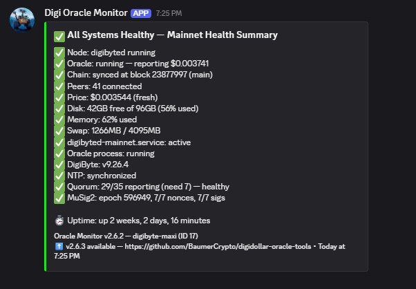

# digidollar-oracle-tools

Operator tools and monitoring scripts for [DigiByte](https://www.digibyte.org/) DigiDollar Oracle nodes.

Maintained by **digibyte-maxi** (Oracle Slot 17) — see contact at the bottom.

---

## What's in this repo

| File | Purpose |
|------|---------|
| [oracle-monitor.sh](oracle-monitor.sh) | Bash health monitor v2.5.6 — 12 checks (daemon, oracle, chain sync, peers, price freshness, consensus status, disk, memory, swap pressure, version, NTP, quorum margin). Quorum tracking via `getdigidollardeploymentinfo` + `getoracles` with MuSig2 session health. Counts online oracles by heartbeat (stable across round transitions). Anti-flap: cooldown timer + hysteresis buffer prevent alert spam during volatile periods. `--config /path` for dual-instance monitoring (testnet + mainnet). DigiDollar BIP9 pre-activation guard downgrades oracle checks to standby INFO before activation. Auto-detects either `digibyted` (headless) or `digibyte-qt` (Qt wallet) so operators running either binary get correct alerts. Discord webhook alerts with red/yellow/green embeds, `NETWORK_LABEL` in card titles, footer version stamp. Disk line shows free/total/used%; the Low Disk alert names your configurable `DATADIR` so you know exactly where to clean up (v2.5.5). MuSig2 line now carries its own ✅/ℹ️/⚠️ status icon for visual consistency with the other health lines (v2.5.6). External config file, `--dry-run` mode, jq-based JSON parsing. State files prevent repeat alerts. |
| [oracle-network-status.sh](oracle-network-status.sh) | Gitter network status bot v1.6.3 — posts automated oracle network health summaries to the DigiDollar Gitter channel every 12 hours via Matrix API. Network label in header (auto-detected or config override). Reports: fresh heartbeats, quorum health, consensus price, MuSig2 session, BIP9 activation, last bundle signers, software version adoption with compliance icons per `ACCEPTED_VERSIONS` whitelist (RC46 hash-variant collapse, three-tier sort: compliant on top, non-compliant with version in the middle, "no version reported" at the end), stale/inactive oracle list with @ mention notifications, and an upgrade nudge section for fresh operators running non-compliant versions. `--config /path` flag for dual-instance monitoring (testnet + mainnet). **DigiDollar BIP9 pre-activation guard (v1.6.2)** splits RPC calls into two phases so pre-activation mainnet daemons don't error on DD-required RPCs: Phase 1 (always-safe) resolves BIP9 status, activation-height math from `getdeploymentinfo.bip9.since + statistics.period`, quorum config, MuSig2 session; Phase 2 (DD-required) only fires in FULL mode. Standby/birth/endgame modes skip Phase 2 entirely. `--endgame-only` flag for hourly countdown ticker in the last 24 hours before activation (silent-exit outside the band, so hourly cron only posts when it matters). One-shot birth announcement fires automatically on the first cron pass after DD flips to ACTIVE, with `m.mentions` notifications to Jared (slot 0) and DigiSwarm (slot 15), state-file dedup prevents double-fire. **v1.6.3 audit fixes:** in BIP9 ACTIVE state `bip9.since` alone is the activation height (Core drops `statistics` once active, verified live on testnet26), so the birth announcement now reports the true activation block instead of the next retarget boundary; upgrade-nudge ping counts moved to a `u<id>` namespace so the fresh-oracle reset can't wipe them each cycle (the 6-ping cap now actually engages); and the 12hr standby defers to the hourly endgame ticker inside the final 24h (59-minute dedup window) so the room gets one countdown per hour, not two five minutes apart. Bot account: `@digidollar-oracle-bot:matrix.org`. |
| [oracle-roster.template](oracle-roster.template) | Template for the oracle-to-Gitter-handle mapping file used by the @ mention feature. Copy to `~/.oracle-monitor/oracle-roster.conf` and populate with real Matrix IDs. The populated file stays on VPS only — never push to GitHub. |
| [config.template](config.template) | Configuration template for oracle-monitor.sh and oracle-network-status.sh. Copy to `~/.oracle-monitor/config` and set your oracle ID, webhook URL, alert thresholds, quorum margin thresholds, anti-flap settings, network label, and Matrix API credentials for the Gitter bot. v1.6.2 additions (all optional): `ACCEPTED_VERSIONS` whitelist for the Software section compliance icons, `VERSION_NUDGE_ENABLED` toggle for the upgrade nudge feature, `ACTIVATION_HEIGHT_OVERRIDE` manual escape hatch for the pre-activation countdown math. Both scripts work without any of it using built-in defaults. |
| [ORACLE_SETUP_QUICKSTART.md](./ORACLE_SETUP_QUICKSTART.md) | Quick-start checklist for new oracle operators. Covers download, config, key generation, and posting to Gitter. |
| [ORACLE_SETUP_TUTORIAL.md](./ORACLE_SETUP_TUTORIAL.md) | Full step-by-step tutorial for all platforms (Linux, Windows, macOS). Posted by shenger in the DigiDollar Gitter community. |
| [ORACLE_HARDENING_GUIDE.md](ORACLE_HARDENING_GUIDE.md) | VPS security hardening guide v1.4.1 — SSH, UFW, Fail2Ban, kernel hardening, systemd, resource isolation and OOM protection. Step-by-step, based on my live oracle setup. |
| [HOME_ORACLE_HARDENING_GUIDE.md](HOME_ORACLE_HARDENING_GUIDE.md) | Home network security hardening guide — Linux, Windows, macOS. Three tiers (Essential, Recommended, Advanced). Covers firewall, port forwarding, NTP, router hardening, UPS, VLANs, WireGuard. Network diagrams: [Tier 1](https://htmlpreview.github.io/?https://github.com/BaumerCrypto/digidollar-oracle-tools/blob/main/network-tier1-essential.html) · [Tier 2](https://htmlpreview.github.io/?https://github.com/BaumerCrypto/digidollar-oracle-tools/blob/main/network-tier2-recommended.html) · [Tier 3](https://htmlpreview.github.io/?https://github.com/BaumerCrypto/digidollar-oracle-tools/blob/main/network-tier3-advanced.html). Community-requested by Aussie Epic. |
| [oracle-monitor.ps1](oracle-monitor.ps1) | Windows PowerShell port v2.5.6-win.1 — full logic parity with Linux v2.5.6. PS 5.1 and PS 7 compatible, zero dependencies (native JSON parsing). Includes watch mode (`-Watch`) and `-Config` for dual-instance monitoring. Ships UTF-8 with BOM. |
| [config.template.ps1](config.template.ps1) | Windows configuration template for oracle-monitor.ps1. |
| [oracle-monitor-macos.sh](oracle-monitor-macos.sh) | macOS port v2.5.6-macos.1 — stock bash 3.2 compatible, jq is the only dependency. Includes watch mode (`--watch`) and `--config` for dual-instance monitoring. |
| [config-macos.template](config-macos.template) | macOS configuration template for oracle-monitor-macos.sh. |
| [CROSS_PLATFORM_SETUP.md](CROSS_PLATFORM_SETUP.md) | Setup guide for Windows and macOS ports — installation, config, Task Scheduler/cron, watch mode, troubleshooting. |

### Testing

The Windows and macOS ports ship with parallel isolated test harnesses for verifying `check_daemon` + `check_services` behavior on your box before scheduling the monitor. Nine scenarios each — auto-detect for headless vs Qt, override honored, service check appropriately skipped when Qt is the running daemon, and so on.

| Harness | Purpose |
|------|---------|
| [test-macos-daemon-services.sh](test-macos-daemon-services.sh) | Mocks pgrep, launchctl, and `$CLI` — runs 9 scenarios in isolation. Verifies parity with the Linux logic before you point the monitor at a live oracle. |
| [test-win-daemon-services.ps1](test-win-daemon-services.ps1) | Mocks Get-Process, Get-Service, and Invoke-DGBCli — runs 9 scenarios under Windows PowerShell 5.1 or 7. Verifies PS-specific behavior including auto-detect candidate loop and Windows Service Qt-skip. Ships UTF-8 with BOM. |

Neither harness sends Discord alerts, touches state files, or runs against a real node — they're safe to run on any box, even without DigiByte installed.

More tools will be added as the DigiDollar testnet matures toward mainnet activation.
**Roadmap:** See [open issues](https://github.com/BaumerCrypto/digidollar-oracle-tools/issues) for planned features — mainnet migration, bundle signer detection, cross-platform support, and more.

---

## Platform support

The monitor runs natively on all three major platforms. Same 12 checks, same DigiDollar BIP9 pre-activation guard, same quorum state machine, same anti-flap logic, same Qt/headless auto-detect, same Discord card format — only the platform plumbing differs.

| Platform | Script | Config template | Version |
|---|---|---|---|
| Linux | [`oracle-monitor.sh`](oracle-monitor.sh) | [`config.template`](config.template) | 2.5.6 |
| Windows 10/11 | [`oracle-monitor.ps1`](oracle-monitor.ps1) | [`config.template.ps1`](config.template.ps1) | 2.5.6-win.1 |
| macOS | [`oracle-monitor-macos.sh`](oracle-monitor-macos.sh) | [`config-macos.template`](config-macos.template) | 2.5.6-macos.1 |

Windows needs no dependencies at all (PowerShell parses JSON natively). macOS needs only jq and runs on the stock bash 3.2 every Mac ships with. Setup for both is in [`CROSS_PLATFORM_SETUP.md`](CROSS_PLATFORM_SETUP.md). The rest of this README documents the Linux version; the ports behave identically.

---

## `oracle-monitor.sh`

### What it checks (every 5 minutes by default)

- `digibyted` daemon process alive (auto-detects headless `digibyted` or Qt wallet `digibyte-qt` — configurable via `DAEMON_PROCESS` override)
- Oracle is `running` in `listoracle`
- Chain sync (`blocks` vs `headers` from `getblockchaininfo` — alerts when the node falls more than `MAX_CHAIN_BEHIND` blocks behind)
- Peer count (default min: 3)
- Price freshness (`is_stale` flag on `getoracleprice`)
- Degraded consensus detection (`status` != `ok` on `getoracleprice`)
- Disk space — free, total, and used% (default min: 5GB free); the Low Disk alert names your `DATADIR` on its own line so you know exactly where to clean up (v2.5.5)
- Memory usage
- **Swap pressure** — alerts when swap usage exceeds threshold (default 100 MB). On a properly tuned box with `swappiness=10`, any meaningful swap usage signals real memory pressure before things get critical (v2.4)
- `digibyted.service` and oracle process status via `listoracle` RPC — systemd unit check auto-skips with an INFO line when the Qt wallet is the running daemon (Qt operators typically run outside systemd)
- Binary version drift detection via RPC (`getnetworkinfo` → `.subversion`) — works identically for Qt and headless (v2.5)
- NTP time synchronization
- **Quorum margin tracking** — counts online oracles via `getoracles true` using `heartbeat_status` (stable across MuSig2 round transitions, matches dashboard's "Online Heartbeats" metric), compares against on-chain quorum threshold from `getdigidollardeploymentinfo`, reports MuSig2 session health. Anti-flap: cooldown timer throttles recovery alerts during volatile periods, hysteresis buffer prevents oscillation at band boundaries

### DigiDollar activation status handling

Before DigiDollar BIP9 activates on your target chain, the oracle RPCs (`listoracle`, `getoracleprice`, `getoracles`) return no data — the deployment simply isn't live yet. Without special handling, a monitor pointed at a mainnet node right now would fire red alerts every 5 minutes for oracle down, price unknown, and quorum unavailable, even though nothing is actually broken.

The v2.5+ monitors solve this with a pre-flight check. A `check_digidollar_active` function runs first on every pass, reads `getdigidollardeploymentinfo` for the current deployment status, and sets a `DD_ACTIVE` global that the four oracle-dependent checks (`check_oracle`, `check_price`, `check_services`, `check_quorum`) consult before deciding whether to alert.

When `DD_ACTIVE=false`, those four checks downgrade "no data" to a blue ℹ️ standby INFO line instead of a red alert — showing something like `ℹ️ Oracle: standby (DigiDollar deployment: started)` in the health summary. The other 8 checks (daemon, chain, peers, disk, memory, swap, service, NTP, version) continue to alert normally on real problems. Result: your Discord channel stays quiet until DigiDollar activates, then automatically switches to full oracle alerting once `DD_ACTIVE=true`.

This is why a pre-activation mainnet monitor shows an all-green health summary with four ℹ️ standby lines — that's correct pre-activation behavior, not a bug. It flips to full oracle data automatically the moment BIP9 locks in.

### What it sends

Discord embeds — color-coded:

- 🔴 **Red** — critical (daemon down, oracle stopped, chain stuck, quorum at edge or lost)
- 🟡 **Yellow** — warnings (low peers, low disk, stale price, degraded consensus, NTP desync, quorum getting thin, swap pressure)
- 🟢 **Green** — recovery confirmations (quorum healthy, margin improving)
- 🔵 **Blue** — 12-hour status summary, plus ℹ️ INFO lines for pre-activation standby state
- **Card titles** carry the `NETWORK_LABEL` from your config on *every* alert — health summaries (`Testnet26 Health Summary`), individual checks (`Mainnet — 🔴 Node Down`), and the `--test` alert — so dual-instance operators can tell which daemon fired an alert at a glance without opening the card (v2.5.3)
- **Footer** stamps the monitor version and your oracle identity on every card (e.g. `Oracle Monitor v2.5.6 — digibyte-maxi (ID 17)`)

State files in `~/.oracle-monitor/` prevent the same alert firing every 5 minutes — you get notified once when something breaks and once again when it recovers. Quorum tracking uses a single `quorum_state` file that stores the current band and timestamp, with cooldown and hysteresis to prevent alert flapping during network volatility.

All timestamps inside alerts are in UTC for unambiguous reading across timezones. Discord's footer time auto-converts to each viewer's local time.

### Discord alert examples

**Health summary with quorum tracking and MuSig2 session status:**



**Quorum state transition alerts — red/yellow/green as oracle count changes:**


_The Quorum1 image is a current v2.5.6 Testnet26 health summary — the day-to-day view most operators see. The Quorum2 image (quorum state transitions) is older and will be refreshed when an organic quorum event provides a fresh capture, likely post-mainnet activation — see [issue #29](https://github.com/BaumerCrypto/digidollar-oracle-tools/issues/29)._

### Requirements

- Linux (tested on Ubuntu 24.04 LTS) — for Windows and macOS, see [Platform support](#platform-support) above
- DigiByte Core **v9.26.4** (also compatible with v9.26.2/v9.26.3 and RC44–RC46 — uses `listoracle`, `getoracleprice`, `getdigidollardeploymentinfo`, `getoracles` RPCs)
- `jq` (for JSON parsing — install with `sudo apt install jq`)
- `curl`
- A Discord webhook URL — create one at: *Server Settings → Integrations → Webhooks → New Webhook*

### Setup

1. Download the script and config template to your oracle VPS:
```bash
   wget https://raw.githubusercontent.com/BaumerCrypto/digidollar-oracle-tools/main/oracle-monitor.sh
   wget https://raw.githubusercontent.com/BaumerCrypto/digidollar-oracle-tools/main/config.template
   chmod +x oracle-monitor.sh
```

2. Create your config file from the template:
```bash
   mkdir -p ~/.oracle-monitor
   cp config.template ~/.oracle-monitor/config
```

3. Edit the config file with your settings:
```bash
   nano ~/.oracle-monitor/config
```
   Set your Discord webhook URL, oracle ID, and oracle name. For mainnet, change `CLI="digibyte-cli"`.

4. Test with `--dry-run` (runs all checks, prints to terminal, skips Discord):
```bash
   ./oracle-monitor.sh --dry-run
```

5. Test the webhook:
```bash
   ./oracle-monitor.sh --test
```
   You should see a test alert appear in your Discord channel.

6. Test a full health summary:
```bash
   ./oracle-monitor.sh --summary
```

7. Add to cron (`crontab -e`):
```cron
   */5 * * * * $HOME/oracle-monitor.sh 2>/dev/null
   0 */12 * * * $HOME/oracle-monitor.sh --summary 2>/dev/null
```

### Flags

| Flag | What it does |
|------|-------------|
| *(none)* | Normal health check — alerts only on problems or recovery |
| `--summary` | Full status summary — always sends to Discord |
| `--dry-run` | Runs all checks, prints to terminal, skips Discord, no state changes |
| `--test` | Sends a test embed to Discord to verify webhook |
| `--config /path` | Use alternate config file — enables dual-instance monitoring (v2.3+) |

### Configuration options

All thresholds are configurable in `~/.oracle-monitor/config`. The script uses built-in defaults if a value isn't set.

| Setting | Default | Description |
|---------|---------|-------------|
| `DISCORD_WEBHOOK` | *(empty)* | Discord webhook URL for alerts |
| `ORACLE_ID` | `0` | Your oracle slot ID |
| `ORACLE_NAME` | `my-oracle` | Your oracle name (shown in Discord embeds) |
| `CLI` | `digibyte-cli -testnet` | RPC command. Use `digibyte-cli` for mainnet |
| `WALLET_FLAG` | `-rpcwallet=oracle` | Wallet flag for RPC calls |
| `MIN_PEERS` | `3` | Minimum peer count before alerting |
| `MIN_DISK_GB` | `5` | Minimum free disk space (GB) |
| `DISK_PATH` | `/home` | Path whose filesystem is watched for free space. Point it at the mount holding your datadir if that isn't under `/home` (v2.5.4) |
| `DATADIR` | `$HOME/.digibyte` | DigiByte datadir named in the Low Disk alert. Display-only — never read or written. Dual-instance operators set it per config so each alert names its own datadir (v2.5.5) |
| `MEM_THRESHOLD` | `90` | Memory usage % above which to alert |
| `SWAP_THRESHOLD_MB` | `100` | Swap usage in MB above which to alert. On a swappiness=10 box, any meaningful swap means real pressure (v2.4) |
| `MAX_CHAIN_BEHIND` | `10` | Blocks behind before alerting |
| `QUORUM_GREEN` | `12` | Oracles reporting at/above this = healthy (no alert). Tuned in v2.5.1 — the old 20/12 defaults fired "getting thin" at 2x the 7-of-35 quorum floor. Testnet suggestion: 10 |
| `QUORUM_YELLOW` | `10` | Below green but at/above this = "getting thin" warning. Testnet suggestion: 8 |
| `QUORUM_COOLDOWN` | `30` | Minutes between quorum recovery alerts. Escalation (worse) always fires immediately. Set to `0` to disable (v2.1+) |
| `QUORUM_HYSTERESIS` | `3` | Recovery buffer — must exceed threshold by this many oracles to recover. Prevents flapping at boundaries. Set to `0` to disable (v2.1+) |

The quorum minimum (`oracle_consensus_required`, currently 7) comes from the chain itself via `getdigidollardeploymentinfo` — it's not configurable. Below that threshold, DigiDollar signing halts regardless of your config settings.

### Low Disk alerts name your datadir (v2.5.5)

The disk line shows the full picture — `✅ Disk: 156GB free of 200GB (22% used)` — and when disk runs low, the red alert names the datadir to clean up, on its own line so it's a clean copy target on mobile:

```
🔴 Low Disk Space
Only 3GB free of 200GB (98% used).
Clean up old logs or unused chain data in:
/home/YOU/.digibyte/
```

That path comes from the `DATADIR` config variable. No RPC returns the datadir, so the monitor can't discover it — you declare it. Single-instance operators leave the default and never think about it again.

Dual-instance operators (testnet + mainnet on one box via `--config`) should set `DATADIR` per config file — left at the default, both instances name the same path and the two alerts are ambiguous. Set per config (testnet: `DATADIR="$HOME/.digibyte/testnet26"`, mainnet: `DATADIR="$HOME/.digibyte"`), the same full disk produces two distinct, actionable cards:

```
Testnet26 — 🔴 Low Disk Space
Only 3GB free of 200GB (98% used).
Clean up old logs or unused chain data in:
/home/YOU/.digibyte/testnet26/
```

```
Mainnet — 🔴 Low Disk Space
Only 3GB free of 200GB (98% used).
Clean up old logs or unused chain data in:
/home/YOU/.digibyte/
```

**Testnet26 dual-instance Low Disk alert — escalation and recovery pair with `NETWORK_LABEL` prefix and `DATADIR` path call-out:**


Same disk, same numbers — but each card tells you which daemon fired (`NETWORK_LABEL`, v2.5.3) and exactly which directory to prune (`DATADIR`, v2.5.5). Both v2.5.5 disk enhancements were suggested by Aussie Epic. Mainnet chain data lives at the datadir top level; testnet data lives in a subdirectory named for the current testnet reset (`testnet26`, `testnet27`, ...) — bump your testnet `DATADIR` when the testnet resets.

### Quorum alert bands

| Active oracles | Status | Escalation alert | Recovery alert |
|----------------|--------|------------------|----------------|
| 🟢 12+ | Comfortable | — | `✅ Quorum Healthy` |
| 🟡 10–11 | Getting thin | `⚠️ Quorum Getting Thin` | `✅ Quorum Improved — Getting Thin → Healthy` |
| 🔴 7–9 | At quorum edge | `🚨 Quorum at Edge` | `✅ Quorum Improved — At Edge → Getting Thin` |
| 💀 Below 7 | DD signing halted | `🚨 QUORUM LOST` | `✅ Quorum Recovered — LOST → At Edge` |

**Escalation** (count drops into a worse band) always fires immediately. **Recovery** (count rises into a better band) is throttled by `QUORUM_COOLDOWN` and requires the count to exceed the threshold by `QUORUM_HYSTERESIS` oracles. This prevents a single oracle bouncing around a boundary from generating a stream of alerts.

### Hysteresis recovery thresholds (default QUORUM_HYSTERESIS=3)

| Recovery to | Threshold | Required count |
|-------------|-----------|----------------|
| 🟢 Healthy | `QUORUM_GREEN` (12) | 12 + 3 = **15** |
| 🟡 Getting thin | `QUORUM_YELLOW` (10) | 10 + 3 = **13** |
| 🔴 At edge | `oracle_consensus_required` (7) | 7 + 3 = **10** |

With `QUORUM_HYSTERESIS=0`, recovery fires at the exact threshold (v2.0 behavior).

### RPC field reference

Both scripts parse specific fields from DigiByte Core RPCs. If a future RC renames a field, these scripts may need updates. Known field names as of RC46:

| RPC | Field used |
|-----|-----------|
| `listoracle` | `running` *(not `is_running`)* |
| `listoracle` | `price_usd` *(not `last_price_usd`)* |
| `getoracleprice` | `price_usd`, `is_stale`, `status`, `oracle_count` |
| `getdigidollardeploymentinfo` | `oracle_consensus_required`, `oracle_total_slots`, `musig2_session.state`, `musig2_session.epoch`, `musig2_session.nonce_count`, `musig2_session.partial_sig_count` |
| `getoracles true` | `last_price_usd`, `status`, `heartbeat_status` *(v2.2: "fresh" = online within 30 min)*, `heartbeat_age_seconds`, `heartbeat_timestamp`, `software_version` *(used by oracle-network-status.sh)* |
| `getblockchaininfo` | `chain` *(used by oracle-network-status.sh v1.4 for network label auto-detection)* |
| `getoraclesigners` | `bundle_count`, `bundles[].height`, `bundles[].signer_count`, `bundles[].signer_ids` *(used by oracle-network-status.sh)* |

**RC45 new RPCs** (not used by these scripts yet but available):
| RPC | Purpose |
|-----|---------|
| `exportoracleprivkey` | Export oracle signing key from wallet (wallet-context, usable before activation) |
| `importoracleprivkey` | Import oracle signing key into wallet (wallet-context, usable before activation) |

---

## `oracle-network-status.sh`

Community-facing Gitter bot that posts oracle network health summaries to the [DigiDollar Gitter channel](https://app.gitter.im/#/room/#digidollar:gitter.im) every 12 hours. Unlike `oracle-monitor.sh` (which watches your own node and alerts you privately via Discord), this script monitors the entire oracle network and reports publicly.

### What it reports

- **Network label** — which chain the report covers (e.g. "Testnet26" or "Mainnet"), auto-detected from `getblockchaininfo` or set via `NETWORK_LABEL` in config (v1.4)
- **Fresh Heartbeats** — active oracle count vs roster size, quorum health status (healthy / thin / critical / lost)
- **Consensus price** — current DGB/USD price and oracle price feed status
- **MuSig2 session** — current epoch, signing state, nonce and signature counts
- **BIP9 activation** — deployment status and signaling bit
- **Last bundle** — most recent on-chain price bundle block height and signer count
- **Software versions** (v1.6+) — all versions with compliance icons per `ACCEPTED_VERSIONS` whitelist. Compliant versions (✅) sorted by count first, non-compliant versions (⚠️) sorted by count next, "No version reported" bucket pinned at the end. RC46 long/short hash-variant clutter collapses to one canonical line per base version.
- **Upgrade nudge** (v1.6+, 📢) — fresh operators running non-compliant versions get a light @ mention. Same 6-ping cap as the stale/inactive nudges (no spam). Skipped for stale/inactive operators since they're already pinged in those sections.
- **Stale oracles** (⚠️) — were running, went down (liveness concern). Operators are @ mentioned in Gitter for up to 6 cycles (3 days), then suppressed but still listed.
- **Inactive oracles** (❌) — have key or wallet issues on the current network. Same @ mention behavior as stale.

### Modes (v1.6+)

The bot has four operating modes decided at runtime based on chain, DD BIP9 activation state, and the `--endgame-only` flag:

- **FULL** — regular network status post. Always used on testnet (DD active since block 600). Used on mainnet post-activation. This is what the "What it reports" section above describes.
- **STANDBY** — mainnet + DD not yet active. Posts a compact countdown with current block, activation block, blocks remaining, day/hour granularity, and calendar UTC ETA. Skips the full status data (which isn't available pre-activation anyway). Inside the final 24h it defers to the hourly endgame ticker (59-minute dedup window, v1.6.3) so the room gets one countdown per hour instead of near-duplicates 5 minutes apart.
- **BIRTH** — mainnet + DD just flipped to ACTIVE + no prior birth-state file. Fires a one-shot announcement with `m.mentions` notifications to Jared (slot 0) and DigiSwarm (slot 15). State-file dedup prevents double-fire from the endgame vs 12hr cron collision window.
- **ENDGAME** — silent-exit variant of STANDBY that fires from the hourly `--endgame-only` cron. Only posts when inside the 24h band before activation. Silent exit outside that band so hourly cron doesn't spam.

### Example output (FULL mode, v1.6.2 formatting)

```
🟢 Oracle Network Status, Testnet26, 2026-07-13 00:29 UTC

Fresh Heartbeats: 16/35 (quorum healthy, threshold: 7)
Consensus price: $0.002529 (status: active)
MuSig2: epoch 3061, complete, 7/7 nonces, 7/7 sigs
BIP9: active (bit 23)
Last bundle: block 122446, signed by 7 oracles

Software (accepted: v9.26.2 / v9.26.3 / v9.26.4):
  ✅ v9.26.4: 7 operators
  ✅ v9.26.3: 5 operators
  ✅ v9.26.2: 1 operator
  ⚠️ v9.26.0rc46 (pre-release): 12 operators
  ⚠️ v9.26.1-pre2 (pre-release): 1 operator
  ⚠️ No version reported: 9 operators

📢 Please upgrade to v9.26.2 or newer:
  — ID 9 Ogilvie @ogilvie:gitter.im
  — ID 18 Anthony @usascholar:gitter.im
  — ID 26 HashedMax @hashedmax:gitter.im
  — ID 29 medgborsole3452 @eps8sap:gitter.im

⚠️ Stale (10):
  — ID 4 Shenger @shenger:gitter.im
  — ID 5 Ycagel @ycagel-60c7a14b6da03739847edeeb:gitter.im
  — ID 10 ChopperBrian @chopperbrian-610ed4a86da037398482ada7:gitter.im
  (...)

❌ Inactive (9):
  — ID 7 LookInto @lookintomyeyes:gitter.im
  (...)
```

### Example output (STANDBY mode, pre-activation mainnet)

```
🟢 Oracle Network Status, Mainnet, 2026-07-13 00:10 UTC

📅 DigiDollar Mainnet Activation: PENDING
   Current stage: LOCKED_IN (bit 23)
   Current block: 23,843,024
   Activation block: 23,869,440
   Blocks remaining: 26,416
   Time to activation: ~4 days 14 hours
   Estimated activation: 2026-07-17 ~14:12 UTC

Roster: 35 slots configured, 7-of-35 quorum threshold
Signing status: standby, mainnet oracles begin publishing at BIP9 ACTIVE

This bot will resume full network status posts (fresh heartbeats,
consensus price, MuSig2, upgrade nudges) automatically at activation.
```

### Data sources

| RPC | What it provides |
|-----|-----------------|
| `getblockchaininfo` | Chain identification — auto-detects "test" → Testnet, "main" → Mainnet for header label (v1.4). Current block height for countdown math (v1.6). |
| `getdeploymentinfo` | BIP9 standard deployment info — `bip9.since + statistics.period` gives activation-height math that works pre-activation on mainnet (v1.6.2). In ACTIVE state Core drops `statistics` and `since` alone is the activation height (v1.6.3). |
| `getdigidollardeploymentinfo` | DGB-specific extras — quorum config, MuSig2 session state, BIP9 status. Returns partial data pre-activation but the needed fields are populated. |
| `getoracles true` | Per-oracle heartbeat status — fresh, stale, and offline lists (FULL mode only, pre-activation returns error). |
| `getoracleprice` | Consensus price, feed status, oracle count (FULL mode only). |
| `getoraclesigners 50` | Recent bundle signer participation, 50-block window covers at least one full 40-block round (FULL mode only). |

v1.6.2 splits these into two phases: Phase 1 (`getblockchaininfo`, `getdeploymentinfo`, `getdigidollardeploymentinfo`) always runs. Phase 2 (`getoracles`, `getoracleprice`, `getoraclesigners`) only runs in FULL mode. This prevents pre-activation mainnet daemons from erroring on RPCs that require DD to be active.

### Requirements

- Linux (tested on Ubuntu 24.04 LTS)
- DigiByte Core **v9.26.4** (also compatible with v9.26.2/v9.26.3 and RC44–RC46)
- `jq`, `curl`
- A [Matrix](https://matrix.org) bot account joined to `#digidollar:gitter.im`

### Setup

1. Create a Matrix bot account at [Element](https://app.element.io/#/register) (e.g. `@digidollar-oracle-bot:matrix.org`)
2. Join `#digidollar:gitter.im` from the bot account
3. Generate an access token on the VPS:
```bash
curl -s -X POST "https://matrix.org/_matrix/client/v3/login" \
  -H "Content-Type: application/json" \
  -d '{"type":"m.login.password","identifier":{"type":"m.id.user","user":"YOUR_BOT_USERNAME"},"password":"YOUR_PASSWORD"}' \
  | jq -r '.access_token'
```
4. Get the room ID (Element → Room Settings → Advanced → Internal room ID)
5. Add to `~/.oracle-monitor/config`:
```bash
MATRIX_ACCESS_TOKEN="your_token_here"
MATRIX_ROOM_ID="!your_room_id:gitter.im"
```
6. Set the network label (optional — auto-detected from chain if not set):
```bash
NETWORK_LABEL="Testnet26"
```
7. For @ mentions (optional): populate the roster mapping file:
```bash
wget https://raw.githubusercontent.com/BaumerCrypto/digidollar-oracle-tools/main/oracle-roster.template
cp oracle-roster.template ~/.oracle-monitor/oracle-roster.conf
nano ~/.oracle-monitor/oracle-roster.conf
# Fill in oracle ID to Gitter Matrix ID mappings — see template for format
```
8. Test: `./oracle-network-status.sh --dry-run`
9. Test: `./oracle-network-status.sh --test`
10. Test mentions: `./oracle-network-status.sh --test-mention`
11. Add to cron: `5 */12 * * * /home/YOUR_USER/oracle-network-status.sh 2>/dev/null`

### Flags

| Flag | What it does |
|------|-------------|
| *(none)* | Collect data and post to Gitter |
| `--dry-run` | Collect data, print to terminal, skip Gitter post |
| `--test` | Send a test message to Gitter to verify Matrix API |
| `--test-mention` | Send a test @ mention to verify Gitter notifications work |
| `--config /path` | Use alternate config file, enables dual-instance monitoring (v1.4) |
| `--endgame-only` | Endgame countdown mode (v1.6.2, mainnet). Posts only if LOCKED_IN + inside the 24h band, or ACTIVE + birth-announcement not yet fired. Silent-exit otherwise. Designed for hourly cron alongside the regular 12hr cron. |

### Dual-instance monitoring (testnet + mainnet)

When mainnet launches, run two independent instances from the same script using `--config`:

```cron
# Testnet 12hr status pulse (default config)
5 */12 * * * /home/YOUR_USER/oracle-network-status.sh 2>/dev/null
# Mainnet 12hr status pulse (custom config)
10 */12 * * * /home/YOUR_USER/oracle-network-status.sh --config ~/.oracle-monitor-mainnet/config 2>/dev/null
# Mainnet hourly endgame countdown ticker (v1.6.2, silent-exit outside 24h band)
15 * * * * /home/YOUR_USER/oracle-network-status.sh --config ~/.oracle-monitor-mainnet/config --endgame-only 2>/dev/null
```

Each instance uses its own config file and tracks mention state independently. The roster file is shared by default (same 35 operators on both networks). The endgame ticker cost is negligible outside the 24h band (silent-exit after Phase 1 RPCs). Setup:

```bash
mkdir -p ~/.oracle-monitor-mainnet
cp ~/.oracle-monitor/config ~/.oracle-monitor-mainnet/config
# Edit mainnet config: CLI="digibyte-cli", NETWORK_LABEL="Mainnet"
ln -s ~/.oracle-monitor/oracle-roster.conf ~/.oracle-monitor-mainnet/oracle-roster.conf
```

`--config` combines with action flags in any order: `--config /path --dry-run` or `--dry-run --config /path`.

### Note on running your own instance

This script is the reference implementation for the Gitter network status bot posting to `#digidollar:gitter.im`. First deployed 2026-06-16 (v1.2, GitHub issue #18), maintained and iterated continuously since. Currently at v1.6.2 with dual-instance testnet + mainnet monitoring running under my authorship.

**ONE bot per network is sufficient to serve the room.** Running a second instance against the same Gitter channel produces duplicate posts, splits @ mention tracking, and confuses operators. My testnet + mainnet instances (using `--config` for dual-instance) currently cover the network and coordinate with Jared and DigiSwarm on cadence and content.

If you want to monitor your own oracle privately, use `oracle-monitor.sh` with a Discord webhook to your own channel. That's the intended pair: `oracle-monitor.sh` for private per-operator alerts, `oracle-network-status.sh` for the shared community status feed.

If you have ideas to improve the reference implementation (compliance rules, new sections, additional RPC data, better formatting), open an issue or PR on this repo. Contributions have shaped every version since v1.2, and I welcome more. Bastian's "any v9.26 will do" rule became the default `ACCEPTED_VERSIONS` list in v1.6. Aussie Epic's suggestions shaped the disk alert phrasing in the monitor. That collaboration is the point.

If you want to run a modified version for personal testing or as a backup:

- Change the author signature line (search for `digibyte-maxi` throughout the file) to your own identity, so nobody thinks your instance is mine
- Change the Matrix bot account so posts are visibly from a different sender in Gitter
- Coordinate in `#digidollar:gitter.im` before posting to the shared room, so we don't produce duplicate output
- Reach out on GitHub issues if you hit ecosystem-specific bugs or field-name changes

The MIT license grants full rights to fork, modify, and redistribute. This coordination note is about ecosystem stewardship, not permission.

---

## Compatibility

| Component | Version |
|-----------|---------|
| OS | Linux (Ubuntu 24.04 LTS), Windows 10/11 (PowerShell 5.1+), macOS (bash 3.2+) |
| DigiByte Core | v9.26.4 (also compatible with v9.26.2, v9.26.3, and RC44/RC45/RC46) |
| Chain | testnet26 |
| Oracle protocol | v0x03 MuSig2 bundle |
| oracle-monitor.sh | v2.5.6 |
| oracle-monitor.ps1 | v2.5.6-win.1 |
| oracle-monitor-macos.sh | v2.5.6-macos.1 |
| oracle-network-status.sh | v1.6.3 |

If you're running a different release and something breaks, please open an issue.

---

## Contributing

Pull requests welcome. If you spot a bug, run into a field-name change on a newer RC, or want to add a check, open an issue or PR.

---

## Author

**digibyte-maxi** — DigiDollar oracle operator (Slot 17)

- GitHub: [BaumerCrypto](https://github.com/BaumerCrypto) (display name: BaumerCrypto2.0)
- X/Twitter: [@BaumerCrypto2_0](https://x.com/BaumerCrypto2_0)
- Gitter: `digibyte-maxi` in [#digidollar](https://app.gitter.im/#/room/#digidollar:gitter.im)

---

## License

[MIT](LICENSE) — use, fork, modify, share. Credit appreciated but not required.

## Disclaimer

These scripts are provided as-is for the DigiByte community. The DigiDollar protocol is live on testnet26; mainnet activation is in progress via miner signaling (BIP9 bit 23, signaling window opened June 1, 2026). Always test on testnet first and back up your oracle wallet.
